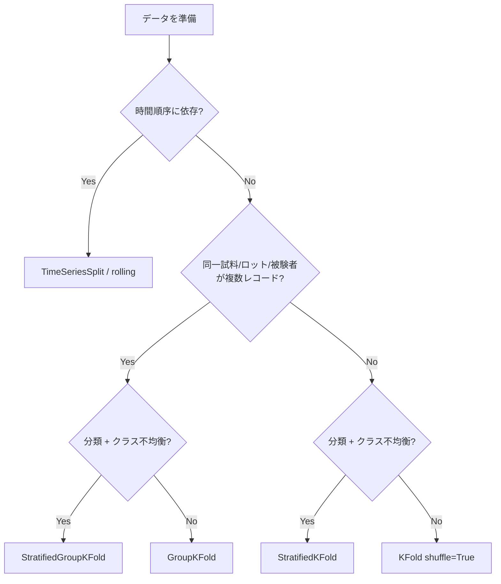

# 第7章 モデル選択・交差検証・データリーク検知

> **本章の到達目標**
> - k-fold / stratified / group / time-series の CV を、データ性質から**機械的に**選び分けられる
> - **同一試料・同一ロット・時系列**の 3 種の group leak を、`GroupKFold` / `TimeSeriesSplit` で予防できる
> - **前処理・特徴量選択・欠損補完・ハイパーパラメータ探索**を、Pipeline + `GridSearchCV` / ネスト CV で fold 内実施できる
> - ハイパーパラメータ探索と本評価を **ネスト CV** で分離し、独立テストへの過剰参照を防げる
> - AI エージェント特有のリーク（**会話コンテキスト経由の情報伝播・後付け特徴量追加・test スコア駆動探索**）を検知できる
> - 本章末の **CV 設計チェックリスト** を、以降すべての Skill 実装で使う
>
> **本章で扱わないこと**
> - モデル自体の解釈（SHAP / PDP / permutation importance） → **第8章**
> - PyMC / ベイズ推論の診断（$\hat{R}$ / ESS / PPC） → **第10章・第12章**
> - 深層学習の CV（early stopping、時間軸に沿った検証） → 本書外
> - 統計的検定（多重比較補正の理論） → 統計学の教科書に譲る。ただし多重比較の実務的落とし穴は本章 §7.7 で言及

---

## 7.1 なぜこの章か——第5章の「とりあえず KFold」の限界

第5章では、Skill 構造を示すために `KFold(n_splits=5, shuffle=True)` を素で使いました。しかし、次のような場面では **これだけでは不十分** です：

- **同一試料の反復測定が train と test に分かれて入る** → CV スコアが良くても実運用では悪化（第5章 §5.9 の代表症状）
- **同一ロットの試料が分割違反** → 「見たことのある組成領域」で評価してしまう
- **時系列データで未来を先に見る** → CV では「予測できた」ように見えるが、実運用では成立しない
- **前処理を全データで実施** → CV の各 fold で微妙にリーク
- **ハイパーパラメータを何度も試して、独立テストで確認** → 独立テストが「本当の独立」ではなくなる

**第7章は、「どう推定するか」だけに集中します**。第5章・第6章では「何を予測するか」「何を成功とみなすか」が主題でしたが、ここでは **推定手続きそのものの正しさ** を問います。

> [!IMPORTANT]
> **第7章はすべての教師あり／教師なし Skill の共通規律**です。ここを飛ばして第8章以降に進むと、以降の章の成果物すべての信頼性が損なわれます。Route C（sklearn のみ）読者にとっては本章が **必読** です（第1章 §1.6）。

---

## 7.2 CV の 4 分類と選択マップ

scikit-learn の `model_selection` には 20 以上の splitter がありますが、**実務で覚えるべきは 4 分類**です：

| 分類 | Splitter | 使う場面 |
|---|---|---|
| **一般 CV** | `KFold`, `ShuffleSplit`, `RepeatedKFold` | データが i.i.d.、識別子・時系列・グループ構造なし |
| **層化 CV** | `StratifiedKFold`, `StratifiedShuffleSplit` | 分類、クラス不均衡あり |
| **グループ CV** | `GroupKFold`, `GroupShuffleSplit`, `LeaveOneGroupOut`, `StratifiedGroupKFold` | 反復測定・ロット・被験者・機器などのグループ構造あり |
| **時系列 CV** | `TimeSeriesSplit`（scikit-learn 標準）、rolling / expanding window（自作 or `sktime`） | 時系列データ |

### 選択マップ



### 4 分類の意思決定を仕様書に書く

Skill 仕様書 ⑥ 再現性条件の `cv_scheme` フィールドに、**選択根拠**まで書きます：

```yaml
cv_scheme:
  type: GroupKFold
  n_splits: 5
  group_column: specimen_id
  rationale: |
    RRUFF データは同一標本 (specimen) に対して複数のスペクトルを持つため、
    KFold では標本レベル leak が起きる。GroupKFold で標本単位の分割を強制。
    scikit-learn の RepeatedGroupKFold は存在しないため、繰り返しは
    n_splits を大きく取るか seed を変えて自作する。
```

**「後から `TimeSeriesSplit` に変えました」は audit violation**（第4章 §4.5 分類 B）です。CV スキーム自体も凍結対象です。

---

## 7.3 グループリークと `GroupKFold`

### グループリークの定義

**同じ "実体" に由来する複数のレコードが train と test の両方に入ることを、group leak と呼びます**。実体としてよくあるもの：

| データ型 | 実体 | group 列の候補 |
|---|---|---|
| 反復測定 | 同一試料 | `sample_id`, `specimen_id` |
| 合成条件 | 同一ロット | `batch_id`, `lot_id` |
| ユーザー研究 | 同一被験者 | `subject_id` |
| 装置・時期 | 同一機器・同日 | `instrument_id`, `session_date` |
| スペクトル群 | 同一 RRUFF entry | `rruff_id` |

**group leak があると、CV スコアが実運用より過大**になります。理由：test の「未知試料」が実は train と関連する試料であり、「初見データ」の予測タスクではなくなるためです。

### `GroupKFold` の使い方

```python
from sklearn.model_selection import GroupKFold, cross_validate

cv = GroupKFold(n_splits=5)
scores = cross_validate(
    pipeline, X_train, y_train,
    groups=groups_train,               # ここが重要
    cv=cv,
    scoring=["neg_root_mean_squared_error", "r2"],
    return_indices=True,
)
```

**`groups` パラメータを渡し忘れると `GroupKFold` は使えません**。エージェントが `cross_validate` を書く場合、Skill 仕様書に `group_column` があれば **必ず `groups` を渡す**ように指示するテンプレートを用意します（§7.8 チェックリスト）。

### 分類 + グループの場合：`StratifiedGroupKFold`

分類タスクで **クラス不均衡** かつ **グループ構造** がある場合、`GroupKFold` だけではクラスが偏ります。`StratifiedGroupKFold` で両立します：

```python
from sklearn.model_selection import StratifiedGroupKFold

cv = StratifiedGroupKFold(n_splits=5)
for train_idx, test_idx in cv.split(X_train, y_train, groups=groups_train):
    ...
```

### 反復回数を増やす場合

`RepeatedKFold` / `RepeatedStratifiedKFold` は sklearn 標準にありますが、**`RepeatedGroupKFold` は存在しません**。反復が必要なら次のいずれか：

- `n_splits` を大きくする（データが許す範囲で）
- 自作の `for seed in seeds: GroupKFold(...)` ループ + `groups` シャッフル
- `sklearn.model_selection.GroupShuffleSplit(n_splits=多い)` を使う（重複を許すため厳密な k-fold ではない）

---

## 7.4 時系列リークと rolling / expanding CV

### 時系列 CV の原則

**train は test より過去でなければならない**。これは第5章 §5.2 で最小 holdout として扱いましたが、CV では「複数の window で繰り返し評価」する必要があります。

主な設計：

| 方式 | 特徴 | 使う場面 |
|---|---|---|
| **Expanding window（`TimeSeriesSplit`）** | 各 fold で train が拡大、test は次の window | データ蓄積とともに精度が向上する状況 |
| **Rolling window** | train の window サイズを固定、両者をスライド | データ分布が時期で変化する状況 |
| **Blocked K-Fold**（時系列内の独立 block を仮定） | train/test に時間ギャップを挟む | 系列内相関が短距離、独立性を仮定できる |
| **Purged K-Fold**（金融時系列向け） | train/test の境界で系統的除外 | 特徴量計算のウィンドウが未来を含みうる |

### `TimeSeriesSplit` の使用例

```python
from sklearn.model_selection import TimeSeriesSplit

cv = TimeSeriesSplit(n_splits=5, gap=0, test_size=None)
for train_idx, test_idx in cv.split(X_sorted):
    # 事前に timestamp でソートしておく必要がある
    ...
```

**注意点**：

- **`X_sorted` は timestamp 昇順にソート済み**であることが前提。ソートを忘れると意味を成さない
- **`gap` パラメータ**：train と test の間に空ける index 数。系列内相関が長い場合や、遅延特徴量を使う場合は `gap > 0` にする
- **`test_size` を指定しない**とデータ量から自動計算。実務では明示的に指定推奨

### 遅延特徴量の未来参照リーク

「t-1 の値を特徴量にする」ような遅延特徴量では、**特徴量計算のウィンドウが未来を含みうる**点に注意します：

```python
# 悪い例：移動平均を全データで計算してから split
df["ma_10"] = df["value"].rolling(10).mean()   # 未来を含む！
X_train, X_test = time_split(df)

# 良い例：Pipeline 内で fold ごとに計算、または片側移動平均
df["ma_10"] = df["value"].shift(1).rolling(10).mean()   # 過去のみ
```

移動平均の計算は「対称移動平均」だと未来を含みます。**時系列では `shift(1)` を挟むのが基本**です。

---

## 7.5 前処理・特徴量選択のリークを Pipeline で封じる

### 全データ fit の落とし穴

以下はすべて **fold ごとに train のみで fit** すべきものです：

1. `StandardScaler` / `MinMaxScaler` / `RobustScaler`
2. `PCA` / `TruncatedSVD`
3. `SimpleImputer` / `KNNImputer` / `IterativeImputer`（欠損補完）
4. `SelectKBest` / `SelectPercentile` / `RFE`（特徴量選択）
5. カテゴリ変数の `TargetEncoder`（目的変数を使う。特にリークしやすい）
6. カテゴリ変数の `OrdinalEncoder` / `OneHotEncoder`（train に無いカテゴリの扱い）

**Pipeline に入れれば、`cross_validate` が自動的に fold ごとに fit** してくれます。**Pipeline に入れず手書きすると全部リークします**。

### `ColumnTransformer` で列ごとの前処理

異なる列に異なる前処理を適用する場合、`ColumnTransformer` を使います：

```python
from sklearn.compose import ColumnTransformer
from sklearn.preprocessing import StandardScaler, OneHotEncoder
from sklearn.impute import SimpleImputer

numeric_cols = ["temperature", "pressure", "concentration"]
categorical_cols = ["method", "substrate"]

preprocessor = ColumnTransformer([
    ("num", Pipeline([
        ("imputer", SimpleImputer(strategy="median")),
        ("scaler",  StandardScaler()),
    ]), numeric_cols),
    ("cat", Pipeline([
        ("imputer", SimpleImputer(strategy="most_frequent")),
        ("onehot",  OneHotEncoder(handle_unknown="ignore")),
    ]), categorical_cols),
])

pipeline = Pipeline([
    ("preprocess", preprocessor),
    ("model",      RandomForestRegressor(random_state=42)),
])
```

**`OneHotEncoder(handle_unknown="ignore")` は重要**：train に無いカテゴリが test に現れると、無指定ではエラーになります。

### 特徴量選択も fold 内で

特徴量選択を全データで実施してから CV を回す（＝「予選」的な使い方）は、**特徴量選択のリーク**として広く知られています：

```python
# 悪い例：全データで SelectKBest してから CV
selector = SelectKBest(k=20).fit(X, y)
X_reduced = selector.transform(X)
scores = cross_val_score(model, X_reduced, y, cv=5)   # リーク

# 良い例：Pipeline 内で fold ごとに選択
pipeline = Pipeline([
    ("selector", SelectKBest(k=20)),
    ("model",    RandomForestRegressor(random_state=42)),
])
scores = cross_validate(pipeline, X, y, cv=5)   # OK
```

---

## 7.6 ネスト CV：ハイパーパラメータ探索と本評価の分離

### なぜネスト CV か

**同じ CV でハイパーパラメータ選択と汎化性能推定を両方行うと、性能推定が楽観バイアスを持つ**——これは統計学・ML の古典的な問題です（Cawley & Talbot 2010）。理由：CV スコアで選ばれたハイパーパラメータは、その CV スコアに対して過剰適合しているため。

**ネスト CV** は、外側 CV で汎化性能を推定し、内側 CV でハイパーパラメータを選ぶ構造です：

```
外側 CV (5-fold): 各 fold で
  ├─ train_outer (80%)
  │   └─ 内側 CV (5-fold) で GridSearchCV → best hyperparams
  │       └─ train_outer 全体で best hyperparams で refit
  └─ test_outer (20%)
      └─ refit したモデルで評価
```

### `GridSearchCV` + `cross_val_score` によるネスト CV

```python
from sklearn.model_selection import GridSearchCV, cross_val_score, KFold

param_grid = {"model__n_estimators": [100, 300], "model__max_depth": [5, 10, None]}
inner_cv = KFold(n_splits=5, shuffle=True, random_state=42)
outer_cv = KFold(n_splits=5, shuffle=True, random_state=1)

grid = GridSearchCV(pipeline, param_grid, cv=inner_cv,
                    scoring="neg_root_mean_squared_error", n_jobs=-1)
nested_scores = cross_val_score(grid, X_train, y_train, cv=outer_cv,
                                 scoring="neg_root_mean_squared_error")

print(f"ネスト CV RMSE: {-nested_scores.mean():.3f} ± {nested_scores.std():.3f}")
```

**外側 CV の平均が「Skill の汎化性能推定値」**、独立テストは **最後に 1 回だけ** 評価する保険の位置づけです。

### グループ・時系列でのネスト CV

- グループ構造がある場合：`GroupKFold` を内側・外側の両方に使う（`groups` を `cross_val_score(..., groups=...)` にも渡す）
- 時系列の場合：`TimeSeriesSplit` を内外で使い、内側は expanding、外側も expanding とする
- **内側と外側で `random_state` を変える**（同じだと分割が同一で意味を成さない）

### いつネスト CV が必要か

| 状況 | ネスト CV が必要か |
|---|---|
| 独立テストを持たない | **必要** |
| 独立テストがあり、ハイパーパラメータ空間が小さい（3〜5 通り以下） | 単純 CV でも大きな bias は出にくい |
| ハイパーパラメータ空間が広い（10 通り以上）| **必要** |
| モデル種類自体を探索する（RF vs GBM vs Ridge…）| **必要** |

**探索空間が広いのに単純 CV で最良を選び、独立テストで評価すると、独立テストが探索の一部になっている**（テストの複数回参照、第4章 §4.5 の B）ことに注意します。

---

## 7.7 AI エージェント特有のリーク

AI エージェントを使う分析では、**従来の統計/ML にはなかったタイプのリーク**が発生します。これは vol-01 第14章の「循環設計問題」を統計/ML の文脈で具体化したものです：

### エージェント特有リーク・カタログ

| # | リーク源 | 具体例 | 予防策 |
|---|---|---|---|
| 1 | **会話コンテキスト経由の情報伝播** | 独立テストのスコアをエージェントに見せた後で、「もっと良いモデルを試して」と依頼 → エージェントがテスト結果を暗黙に参照 | 独立テスト評価は最終 1 回、その結果を別セッション化 |
| 2 | **後付け特徴量追加** | CV スコアが悪い → エージェントが自動で新特徴量を提案 → CV を回し直す（探索と本評価の混同） | 特徴量集合を仕様書 ⑥ で凍結、追加は Skill バージョンを上げて別実行 |
| 3 | **test スコア駆動探索** | 「独立テストが悪い、改善方法は？」→ 改善案 → 適用 → 独立テスト再評価 のループ | test は 1 回のみ、悪ければ Skill 再設計 |
| 4 | **ハイパーパラメータの後付け拡張** | GridSearch の範囲を、結果を見た後で広げる | パラメータ範囲を仕様書で凍結、拡張は audit violation |
| 5 | **モデル選択の後付け** | RF で悪かったので GBM に切り替える → GBM のスコアだけ報告 | 探索空間を仕様書で凍結、モデル種類の切り替えも Skill バージョン管理 |
| 6 | **多重比較の暗黙化** | 20 通りの分析を試して、有意だった 1 つを報告 | Bonferroni / FDR で補正するか、分析メニューを事前に凍結 |
| 7 | **チャットログの学習源化** | エージェントが会話履歴を「学習データ」として扱ってしまう | チャットログは分析ログとして残すが、Skill の再学習には使わない |

### 予防：エージェントに渡す情報の設計

- **CV スコア** はエージェントに見せて OK（探索の材料）
- **独立テストスコア** はエージェントに見せる前に「これで確定します」と宣言してから見せる、または別セッションで確定させる
- **チャットで発見された "改善案"** は、その場では採用せず、**次バージョンの仕様書更新提案として記録**する（第4章 §4.4 の運用ルールを継承）

### provenance の役割

エージェント特有リークの検知には、**分析 provenance の完全記録**が必須です：

- 各 Skill 実行の入力・出力・パラメータ
- チャットセッションの ID と該当メッセージ
- 特徴量集合・モデル種類のバージョン変更履歴
- 独立テスト評価回数（1 を超えたら警告）

---

## 7.8 CV 設計チェックリスト（本章の主成果物）

以降のすべての Skill 実装で、**このチェックリストを通過してから独立テストに進む** ようにします：

### 事前設計チェック（Skill 仕様書段階）

- [ ] `task_type` を明記した（regression / classification / clustering / anomaly_detection / bayesian）
- [ ] `cv_scheme.type` を選択根拠付きで書いた（§7.2 選択マップに基づく）
- [ ] グループ構造がある場合、`group_column` を指定した
- [ ] 時系列の場合、`timestamp_column` を指定し、`gap` を設計した
- [ ] クラス不均衡の場合、`Stratified*` を選んだ
- [ ] ハイパーパラメータ探索空間を仕様書で凍結した
- [ ] 独立テストは 1 回のみ評価するルールを仕様書 ⑤ に明記した

### 実装チェック（コード段階）

- [ ] 前処理・欠損補完・特徴量選択・スケーリングを **すべて Pipeline 内**に配置した
- [ ] `cross_validate` に `groups=` を渡した（`GroupKFold` 使用時）
- [ ] 時系列データを timestamp でソート済み
- [ ] `TargetEncoder` を使う場合、fold 内で fit されるよう Pipeline 化した
- [ ] `OneHotEncoder(handle_unknown="ignore")` を設定した
- [ ] `return_indices=True` で `data_split` を provenance に保存した
- [ ] ネスト CV を使うなら、内側・外側で seed / splitter が独立している

### 事後検証チェック（実行後）

- [ ] `y_train` / `y_test` / `groups_train` / `groups_test` に重複が無い
- [ ] fold ごとの学習/検証スコアが極端に乖離していない（train >> test は過学習）
- [ ] fold 間の分散が想定内（1 つの fold だけ極端なら分割違反の疑い）
- [ ] 独立テスト評価は 1 回のみ実施
- [ ] provenance に `cv_scheme` / `data_split` / `metric_definition` が全て記録された
- [ ] エージェントとのチャットで「独立テスト後の探索」が発生していない

---

## 7.9 章末ワーク

1. **自分のデータで CV 選択マップ（§7.2）を辿り、`cv_scheme` を仕様書に書き下す**：選択根拠まで含めて 3〜5 行
2. **意図的なリーク作りとその検知**：
   - 全データで `StandardScaler.fit` → CV スコアの過大化を観察
   - `GroupKFold` を `KFold` に変える → スコアの変化と分割違反を確認
   - 特徴量選択を CV 外で実施 → スコアの変化を確認
3. **ネスト CV を実装**し、単純 CV の best score との差を測定する（この差が「楽観バイアス」の実測値）
4. **エージェントとのチャットログから、`§7.7` のリーク・カタログ 7 項目を検知するチェックリストを 1 つ選び、自分の運用に組み込む**
5. **CV 設計チェックリスト（§7.8）を第5章・第6章の 3 ハンズオンすべてに適用**し、通らなかった項目を仕様書に反映

---

## 7.10 本章のまとめ

- CV の 4 分類（一般 / 層化 / グループ / 時系列）を、データ性質から機械的に選ぶ（§7.2 マップ）
- **グループリーク** は同一試料・同一ロット・同一被験者・同一機器が train/test に分散した際に発生。`GroupKFold` / `StratifiedGroupKFold` で予防
- **時系列リーク** は未来参照から発生。`TimeSeriesSplit` + `gap` + timestamp ソート、遅延特徴量は `shift(1)` が基本
- **前処理・特徴量選択・欠損補完・スケーリング**は必ず Pipeline 内で fold ごとに fit
- **ネスト CV** で「ハイパーパラメータ探索」と「汎化性能推定」を分離。独立テストは最終 1 回のみ
- **AI エージェント特有のリーク** 7 種を明示的に予防：会話コンテキスト、後付け特徴量、test スコア駆動探索、パラメータ後付け拡張、モデル選択後付け、多重比較の暗黙化、チャットログ学習源化
- 本章末の **CV 設計チェックリスト** を、以降のすべての Skill 実装で使う

---

## 参考資料

### 本書内の該当章
- [第4章 統計/ML 分析用 Skill の設計原則](./chapter-04.md)（禁止事項 6 項目）
- [第5章 教師あり学習を Skill 化する](./chapter-05.md)（anti-leakage split contract）
- [第6章 教師なし学習を Skill 化する](./chapter-06.md)（bootstrap 安定性評価）
- 第8章 解釈可能性とレポート化（次章）
- 第14章 統計/ML 特有の失敗パターン（本章の禁止事項の事例集）
- 付録B Scikit-learn チートシート（CV splitter リファレンス）

### 外部参考
- scikit-learn User Guide - Cross-validation: <https://scikit-learn.org/stable/modules/cross_validation.html>
- scikit-learn User Guide - Grid Search: <https://scikit-learn.org/stable/modules/grid_search.html>
- Cawley, G. C., & Talbot, N. L. C. "On Over-fitting in Model Selection and Subsequent Selection Bias in Performance Evaluation." *Journal of Machine Learning Research* **11**, 2079–2107 (2010). — ネスト CV の必要性を示す古典
- Kapoor, S., & Narayanan, A. "Leakage and the reproducibility crisis in machine-learning-based science." *Patterns* **4**, 100804 (2023). <https://doi.org/10.1016/j.patter.2023.100804> — データリークの類型化
- Varma, S., & Simon, R. "Bias in error estimation when using cross-validation for model selection." *BMC Bioinformatics* **7**, 91 (2006). — 楽観バイアスの初期実証
- Roberts, D. R. et al. "Cross-validation strategies for data with temporal, spatial, hierarchical, or phylogenetic structure." *Ecography* **40**, 913–929 (2017). — 構造化データの CV 設計
- de Prado, M. L. *Advances in Financial Machine Learning*. Wiley, 2018. — Purged K-Fold（金融時系列向け）の解説
