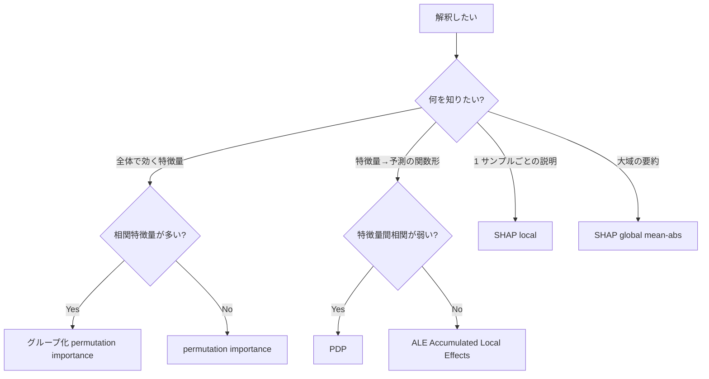

# 第8章　解釈可能性とレポート化

> [!IMPORTANT]
> **本章の到達目標**
>
> - **なぜ解釈するのか**を、Human-in-the-loop の質を上げる視点で言語化できる
> - **permutation importance / PDP / SHAP** の 3 手法の使い分けと落とし穴を説明できる
> - **物理知見との突き合わせ**を仕様書に組み込める
> - **統計的有意 ≠ 物理的意義**の区別を Skill レベルで担保できる
> - 解釈可能性 Skill の 6 要素仕様を書ける
> - 再現可能な解釈レポートを Provenance 付きで生成できる

## 本章で扱わないこと

- **因果推論・因果効果推定**：SHAP 値は因果効果ではない。因果は vol-04 で扱う
- **深層学習モデルの解釈**（Grad-CAM, Attention 可視化等）：vol-03 の範疇
- **LIME**：SHAP に統合されている実務では優先度が低い（比較のみ触れる）
- **公平性・バイアス検知**：関連するが独立トピックで、本書では扱わない

---

## 8.1 なぜ解釈するのか——Human-in-the-loop の質

材料研究で ML を使う目的は多くの場合、**予測そのものではなく「なぜそうなるか」を人間が判断・議論するため**です。予測が当たっても、次の実験計画・論文執筆・共同研究者との合意形成には**理由**が必要です。

エージェント時代には、この「解釈」自体が新しいリスクを持ちます：

| リスク | 例 |
|---|---|
| **もっともらしい解釈のハルシネーション** | 「SHAP 値が高い＝物理的に重要」とエージェントが断言 |
| **解釈手法の選択自体が結果を歪める** | permutation vs SHAP で「重要な特徴」が違う |
| **統計的有意を物理的意義と混同** | p 値が小さい ≠ 材料設計に使える寄与 |
| **解釈が意思決定を後押しする方向にドリフト** | 「解釈できたから採用」の逆算 |

本章の目的は、**解釈手法を Skill として仕様化することで、これらのリスクを事前に封じる**ことです。

---

## 8.2 3 つの解釈手法：使い分けマップ

実務で最初に覚える 3 手法：

| 手法 | 何を測るか | 計算コスト | 主な用途 | 主な落とし穴 |
|---|---|---|---|---|
| **Permutation Importance** | 特徴量をシャッフルした際の予測性能低下 | O(n_features × n_repeats) | どの特徴量がモデルに効いているかの全体像 | 特徴量間の相関に弱い（相関特徴量は互いに importance を下げ合う） |
| **PDP（Partial Dependence Plot）** | 特徴量を変化させたときの平均予測 | O(n_features × grid) | 「その特徴量を増やすとどう変わるか」の可視化 | 特徴量間の相関を無視した外挿を含む |
| **SHAP** | 各サンプル・各特徴量の寄与を Shapley 値で分解 | O(n_samples × モデル依存) | 局所（1 サンプルごと）と大域の両方 | 計算コスト大、tree ベース以外は近似が必要 |

### 選択マップ



> [!NOTE]
> **ALE**（Accumulated Local Effects）は相関特徴量に強く PDP の代替として推奨されますが、scikit-learn 標準ではないため、本書では概念のみ紹介し、実装は SHAP または `alibi` パッケージを推奨します。

### 3 手法は「一致すべき」ではない

読者の直感に反しますが、**3 手法の結果は必ずしも一致しません**。それぞれ**測っているものが違う**からです：

- **permutation importance**：「その特徴量が使えなくなったらどれだけ性能が落ちるか」（モデル性能への貢献）
- **PDP**：「その特徴量を変えたら予測平均はどう動くか」（関数形）
- **SHAP**：「予測値のうちその特徴量が寄与している分」（予測値への貢献）

3 手法で異なる結論が出た場合、それは**モデルが特徴量間の複雑な相互作用を捉えている**サインで、無理に一致させるのではなく**それぞれの解釈**を仕様書に書き込むのが正しい対応です。

---

## 8.3 permutation importance の Skill 化

### 基本と落とし穴

scikit-learn 標準の `permutation_importance`：

```python
from sklearn.inspection import permutation_importance

result = permutation_importance(
    pipeline, X_test, y_test,
    n_repeats=30, random_state=42, n_jobs=-1,
    scoring="neg_root_mean_squared_error",
)

importances = pd.DataFrame({
    "feature":       X_test.columns,
    "importance":    result.importances_mean,
    "std":           result.importances_std,
}).sort_values("importance", ascending=False)
```

**落とし穴**：

1. **test セットで計算する**（train で計算するとリークした特徴量が過大評価される）
2. **`n_repeats=30` 以上**推奨（分散が大きいため）
3. **相関特徴量問題**：`x1` と `x2` が強く相関している場合、片方をシャッフルしても他方から情報が復元でき、両方の importance が過小評価される
4. **符号**：`neg_*` scoring では importance は「性能低下量」なので符号を反転して読む
5. **CV との併用**：CV の各 fold で計算し、fold 間で集約するのが最も安定（第7章 §7.5 と同じ発想）

### 相関特徴量問題の対処

```python
# 相関の強い特徴量をグループ化
from scipy.cluster.hierarchy import linkage, fcluster
from scipy.spatial.distance import squareform

corr = np.abs(X_test.corr().values)
dist = 1 - corr
np.fill_diagonal(dist, 0)
Z = linkage(squareform(dist), method="average")
cluster_ids = fcluster(Z, t=0.3, criterion="distance")   # 0.3 は相関 0.7 相当

# クラスタごとに 1 つずつ「代表特徴量」を選び、それで importance を計算
```

またはシンプルに、**相関 |r| > 0.7 の特徴量ペアがある場合、片方を落としてから計算**する方針もあります。この判断は仕様書に書き込みます。

### Skill 仕様書（抜粋）

```yaml
skill: permutation_importance_v1
purpose: モデルの大域的な特徴量重要度を、test set で評価する

inputs:
  fitted_pipeline: sklearn Pipeline （fit 済み）
  X_test:  pandas.DataFrame
  y_test:  pandas.Series
  correlation_policy:
    threshold: 0.7
    action:    drop_one_of_pair   # または: group_cluster / warn_only

outputs:
  importance_table:  CSV（feature, importance_mean, importance_std, rank）
  importance_plot:   PNG
  provenance:        YAML（後述）

success_criteria:
  primary:   上位 5 特徴量の rank が 3 seed 間で ≥60% 一致
  secondary: importance_std / importance_mean < 0.3（変動係数）

forbidden:
  - train セットでの計算
  - 相関 0.7 超のペアを未処理のまま計算

reproducibility:
  n_repeats:    30
  random_seed:  仕様書 ⑥ に固定
  package_versions: scikit-learn>=1.3
```

---

## 8.4 PDP の Skill 化

### 基本

```python
from sklearn.inspection import PartialDependenceDisplay

fig, ax = plt.subplots(1, 3, figsize=(15, 4))
PartialDependenceDisplay.from_estimator(
    pipeline, X_test, features=["feat_a", "feat_b", ("feat_a", "feat_b")],
    ax=ax, grid_resolution=50,
)
```

### 落とし穴

1. **外挿問題**：`feat_a` のグリッドを [min, max] で切ると、実際には出現しない組み合わせでの予測を含む
2. **相関特徴量問題**：`feat_a` を変えるとき `feat_b` は固定される → 相関があると非現実的な組み合わせを評価
3. **ICE（Individual Conditional Expectation）との併用**：平均だけ見ると Simpson's paradox 的な誤解を招く
4. **`grid_resolution`**：デフォルト 100 は多すぎることが多い、50〜100 で十分

### ICE との併用が必須の場面

**「特徴量の効果はサンプルによって符号が違う」**ような相互作用が強い場合、PDP の平均線だけでは真実を隠します：

```python
PartialDependenceDisplay.from_estimator(
    pipeline, X_test, features=["feat_a"],
    kind="both",   # "average" (PDP) + "individual" (ICE) を両方描く
    subsample=200,
)
```

**ICE 線が交差する**なら相互作用あり、**全 ICE 線が平行**なら平均代表性が高い、というのが実務判断です。

### PDP の代替：ALE

相関特徴量が多い場合、**ALE（Accumulated Local Effects）** の方が現実的な解釈を与えます。scikit-learn 標準にはないため、以下のいずれかを推奨：

- `alibi` パッケージ：`from alibi.explainers import ALE`
- `PyALE` パッケージ：軽量な独立実装

「PDP と ALE の結果が乖離する ＝ 相関特徴量の影響が強い」という診断としても使えます。

---

## 8.5 SHAP の Skill 化

### 基本

```python
import shap

# tree ベースモデルなら TreeExplainer（高速・厳密）
explainer = shap.TreeExplainer(pipeline.named_steps["model"])
X_test_transformed = pipeline[:-1].transform(X_test)   # 前処理後空間
shap_values = explainer.shap_values(X_test_transformed)

# 大域：feature importance
shap.summary_plot(shap_values, X_test_transformed,
                  feature_names=X_test.columns, plot_type="bar")

# 局所：1 サンプル
shap.waterfall_plot(shap.Explanation(
    values=shap_values[0], base_values=explainer.expected_value,
    data=X_test_transformed[0], feature_names=X_test.columns,
))
```

### 落とし穴と実務判断

1. **モデルタイプで explainer を選ぶ**：
   - tree（RF, GBM, XGBoost, LightGBM, CatBoost）→ `TreeExplainer`（厳密・高速）
   - 線形 → `LinearExplainer`
   - それ以外（NN, SVM, カスタム）→ `KernelExplainer`（近似・遅い）または `Explainer`（自動選択）
2. **前処理後の空間で計算する**：Pipeline の場合、`pipeline[:-1].transform(X_test)` で前処理後空間に移してから explainer に渡す
3. **相関特徴量問題は SHAP でも残る**：`TreeExplainer(feature_perturbation="tree_path_dependent")` は tree の構造を使うので相関に堅牢、`"interventional"` は独立性を仮定する（データが必要）
4. **`shap_values` の形状**：回帰は `(n, p)`、多クラス分類は `(n_class, n, p)` のリスト
5. **SHAP 値の合計 = 予測値 - base_value**（線形性）：この性質は「1 サンプルの予測を分解する」ため
6. **符号は「予測値への寄与」**：回帰なら y の単位、二値分類なら logit または確率

### Skill 仕様書（抜粋）

```yaml
skill: shap_interpretation_v1
purpose: モデルの局所・大域の解釈を SHAP 値で生成する

inputs:
  fitted_pipeline: sklearn Pipeline （fit 済み）
  X_test:  pandas.DataFrame
  model_type: "tree" | "linear" | "kernel"   # explainer 選択根拠
  feature_perturbation: "tree_path_dependent" | "interventional"

outputs:
  shap_values:      npz（形状記録）
  summary_plot:     PNG（bar + beeswarm）
  waterfall_plots:  PNG × N（代表 N サンプル）
  provenance:       YAML

success_criteria:
  primary:  上位 5 特徴量の rank が permutation importance と 3/5 以上一致
  secondary: waterfall で報告される特徴量が、対応 PDP と符号一致

forbidden:
  - 前処理を含まない空間で explainer に渡す
  - モデルタイプ未確認のまま KernelExplainer を default で使う
  - shap_values の平均絶対値だけで「重要度」と呼ぶ（分布を無視する）

reproducibility:
  random_seed:      42
  shap_version:     ">=0.44"
  sample_selection: 独立テストから固定 index（seed 42, 100 サンプル）
```

---

## 8.6 物理知見との突き合わせ

材料科学の解釈は、**統計的重要度と物理的意義の合致・乖離**の両方が意味を持ちます：

| 状況 | 意味 | 対応 |
|---|---|---|
| 統計的に重要 + 物理的に既知 | 妥当性の確認 | 「モデルは既知物理を捉えている」と報告 |
| 統計的に重要 + 物理的に未知 | **仮説発見**の候補 | 追実験・文献調査で検証 |
| 統計的に非重要 + 物理的に既知 | **モデル設計の問題** | 特徴量表現・データ量・モデル種類を再検討 |
| 統計的に非重要 + 物理的に非重要 | ノイズ / 無関係 | 特徴量から除外を検討 |

**エージェントに解釈を丸投げしない**ためのプロトコル：

1. 解釈結果を**まず数値・図として提示させる**（言葉での「この特徴量が重要」を先に出させない）
2. 人間が**物理的意義との照合**を行う
3. エージェントには**照合結果を仕様書に書く支援**を依頼する
4. **統計的有意を「物理的意義」と読み替える解釈をエージェントが提示したら訂正**する

### 解釈レポートの書き方

解釈結果を書くときは、**測ったもの・測っていないものを明示**します：

- ❌ 「`bandgap_expt` が最も重要な特徴量」
- ✅ 「`bandgap_expt` は permutation importance で 1 位（±0.03 eV）だが、`element_composition` との相関が |r|=0.72 と強く、この 2 つは分離できていない可能性がある」

---

## 8.7 統計的有意 ≠ 物理的意義

第9章の入り口として、本章でも触れておくべき論点です。**エージェントが「有意差あり」を「意味がある」に読み替える**のは、実務で最頻の失敗です：

| 概念 | 定義 | 材料研究での意味 |
|---|---|---|
| **統計的有意** | 帰無仮説の下でその差以上が観測される確率が低い | 「偶然ではなさそう」 |
| **効果量** | 差の大きさ（Cohen's d, r², 説明分散等） | 「どれくらい大きい差か」 |
| **物理的意義** | 材料設計・実験計画への影響 | 「その差を活かせるか」 |

**Skill 仕様書 ⑤ 禁止事項**に次を必ず入れます：

- p 値のみで「意味がある」と結論しない
- 効果量とその不確かさを併記する
- 物理的閾値（例：「合成再現性の範囲は ±0.1 eV」）を仕様書 ④ の成功条件に書く

### 有意 vs 効果量のワークシート

解釈レポートには、次の 3 列を必ず併記します：

| 特徴量 | 効果推定値 | 95% CI | 物理的閾値 | 判断 |
|---|---|---|---|---|
| `feat_a` | +0.05 eV | [+0.02, +0.08] | ±0.10 eV | 有意だが閾値未満 → 参考 |
| `feat_b` | +0.30 eV | [+0.20, +0.40] | ±0.10 eV | 有意かつ閾値超 → **設計に反映** |
| `feat_c` | +0.15 eV | [-0.05, +0.35] | ±0.10 eV | 閾値超だが不確か → 追実験 |

---

## 8.8 再現可能な解釈レポート

解釈は **Skill 実行の provenance に必ず添付**されるべき成果物です。Appendix A の provenance スキーマ拡張：

```yaml
interpretation_report:
  methods_used: [permutation_importance, pdp, shap]
  method_versions:
    scikit_learn: 1.5.0
    shap:         0.45.0

  permutation_importance:
    file:              artifacts/permimp.csv
    n_repeats:         30
    scoring:           neg_root_mean_squared_error
    correlation_policy_applied: drop_one_of_pair

  pdp:
    features:          [feat_a, feat_b, "(feat_a, feat_b)"]
    ice_included:      true
    grid_resolution:   50

  shap:
    explainer:                 TreeExplainer
    feature_perturbation:      tree_path_dependent
    n_samples:                 100
    sample_selection_seed:     42

  cross_method_agreement:
    top5_permimp_vs_shap_kendall_tau: 0.63

  physical_interpretation:
    known_physics_match:      [feat_a, feat_b]
    novel_hypothesis:         [feat_c]
    discrepancy_with_physics: []
    reviewed_by:              "PI name"
    review_date:              2026-XX-XX
```

**cross_method_agreement** を Kendall's τ で数値化することで、「3 手法が食い違ったら要注意」を機械的に検知できます。

### レポート生成の Skill 化

解釈レポート生成自体を Skill にすることで、**エージェントに毎回同じ形式で書かせる**：

```yaml
skill: interpretability_report_v1
purpose: 3 手法（permutation / PDP / SHAP）の結果と物理知見の照合を統合レポートにする

inputs:
  permimp_result:    permutation_importance_v1 の出力
  pdp_result:        pdp_v1 の出力
  shap_result:       shap_interpretation_v1 の出力
  physical_priors:   YAML（既知物理・閾値）

outputs:
  interpretation_report:  Markdown + PDF
  cross_method_table:     CSV（特徴量 × 手法の順位表）
  discrepancy_flags:      YAML（3 手法乖離 / 物理知見乖離）

success_criteria:
  primary:  上記 4 象限（統計 × 物理）のすべてに 1 件以上が分類されている
            （偏った象限しかないのは分析不足のサイン）
  secondary: 物理知見との照合が PI レビュー済み（review_date が記録されている）

forbidden:
  - p 値のみで「意味がある」と結論する
  - SHAP の絶対値平均を「特徴量重要度」と単独で呼ぶ
  - 効果量と不確かさを併記せずに「重要度ランキング」を出す
```

---

## 8.9 章末チェックリスト

**解釈手法選択チェック**（severity 付き）：

- [ ] 🔴 test セットで計算した（train ではない）
- [ ] 🔴 前処理後の空間で SHAP に渡した
- [ ] 🔴 permutation importance の `n_repeats ≥ 30`
- [ ] 🟡 相関特徴量ペア（|r| > 0.7）の処理方針を仕様書に書いた
- [ ] 🟡 PDP と ICE を併用（相互作用が疑われる場合）
- [ ] 🟡 SHAP explainer をモデルタイプに応じて選んだ

**解釈結果の書き方チェック**：

- [ ] 🔴 効果量と 95% CI を必ず併記
- [ ] 🔴 物理的閾値を仕様書 ④ の成功条件に書いた
- [ ] 🔴 3 手法の cross_method_agreement を数値化（Kendall's τ 等）
- [ ] 🟡 統計 × 物理の 4 象限に特徴量を分類した
- [ ] 🟡 PI / 共同研究者のレビュー日付を provenance に記録

**エージェント運用チェック**：

- [ ] 🔴 エージェントに数値・図を先に出させ、言葉での「重要」判定は最後
- [ ] 🟡 統計的有意を「物理的意義」に読み替える解釈を検知したら訂正
- [ ] 🟡 解釈レポート生成自体を Skill 化した

---

## 8.10 章末ワーク

1. **3 手法の cross_method_agreement を測る**：第5章 §5.7（MatBench）または §5.8（RRUFF）のデータで、permutation / PDP / SHAP の上位 5 特徴量ランキングを Kendall's τ で比較。0.5 未満なら仕様書に「3 手法乖離要因」を追記
2. **相関特徴量ペアの検知**：`|r| > 0.7` の特徴量ペアを列挙し、片方削除 or クラスタ化 or 併存の 3 案の効果を比較
3. **統計 × 物理 4 象限に特徴量を分類**：自分のドメインの既知物理を持ち込み、モデルの上位特徴量を 4 象限（既知 × 統計重要 / 既知 × 非重要 / 未知 × 統計重要 / 未知 × 非重要）に振り分ける
4. **効果量 + 物理的閾値のワークシート**：§8.7 の表を、自分のプロジェクトの 3 特徴量で埋める
5. **解釈レポート Skill を実装**：§8.8 の `interpretability_report_v1` を実装し、第5章のいずれかのハンズオンに適用

---

## 8.11 本章のまとめ

- 解釈の目的は **Human-in-the-loop の質を上げる**こと。予測性能とは独立の Skill 責務
- **3 手法**（permutation / PDP / SHAP）は測っているものが違うため、一致しないのが自然。乖離を数値化して報告する
- **相関特徴量問題**は 3 手法すべてに影響。事前の処理方針を仕様書で凍結
- **物理知見との突き合わせ**を統計 × 物理の 4 象限で行う。エージェント任せにしない
- **統計的有意 ≠ 物理的意義**。効果量と物理的閾値の併記を仕様書 ④ に組み込む
- 解釈レポート自体を Skill 化し、`provenance.interpretation_report` に完全記録する
- 次章（第9章）で、この「効果量と不確かさ」を頻度論から Bayesian へ橋渡しする

---

## 参考資料

### 本書内の該当章

- 第4章 §4.5：Skill 設計の禁止事項（解釈手法にも適用）
- 第7章 §7.5：Pipeline による前処理リーク防止（SHAP に前処理後空間で渡すため）
- 第9章：頻度論と Bayesian の橋、効果量の不確かさ表現へ
- 第14章：解釈の失敗パターン（vol-01 第14章の統計版）
- 付録A：provenance スキーマ拡張（`interpretation_report` 含む）

### 外部参考

<a id="ref-8-1">[8-1]</a> Molnar, C. (2022). *Interpretable Machine Learning*. 2nd ed. [https://christophm.github.io/interpretable-ml-book/](https://christophm.github.io/interpretable-ml-book/) — 本章の理論的土台
<a id="ref-8-2">[8-2]</a> Lundberg, S. M., & Lee, S.-I. (2017). A Unified Approach to Interpreting Model Predictions. *NeurIPS*. — SHAP 原論文
<a id="ref-8-3">[8-3]</a> Fisher, A., Rudin, C., & Dominici, F. (2019). All Models are Wrong, but Many are Useful: Learning a Variable's Importance by Studying an Entire Class of Prediction Models Simultaneously. *JMLR*, 20(177). — permutation importance の理論
<a id="ref-8-4">[8-4]</a> Apley, D. W., & Zhu, J. (2020). Visualizing the effects of predictor variables in black box supervised learning models. *JRSS-B*, 82(4), 1059–1086. — ALE の原典
<a id="ref-8-5">[8-5]</a> Wasserstein, R. L., & Lazar, N. A. (2016). The ASA Statement on p-Values: Context, Process, and Purpose. *The American Statistician*, 70(2), 129–133. — 統計的有意の限界
<a id="ref-8-6">[8-6]</a> SHAP 公式ドキュメント：[https://shap.readthedocs.io/](https://shap.readthedocs.io/)
<a id="ref-8-7">[8-7]</a> scikit-learn Inspection モジュール：[https://scikit-learn.org/stable/modules/inspection.html](https://scikit-learn.org/stable/modules/inspection.html)
