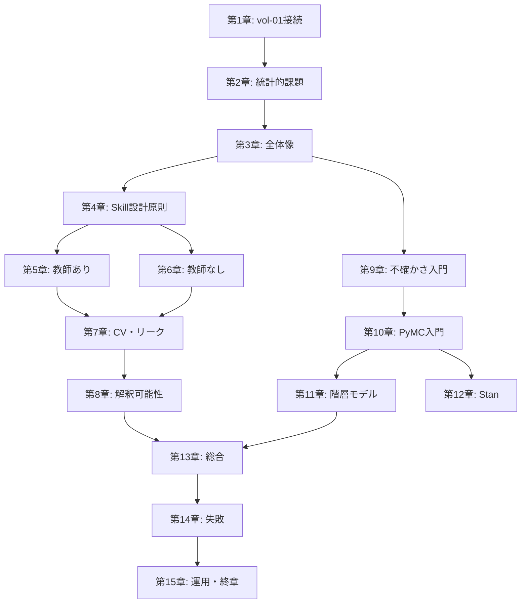

# 「AI エージェント時代の統計・機械学習分析入門」章構成（v0.1 ドラフト）

> vol-02 は vol-01「AI エージェント時代のデータ分析入門」の続編。
> vol-01 が「動く Skill を 1 つ自力で作る」までを扱ったのに対し、
> vol-02 は **その Skill に統計的・機械学習的な厚みを持たせ、不確かさまで含めて主張できる分析** に踏み込む。

## 前提

- **対象読者**: ARIM データポータル会員のデータ分析者（材料・ナノテク研究者）。Python / Jupyter 経験あり
- **vol-01 との関係**: vol-01 完読を推奨（**必須ではない**）。vol-01 未読者向けに、重要用語（Skill / MCP / Human-in-the-loop / データ契約 / provenance）は第1〜3章で最小限に再説明する
- **最終ゴール（合格ライン）**:
  読者が自分の実験データに対し、以下の 3 つを 1 つずつ以上、動く・検証済み・再現できる形で作れること
  1. **Scikit-learn を核にした統計/ML Skill**（回帰・分類・PCA・クラスタリングのいずれか）
  2. **PyMC を核にした Bayesian Skill**（事後分布 / 信用区間 / 事後予測チェックまで含む）
  3. **階層モデルの Skill**（装置間・ロット間・研究室間のばらつきを扱う）
- **分量目安**: 実践書（220〜270 ページ規模）
- **期限**: 6 か月
- **ハンズオン標準環境**（vol-01 に追加）:
  - vol-01 標準 + `scikit-learn`, `pandas`, `numpy`, `scipy`, `matplotlib`, `seaborn`（多くは vol-01 で導入済み）
  - `pymc`（+ `arviz`, `numpyro` バックエンド）
  - `shap`, `pdpbox`（解釈可能性）
  - `cmdstanpy`（Stan 章のみ）
- **参照**:
  - PyMC 公式: https://www.pymc.io/
  - Scikit-learn 公式: https://scikit-learn.org/
  - ArviZ 公式: https://python.arviz.org/
  - Stan 公式: https://mc-stan.org/
  - vol-01 リポジトリ（本書の前提）

## 6 データ型と統計/ML 手法の対応

vol-01 で導入した 6 データ型に、vol-02 の手法をマッピングする。

| データ型 | Scikit-learn の主用途 | PyMC / 階層モデルの主用途 |
|---|---|---|
| スペクトル型 | PCA・クラスタリングによるスペクトル群分類、多変量校正（PLS 等）、ピーク面積からの物性回帰 | 校正曲線のベイズ推定、装置間校正のプーリング、ピークパラメータの事後分布 |
| クロマトグラム・時系列型 | 分類、外れ試料検出、次元削減 | 反応速度定数の事後分布、階層時系列（バッチ間ばらつき） |
| 画像・顕微鏡型 | 特徴量エンジニアリング後の分類・回帰、次元削減 | 粒径分布のベイズ推定、階層モデル（試料間ばらつき） |
| 回折・散乱パターン型 | パターンクラスタリング、相同定の分類 | 格子定数の事後分布、Rietveld パラメータの不確かさ |
| 表形式・プロセス条件型 | 物性予測（RF / GBM / 線形回帰）、感度分析、外れ点検出 | 実験計画への事後分布反映、ロット間・オペレータ間の階層モデル |
| マルチモーダル統合型 | 統合特徴量からの予測、モダリティ間相関 | 統合ベイズモデル（測定モデルの明示化） |

## 章構成案（15 章 + 3 付録）

### 第I部　なぜ「エージェント × 統計・ML」なのか（目安 25〜30 ページ）

| 章 | タイトル | 責務（扱う／扱わない） | 成果物 |
|---|---|---|---|
| 第1章 | vol-01 の Skill に何が足りないのか | 統計/ML の必要性、vol-01 との接続、vol-02 のゴール。技術詳細は扱わない | 本書の到達点と読者ルート |
| 第2章 | ARIM データに現れる統計的課題 | 小サンプル・階層構造・測定誤差・物理制約——なぜ頻度論だけでは足りないか。具体手法は扱わない | 自分のデータの統計的性質の分類 |
| 第3章 | Scikit-learn と PyMC の全体像・使い分け | 2 つの柱の位置づけ、Stan との関係、Jupyter MCP 経由の使用方針。実装は扱わない | 使い分けマップ |

### 第II部　Scikit-learn で足場を築く（目安 55〜65 ページ）

| 章 | タイトル | 責務 | 成果物 |
|---|---|---|---|
| 第4章 | 統計/ML 分析用 Skill の設計原則 | vol-01 第7章の延長。**評価指標の選び方**（MAE/RMSE/R²/ROC-AUC 等）、データ分割方針、循環設計問題の統計版。実行後検証は第10章 | 統計/ML Skill 仕様書テンプレート |
| 第5章 | 教師あり学習を Skill 化する | 回帰（線形・RF・GBM）と分類。校正曲線・物性予測・スペクトル分類の 3 例をハンズオン化。**Skill 内で train/val/test 分割と評価まで自動化**。ハイパーパラメータ探索は第7章 | 教師あり学習 Skill |
| 第6章 | 教師なし学習を Skill 化する | PCA・クラスタリング（k-means, HDBSCAN）・異常検知。スペクトル群・回折パターン群・顕微鏡画像特徴量への適用。可視化まで含める | 教師なし学習 Skill |

### 第III部　落とし穴と検証（目安 40〜50 ページ）

| 章 | タイトル | 責務 | 成果物 |
|---|---|---|---|
| 第7章 | モデル選択・交差検証・データリーク検知 | 交差検証設計（k-fold / grouped / time-series）、ネスト CV、**エージェント特有のリーク**（同一試料が train/test 両方に入る等）の予防と検知 | CV 設計チェックリスト |
| 第8章 | 解釈可能性とレポート化 | SHAP・PDP・permutation importance。**Human-in-the-loop の質を上げる**視点で扱う。ブラックボックスと物理知見の突き合わせ | 解釈可能性 Skill／再現可能レポート |

### 第IV部　PyMC で不確かさを扱う（目安 60〜75 ページ）

| 章 | タイトル | 責務 | 成果物 |
|---|---|---|---|
| 第9章 | 不確かさ入門：頻度論の限界と Bayesian への橋 | 信頼区間 vs 信用区間、事前分布の意味、なぜ材料科学で Bayesian か。**この章では PyMC コードは最小限**、概念に絞る | 不確かさ表現の言語化 |
| 第10章 | PyMC 入門と Skill 化 | `pm.Model` の基本、MCMC 診断（$\hat{R}$・ESS）、事後予測チェック、ArviZ 可視化。**校正曲線のベイズ版**をハンズオン | 基本 PyMC Skill |
| 第11章 | 階層モデル：装置間・ロット間・研究室間 | Partial pooling、非中心化パラメータ化、収束問題。**ARIM 特有の階層構造**を素材にする | 階層モデル Skill |
| 第12章 | Stan との使い分け | Stan の基本文法、PyMC → Stan 移植の勘所、Stan が勝つケース（大規模階層、既存論文再現）。**1 章で完結**、深追いしない | Stan 判断マップ／論文コードを読める最低限 |

### 第V部　総合・運用・失敗（目安 35〜45 ページ）

| 章 | タイトル | 責務 | 成果物 |
|---|---|---|---|
| 第13章 | 総合ハンズオン：材料データで scikit-learn → PyMC → 階層モデル | 1 つの実データを、まず scikit-learn で当たりを付け、次に PyMC で不確かさを付け、最後に階層モデルで装置間差を扱う。**vol-02 全体の統合演習** | 統合 Skill |
| 第14章 | 統計/ML 特有の失敗パターン | データリーク・p-hacking・過学習・事前分布の暴走・MCMC 未収束・多重比較の罠。vol-01 第14章の統計版 | 統計/ML 失敗チェックリスト |
| 第15章 | 組織共有パターンと終章 | Skill 共有 vs 専用 MCP（scikit-learn-mcp/pymc-mcp）化 vs テンプレ配布の判断基準、監査ログ、vol-01+02 の到達点 | 組織展開方針 |

### 付録（目安 30〜40 ページ）

| 付録 | タイトル | 内容 |
|---|---|---|
| 付録A | 統計/ML Skill テンプレート集 | 回帰／分類／PCA／クラスタリング／Bayesian／階層モデル の Skill 雛形。vol-01 付録A と互換の provenance スキーマを使用 |
| 付録B | Scikit-learn / PyMC / Stan チートシート | よく使う API、事前分布の選び方、診断コード集、MCMC トラブル対処 |
| 付録C | 統計/ML 特有のトラブルシューティング | 収束しない・警告地獄・過学習・データリーク疑い・特徴量スケーリング問題。vol-01 付録C との差分に絞る |

## 責務分離マップ（重複防止）

### vol-02 内での分離

| 論点 | 予防・設計側 | 実行・事例側 |
|---|---|---|
| 評価指標選択 | 第4章（設計時） | 第10章（実行時の診断） |
| データリーク | 第7章（予防・検知） | 第14章（事例） |
| 過学習 | 第4章（設計）・第7章（CV） | 第14章（事例） |
| 事前分布 | 第9章（概念）・第10章（実装） | 第14章（暴走事例） |
| MCMC 収束 | 第10章（診断手順） | 第14章（未収束事例） |

### vol-01 との分離

| 論点 | vol-01 側 | vol-02 側 |
|---|---|---|
| Skill 設計原則 | 一般則（第7章） | 統計/ML 特有の指標・分割（第4章） |
| データ契約 | 全般（第8章） | 統計/ML 用の追加要素（第4章で差分説明） |
| 検証 | 物理的妥当性中心（第12章） | 統計指標・不確かさ中心（第10章・第14章） |
| 失敗パターン | 循環設計・漏洩・ハルシネーション（第14章） | データリーク・p-hacking・収束不良（第14章） |
| 装置別テンプレート | 6 データ型テンプレート（第13章） | 6 データ型 × 統計/ML の対応マップ（第2章・付録A） |

## 各ハンズオン章の共通構成

vol-01 と同形式。**第5章で丁寧に説明し、以降の第6・第10・第11・第13章は差分中心**。

- この章で作る Skill の概要
- 入力仕様 / 出力仕様 / 制約条件（vol-01 のデータ契約に準拠）
- **統計/ML 特有の評価基準**（CV 設計・診断指標・事後予測チェック等）
- 実行例 / 失敗例 / 改善版
- 他データ型への転用方法

## 特に注意する重点管理項目

| 項目 | 予防・設計 | 事例・検証 |
|---|---|---|
| データリーク（同一試料が train/test 両方） | 第7章 | 第14章 |
| p-hacking / 多重比較 | 第4章・第7章 | 第14章 |
| 事前分布の主観混入 | 第9章・第10章 | 第14章 |
| MCMC 未収束を "動いた" と誤解 | 第10章 | 第14章 |
| 統計的有意 ≠ 物理的意義 | 第8章・第9章 | 第14章 |
| エージェントによる指標選択の恣意性 | 第4章（循環設計問題の統計版） | 第14章 |

## 章間依存図（Mermaid）

## 未確定事項（v0.2 で議論）

- [ ] 対象データセットの選定：vol-01 で使ったデータセットを継続 or 新規（Materials Project / NOMAD 等）
- [ ] `numpyro` バックエンドを標準にするか（速度大幅向上・GPU 対応）
- [ ] 第12章 Stan の分量（1 章 20 ページ or 章末付録 5 ページ）
- [ ] 深層学習を扱うか（**現案では扱わない**。vol-03 候補）
- [ ] 因果推論（DoWhy / EconML）を扱うか（**現案では扱わない**）
