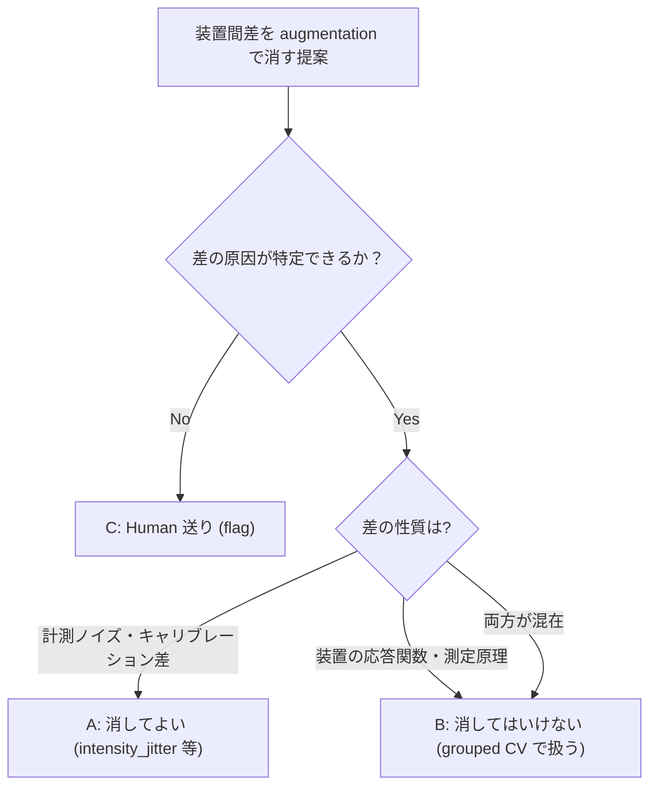

# 第5章　前処理と Augmentation の Skill 化 — Agentic 契約と深層 anti-leakage

第4章で設計した **深層 × Agentic Skill 仕様書テンプレート**（§4.9）と **provenance スキーマ**（§4.10）を、この章では **データ流路の契約**という側面から埋めていきます。データを深層モデルに流し込む前段には、統計/古典 ML には存在しなかった**深層特有の落とし穴**があります。

vol-02 第4-5 章では、`data_split` と CV 設計を **anti-leakage split contract** として言語化しました。この章はその契約を、深層 × Agentic 時代の**追加要件**——augmentation・事前学習データ重複・装置間差の判断ゲート——で拡張します。

> [!NOTE]
> **この章の到達目標**：
> - 深層版 anti-leakage split contract に必要な 3 つの追加要件を列挙できる
> - Augmentation contract の 3 要素（train-only / 物理妥当性 / エージェント権限）を Skill 契約に書ける
> - 装置間差を augmentation で「消してよい / 消してはいけない / Human 送り」の 3 分岐で判断できる
> - エージェントが augmentation の強度を勝手に変更しないための契約を書ける
>
> **この章で扱わないこと**：
> - 具体的な深層モデル実装（第6章）
> - 転移学習の fine-tune 戦略（第7章）
> - 不確かさ推定（第8-9章）
> - Foundation Model への augmentation 適用（第11-12 章で言及）

---

## 5.1 この章で作る Skill（2 種）

この章では 2 つの Skill を作ります。どちらも **契約定義中心**の Skill であり、以降の第6-13 章のハンズオンから常に呼び出されます。

| Skill 名 | 目的 | 出力 |
|---|---|---|
| **`deep_split_contract`** | 学習/検証/テスト分割 + 事前学習データ重複チェック + augmentation 適用範囲を **契約 YAML** として固定 | `split_contract.yaml`、分割インデックス、`leakage_audit.log` |
| **`augmentation_contract`** | データ型・装置種類ごとに augmentation の**契約**（何を・どの強度で・train のみに）を固定 | `augmentation_contract.yaml`、augmentation 適用ログ |

> [!IMPORTANT]
> **これらは「実装 Skill」ではなく「契約 Skill」**です。実際の augmentation 演算（回転・ノイズ付与など）を担うのは第6-7 章のモデル学習 Skill ですが、**契約が先**にあることで、エージェントが augmentation を勝手に強めることを防ぎます。契約なしのハンズオンは vol-03 では書きません。

---

## 5.2 なぜ深層 × Agentic で特別に問題になるか

vol-02 第4-5 章の anti-leakage split contract は、以下を扱いました：

- 分布分割（random split / stratified split / grouped split）
- CV 設計（fold 数、outer/inner CV、時系列 split）
- 特徴量に目的変数が混入していないか

深層 × Agentic では、これに **3 つの新問題**が加わります。

### 新問題 1：Augmentation の物理妥当性

深層モデルの標準ワークフローには **data augmentation**（回転・反転・ノイズ付与・intensity jitter など）が組み込まれています。しかし ARIM のような材料計測データでは、augmentation の多くが**物理的に無意味・または誤った学習を誘発**します。

| データ型 | よく使われる augmentation | 物理的に妥当か？ |
|---|---|---|
| SEM 画像 | 水平フリップ | **場合による**（結晶方位を持つ場合は破壊、非晶質なら OK） |
| SEM 画像 | 90° 回転 | **多くの場合 NG**（結晶方位・成長方向を破壊） |
| XRD パターン | 水平フリップ（2θ 反転） | **NG**（物理的に無意味、負角度は存在しない） |
| XRD パターン | intensity jitter（強度スケール） | **OK**（検出器ゲイン差の模倣） |
| スペクトル | 波数シフト | **場合による**（キャリブレーション差の範囲内なら OK、それ以上は装置種類の変化と混同） |
| 時系列（計測ログ） | 時間反転 | **NG**（因果性を壊す） |

**エージェントは物理妥当性を判断できません**。契約に「このデータ型ではどの augmentation を許すか」を **Human が事前定義**する必要があります。

### 新問題 2：事前学習データとの重複

Foundation Model や pretrained CNN（ImageNet 事前学習など）を使う場合、**事前学習データと自研究のテストデータが重複**すると、汎化性能を過大評価します。特に：

- 材料 FM（MatBERT / CrystaLLM）が Materials Project や ICSD で事前学習されている場合、それらから派生した自研究データはリークの可能性
- Foundation Model の事前学習データが**公開されていない**場合（`pretraining_dataset_license: unknown`、第3章 §3.7）、重複チェック自体が不可能 → **契約上「重複可能性あり」と明記**して結果解釈時に反映

### 新問題 3：エージェントによる augmentation の勝手な強化

エージェントは「精度が上がった」を根拠に、**augmentation 強度を勝手に上げる**ことができます（回転角度を広げる、ノイズを増やす、mixup を混ぜる）。これは第4章 §4.6 で扱った**循環設計問題の深層版**の典型例です。契約で `augmentation_config` を固定し、変更を audit violation にする必要があります（第4章 §4.8 C 分類）。

---

## 5.3 深層版 anti-leakage split contract

vol-02 の split contract に、深層特有の 3 フィールドを追加します。

### 契約 YAML（拡張版）

```yaml
# split_contract.yaml
version: "1.0"

# vol-02 継承部
split_scheme:
  type: "grouped_5fold"       # random / stratified / grouped / temporal
  group_key: "instrument_id"  # 装置別 CV（第7章）
  test_ratio: 0.2
  val_ratio: 0.1
  random_seed: 42
  stratify_by: "class_label"

leakage_prevention:
  target_leakage_check: true      # 特徴量に目的変数が混入していないか
  temporal_order_preserved: true  # 時系列データの場合

# vol-03 追加：事前学習データ重複チェック
pretraining_data_overlap:
  applicable: true            # Foundation Model / pretrained weight を使うか
  pretraining_dataset:
    name: "Materials Project"
    version: "v2024.01"
    identifier_column: "material_id"   # 重複判定に使うカラム
  check_method: "identifier_hash_join"  # または "content_hash", "unknown"
  overlap_action: "exclude_from_test"   # exclude_from_test / warn / block
  overlap_audit_log: "leakage_audit.log"
  # 事前学習データが公開されていない場合
  unknown_dataset_policy: "flag_and_document"

# vol-03 追加：Augmentation 適用範囲
augmentation_scope:
  applied_to: ["train"]       # ["train"] のみ許可、["val", "test"] は禁止
  seed_isolation: true        # augmentation 用 RNG を学習用と分離
  log_applied_transforms: true

# vol-03 追加：CLIP-like モデルの text-image leakage
multimodal_leakage_check:
  applicable: false           # CLIP / MoLFormer など text-image / text-graph の場合 true
  text_test_set_seen_in_pretraining: "unknown"  # true / false / unknown
```

### `pretraining_data_overlap` の 3 ケース

| ケース | `check_method` | `overlap_action` | 備考 |
|---|---|---|---|
| 事前学習データが公開・識別子で照合可 | `identifier_hash_join` | `exclude_from_test` | Materials Project の `material_id` など |
| 事前学習データは公開だが識別子が異なる | `content_hash` | `exclude_from_test` or `warn` | 内容ハッシュで近似判定 |
| 事前学習データが非公開 | `unknown` | `flag_and_document` | ライセンスが `unknown`（第3章 §3.7） |

> [!WARNING]
> **`unknown` ケースこそが最も危険**です。「チェックできない ＝ 重複はない」と結論してはいけません（第2章の**absence of evidence ≠ evidence of absence**、第14章で失敗事例）。契約に `unknown_dataset_policy: flag_and_document` を書き、レポートに「事前学習データ非公開のため独立性未検証」と明記します。

---

## 5.4 データローダ設計と split の実装

vol-02 の CV 実装（sklearn の `GroupKFold` 等）は深層でもそのまま使いますが、**PyTorch/JAX の DataLoader を通す**ことで new なリスクが加わります。

### DataLoader worker seed の provenance 連携

PyTorch `DataLoader` は複数 worker を並列起動して I/O を並列化します。各 worker の RNG seed は**明示的に設定**しないと、実行ごとに異なる augmentation シーケンスが適用され、**再現性が壊れます**（第2章 §2.3 で扱った GPU 非決定性とは別の非決定性）。

```python
# 概念コード（実装は第6章）
def worker_init_fn(worker_id):
    # worker_id ごとに base_seed から派生
    worker_seed = torch.initial_seed() % 2**32
    numpy.random.seed(worker_seed)
    random.seed(worker_seed)

loader = DataLoader(
    dataset,
    batch_size=32,
    num_workers=4,
    worker_init_fn=worker_init_fn,   # 必須
    generator=torch.Generator().manual_seed(42),
)
```

**provenance への記録**（第4章 Layer 1 の `gpu_backend.random_seed_per_worker` に対応）：

```yaml
gpu_backend:
  random_seed_per_worker: [42, 43, 44, 45]
```

### stratified × grouped × augmentation の順序

3 種類の制約が絡む場合、順序を **契約で固定**しないとエージェントが実装で入れ替える可能性があります。

```
[1] grouped split（装置別分割、vol-02 第7章）
    ↓
[2] stratified check（class 分布が train/val/test でずれていないか）
    ↓
[3] augmentation は train のみに適用（split 完了後）
```

**逆順は禁止**（fatal）：augmentation してから split すると、同じ元サンプルの拡張版が train と test の両方に入り、**深層特有のリーク**が発生します。

---

## 5.5 Augmentation contract Skill

Augmentation の契約は **3 要素**で書きます。

| 要素 | 意味 | エージェント可否 |
|---|---|---|
| **① Applied scope（適用範囲）** | train のみ / val / test のいずれに適用するか | **Human 固定**（変更不可） |
| **② Physical validity（物理妥当性）** | データ型ごとに許可される augmentation 種類 | **Human 事前定義** |
| **③ Agent permission（エージェント権限）** | エージェントが強度・種類を選ぶ範囲 | Skill 契約の `approved_augmentation_set` で数値化 |

### 契約 YAML

```yaml
# augmentation_contract.yaml
version: "1.0"
data_type: "spectrum"        # spectrum / image / pattern / timeseries / tabular / multimodal
applied_scope:
  train: true
  val: false                 # 変更禁止（第4章 §4.8 A 分類 fatal）
  test: false                # 変更禁止

# データ型ごとの許可 augmentation リスト（Human 事前定義）
allowed_augmentations:
  - name: "intensity_jitter"
    physical_validity: "OK"     # 検出器ゲイン差の模倣として妥当
    strength_range: [0.05, 0.15]
  - name: "gaussian_noise"
    physical_validity: "OK"     # 計測ノイズの模倣
    sigma_range: [0.01, 0.05]
  - name: "wavelength_shift"
    physical_validity: "conditional"  # キャリブレーション差の範囲内のみ
    shift_range_nm: [-0.5, 0.5]

# 禁止 augmentation（データ型ごとに明示）
prohibited_augmentations:
  - name: "horizontal_flip"
    reason: "物理的に無意味（波数の負値は存在しない）"
    severity: "fatal"
  - name: "vertical_flip"
    reason: "強度の負値は物理的に不可能"
    severity: "fatal"
  - name: "time_reversal"
    reason: "計測時系列の因果性を壊す"
    severity: "fatal"

# エージェントの選択権限（第4章 §4.7 と連動）
agent_permission:
  level: L2                  # L1 / L2 / L3
  approved_augmentation_set: ["intensity_jitter", "gaussian_noise"]
  strength_selection: "within_range_only"   # within_range_only / fixed / free
  can_add_new_augmentation: false           # L1/L2/L3 すべて禁止
  can_modify_strength_range: false          # 全レベル禁止（audit violation）
```

### データ型別の物理妥当性テーブル（Human が事前作成）

| データ型 | OK | 条件付き OK | NG（fatal） |
|---|---|---|---|
| **XRD パターン** | intensity_jitter、poisson_noise | peak_broadening（測定条件シミュレーション） | horizontal_flip、rotation、time_reversal |
| **SEM 画像**（結晶方位あり） | intensity_jitter、gaussian_noise、gaussian_blur | 小角度回転（±5° 以内、成長方向を保つ） | 90°/180° 回転、flip |
| **SEM 画像**（非晶質） | 上 + horizontal_flip、90° 回転 | mixup | vertical_flip（下地判定を壊す場合） |
| **スペクトル**（IR/Raman） | intensity_jitter、gaussian_noise | wavelength_shift（キャリブレーション範囲内） | horizontal_flip、cutout |
| **時系列**（計測ログ） | gaussian_noise、warping（時間軸微調整） | random_crop（時間窓） | time_reversal、shuffle |
| **Tabular** | mixup（連続値のみ）、gaussian_noise（連続値のみ） | SMOTE（少数クラス補完、grouped CV と整合するか要確認） | カテゴリカル列の flip |
| **Multimodal**（image + text） | image 側は上記 | text は本書 scope 外 | text-image 対応を崩す augmentation |

> [!TIP]
> **6 データ型テンプレートは vol-01 第13章の 6 データ型と 1 対 1 に対応**しています。研究室ごとに、装置特性を踏まえてこの表を**自研究の現場版**に埋めることを推奨します。章末ワークで実施します。

---

## 5.6 装置間差を augmentation で消してよいか

ARIM のような**複数装置**からのデータでは、augmentation を **「装置間差を消す道具」** として使いたくなる場面があります。これは**3 分岐で判断**します。

### 3 分岐の判断ゲート

| ケース | 判断 | 根拠 | 例 |
|---|---|---|---|
| **A. 消してよい** | augmentation で装置間差を吸収 | 差が**計測ノイズ・キャリブレーション差**の範囲内 | 装置 A/B で XRD 強度スケーリングが 0.9-1.1 倍のばらつき → `intensity_jitter=0.1` で吸収 |
| **B. 消してはいけない** | grouped CV で装置差を明示的に扱う | 差が**装置の応答関数・測定原理**に由来 | 装置 A は透過型、装置 B は反射型 → augmentation で消すと**評価データが装置 A/B 両方を含む場合に誤って高精度**に見える |
| **C. Human 送り** | エージェントは判断せず flag | 差の性質が**判定不能** | 装置間差の物理的原因が特定できない → 契約に `flag_for_human_review` を書き、Human が A/B を判定 |

### 判断のロジックフロー



### なぜ「消してはいけない」ケースが多いか

装置間差を augmentation で消すと、モデルは「装置間差は無視してよい」を学習します。しかし本番運用で**新しい装置**（学習時に見なかった装置）から来たデータに対しては、装置間差が**未知の分布シフト**として現れ、**信頼できない予測**を返します。

**契約による予防**：

```yaml
# split_contract.yaml の grouped split と組み合わせる
domain_shift_awareness:
  cross_instrument_validation: true       # 装置別 CV で汎化性能を評価
  augmentation_erases_instrument_diff: false  # 装置間差を消すか（デフォルト false）
  instrument_diff_analysis_required: true # Skill 実行前に装置間差の性質を分析
```

---

## 5.7 エージェントの augmentation 権限（Ch04 §4.7 の適用）

第4章 §4.7 で定義した L1/L2/L3 を、augmentation に特化して具体化します。

### L1/L2/L3 の augmentation 権限

| 権限 | augmentation でできること | 例 |
|---|---|---|
| **L1** | 契約通りの augmentation のみ実行（変更一切不可） | `intensity_jitter=0.1` に固定、他の augmentation は追加不可 |
| **L2** | `approved_augmentation_set` 内から選択可、`strength_range` 内で強度選択可 | `intensity_jitter` の `strength_range=[0.05, 0.15]` から `0.08` を選択 |
| **L3** | L2 + 契約内で augmentation の**組み合わせ**を選択可 | `intensity_jitter + gaussian_noise` の組み合わせを試す（**各 augmentation は契約範囲内**） |

### 全レベル禁止

以下は L1/L2/L3 すべてで禁止（第4章 §4.8 C 分類 audit violation または fatal）：

| 禁止項目 | severity | 理由 |
|---|---|---|
| `augmentation_config` の`prohibited_augmentations` を追加せずに削除 | fatal | 物理妥当性違反の可能性 |
| `strength_range` の上限を超える強度を選択 | audit violation | 循環設計問題の深層版 |
| val/test への augmentation 適用 | fatal | データリーク |
| 契約にない新 augmentation の追加 | audit violation | 事後追加は精度水増しのシグナル |
| augmentation の適用ログを保存しない | audit violation | 事後の失敗解析が不能 |

### エージェントの意思決定ログ

エージェントが augmentation を選択した場合、以下を必ずログに残します（第4章 provenance Layer 3 の `augmentation_config` に加えて）：

```yaml
augmentation_decision_log:
  - timestamp: "2026-02-01T10:00:00Z"
    agent_level: L2
    selected_augmentations:
      - name: "intensity_jitter"
        strength: 0.08          # strength_range=[0.05, 0.15] 内
    reason: "val loss がプラトー、震度範囲下限からわずかに増やす"
    approved_by_contract: true
    contract_ref: "augmentation_contract.yaml#v1.0"
```

---

## 5.8 ハンズオン概観：ARIM 風合成スペクトルの Augmentation Skill

具体的な実装は第6章の 1D CNN Skill と統合しますが、この節では**契約と適用ログの雛形**のみを示します。

### 想定するデータ

- ARIM 風合成 IR スペクトル（波数 4000-400 cm⁻¹、5 装置分、各装置 200 サンプル、5 材料クラス）
- 装置間差：intensity スケール ±10%、波数較正 ±0.3 nm、ノイズレベル差

### 契約セット（この Skill が読み込む 2 ファイル）

```
skills/deep_split_contract/
├── skill.yaml                  # Skill 仕様書（第4章 §4.9 テンプレート）
├── split_contract.yaml         # §5.3 の分割契約
└── augmentation_contract.yaml  # §5.5 の augmentation 契約

skills/augmentation_contract/
├── skill.yaml
└── data_type_templates/
    ├── spectrum.yaml
    ├── image_crystalline.yaml
    ├── image_amorphous.yaml
    ├── xrd_pattern.yaml
    ├── timeseries.yaml
    └── tabular.yaml
```

### CI CPU smoke test（第4章 §4.5 と連動）

```yaml
# ci_smoke_test.yaml
data_subset:
  n_samples: 20              # 各装置から 4 サンプル × 5 装置
  n_classes: 3               # 5 クラス中 3 クラスのみ
epochs: 2                    # フル学習 (30 epoch) の 15%
augmentation:
  applied: true              # augmentation ロジックが CI で動くか確認
  reduced_strength: 0.5      # フル強度の 50%（時間短縮）
expected:
  loss_decrease: true        # 2 epoch で loss が下降傾向
  no_nan_or_inf: true
  augmentation_only_on_train: true  # 契約通り
```

**フル実装は第6章**で扱います。

---

## 5.9 失敗パターンと改善版

| 失敗パターン | 原因 | 改善版 |
|---|---|---|
| **精度が上がったので augmentation を強めたら、新装置で崩れた** | 装置間差を augmentation で消していた | 装置間差の性質を分析（§5.6）→ 消してはいけないケースなら grouped CV で扱う |
| **train と test に同じ augmentation を適用してしまった** | データローダで applied_scope 分離不足 | `augmentation_contract.applied_scope.test: false` を契約で固定、Skill 起動時に assert |
| **augmentation してから split したら、精度が異常に高くなった** | 順序違反（§5.4） | 契約に「[1] split → [2] augmentation」と明記、実装は split 済みインデックスに対して適用 |
| **事前学習データとテストが重複していた** | `pretraining_data_overlap` を未チェック | §5.3 の contract で `check_method` を必須化、`unknown` の場合は `flag_and_document` |
| **エージェントが `strength_range` を超えて augmentation を強めた** | `agent_permission` の enforcement 不足 | Skill 起動時に契約 vs 実効値を比較、範囲外なら実行前に停止（第4章 §4.8 audit violation） |
| **同じ元サンプルの augmentation バリアントが train と val の両方に入った** | augmentation を split 前に適用 | augmentation を split 後の train のみに限定、val/test には元サンプルのみ |

---

## 5.10 他データ型への転用（vol-01 第13章との対応）

§5.5 の物理妥当性テーブルは、vol-01 第13章の 6 データ型テンプレートと 1 対 1 で対応します。

| vol-01 第13章のデータ型 | vol-03 第5章での契約テンプレート | 主な augmentation の判断ポイント |
|---|---|---|
| ① 画像（顕微鏡・SEM） | `image_crystalline.yaml` / `image_amorphous.yaml` | 結晶方位の有無で回転・flip の可否が変わる |
| ② スペクトル（IR/Raman/UV-Vis） | `spectrum.yaml` | 波数較正差の範囲内で shift 許可、flip は fatal |
| ③ 回折パターン（XRD） | `xrd_pattern.yaml` | 強度 jitter は OK、2θ 反転は fatal |
| ④ 時系列（計測ログ） | `timeseries.yaml` | 時間反転 fatal、warping は条件付き |
| ⑤ 分子・結晶構造 | `structure.yaml`（本書は骨格のみ、第12章 SSL で詳述） | 対称性を尊重した augmentation のみ |
| ⑥ Tabular（実験計画・組成） | `tabular.yaml` | 連続値のみ mixup、カテゴリカル flip は禁止 |

### applicability domain の判定

vol-02 第7章 §7.10 で扱った applicability domain（AD）は、深層でも **契約フィールド**として残します：

```yaml
# augmentation_contract.yaml
applicability_domain:
  feature_range_check:
    wavelength_range_nm: [400, 4000]
    intensity_normalization: "unit_max"
  out_of_domain_action: "flag_and_route_to_human"
```

**エージェントは AD 外のサンプルには augmentation を適用せず、Human に送ります**。AD 外に augmentation を適用すると、augmentation が「AD を広げた」と誤解される危険があります。

---

## 5.11 章末チェックリスト・ワーク

### チェックリスト

- [ ] 深層版 anti-leakage split contract の 3 追加要件（事前学習データ重複・augmentation 適用範囲・multimodal leakage）を列挙できる
- [ ] `pretraining_data_overlap.check_method` の 3 ケース（`identifier_hash_join` / `content_hash` / `unknown`）を使い分けられる
- [ ] Augmentation contract の 3 要素（Applied scope / Physical validity / Agent permission）を YAML で書ける
- [ ] 装置間差を augmentation で消す 3 分岐（消してよい / 消してはいけない / Human 送り）の判断基準を説明できる
- [ ] L1/L2/L3 の augmentation 権限の差を具体例で説明できる
- [ ] 全レベル禁止項目 5 つ（§5.7）を列挙できる
- [ ] augmentation の順序違反（augmentation → split）が起こす漏洩を説明できる

### ワーク

自研究室で最頻に扱うデータ型（1 つ）を選び、以下を実施：

1. §5.5 のデータ型別物理妥当性テーブルを、自装置の測定原理に照らして書き直す
2. `allowed_augmentations` / `prohibited_augmentations` を **各 3 項目以上**で埋めた `augmentation_contract.yaml` を作成
3. 装置間差の性質を分析し、§5.6 の 3 分岐（A/B/C）のどれに該当するかを判定
4. 該当装置での `strength_range` を、装置校正データ（あれば）から決定
5. L2 権限でエージェントに許す範囲を `approved_augmentation_set` として決定

---

## 5.12 本章のまとめ

- 深層 × Agentic の**データ流路契約**は、vol-02 の anti-leakage split contract に、**augmentation 契約 + 事前学習データ重複 + multimodal leakage** の 3 拡張を加えたもの
- **Augmentation contract の 3 要素**：Applied scope（train のみ）、Physical validity（データ型ごとの許可リスト）、Agent permission（L1/L2/L3 での選択範囲）
- **装置間差の augmentation** は 3 分岐（消してよい / 消してはいけない / Human 送り）で判断。安易に消すと未知装置で崩壊
- エージェントは augmentation の**種類追加・強度上限超え・val/test 適用**を絶対に許されない（第4章 §4.8 の C 分類・A 分類）
- 契約は 2 ファイル（`split_contract.yaml` と `augmentation_contract.yaml`）に集約し、第6-13 章のハンズオンから参照する

第6章では、この章の契約を実際に読み込んで動く**教師あり深層 Agentic Skill 3 種**（1D CNN / 2D CNN / Transformer 骨格）を実装します。

---

## 参考資料

### 本書内

- **第4章 §4.7-4.10**：Agentic 学習権限設計（L1-L3）、Skill 仕様書テンプレート、provenance スキーマ
- **第4章 §4.5**：CI CPU smoke test 設計
- **第4章 §4.8**：禁止事項の severity 表（A/B/C/D/E）
- **第2章 §2.6**：事前学習データと評価データの重複、fine-tune データリーク
- **第3章 §3.7**：事前学習重みライセンス、`pretraining_dataset_license`
- **第6章**：この章の契約を読み込む教師あり深層 Skill
- **第14章**：augmentation の agent-side 強化による精度偽装事例

### vol-02 / vol-01 参照

- **vol-02 第4章**：anti-leakage split contract の基礎
- **vol-02 第5章**：教師あり学習 Skill の共通構造、ハンズオン A/B/C
- **vol-02 第7章 §7.5-7.10**：grouped CV / applicability domain
- **vol-01 第13章**：6 データ型テンプレート（§5.10 との対応）
- **vol-01 第6章**：Human-in-the-loop の予防的 3 原則（§5.6 の Human 送りに対応）

### 外部資料

- PyTorch DataLoader worker seeding — [https://pytorch.org/docs/stable/notes/randomness.html#dataloader](https://pytorch.org/docs/stable/notes/randomness.html#dataloader)
- torchvision transforms（augmentation の物理妥当性を判断する参考リスト）— [https://pytorch.org/vision/stable/transforms.html](https://pytorch.org/vision/stable/transforms.html)
- Materials Project データセット — [https://materialsproject.org/](https://materialsproject.org/)
- Adebayo et al. (2018) "Sanity Checks for Saliency Maps" — attribution sanity check の原論文（第10章で本格対応）
