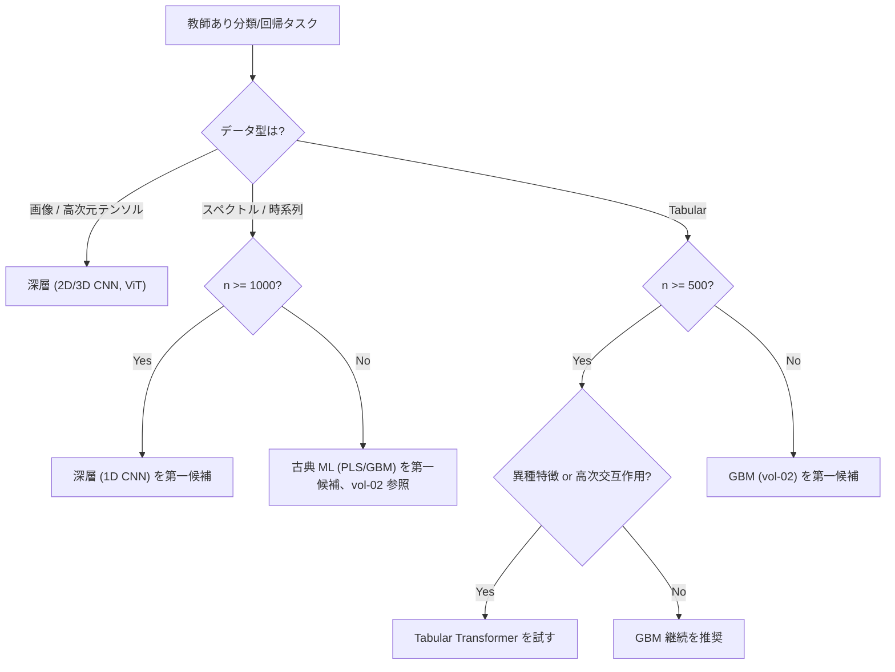

# 第6章　教師あり深層 Agentic Skill を作る

第5章で用意した **`deep_split_contract`** と **`augmentation_contract`** を土台に、この章では 3 つの**教師あり深層 Agentic Skill** をハンズオン化します。すべて **ARIM 風合成データ**を主軸に使い、公開ベンチマークは補助的な対比としてのみ挙げます。

vol-02 第5章の教師あり ML Skill（線形・PLS・RF・GBM）と、この章のハンズオン A（1D CNN）は同じ「スペクトル分類」タスクを扱います。**同じデータに古典 ML と深層を並置**し、どちらを選ぶかの判断根拠を明示することが、この章の隠れた目的です。

> [!NOTE]
> **この章の到達目標**：
> - 教師あり深層 Skill 3 種（1D CNN / 2D CNN / Tabular Transformer）の**契約と実装スケルトン**を書ける
> - 各 Skill で **「エージェントが判断する場面」** と **「Human 承認ゲートを通す場面」** を分けられる
> - vol-02 の GBM と 1D CNN の比較で「深層を選ぶべきタイミング」を根拠つきで語れる
> - epoch 数決定・early stopping 起動・分布外検知後の停止を契約フィールドで書ける
>
> **この章で扱わないこと**：
> - 転移学習・fine-tuning（第7章）
> - 不確かさ推定（第8-9章、この章では確定的予測のみ）
> - Attribution / Grad-CAM（第10章）
> - Foundation Model（第11章）

---

## 6.1 この章で作る 3 Skill と共通ラッパー

この章では 3 つの Skill と 1 つの共通ラッパーを作ります。すべて第4章 §4.9 のテンプレート（7 セクション）に従います。

| Skill 名 | データ型 | モデル | 目的 |
|---|---|---|---|
| **`spectrum_cnn_classifier`** | スペクトル（IR/Raman） | 1D CNN | ARIM 風合成 IR スペクトルの材料クラス分類 |
| **`sem_cnn_classifier`** | SEM 画像 | 2D CNN | ARIM 風合成 SEM 画像の相分類（結晶 / 非晶質 / 混合） |
| **`composition_transformer`** | Tabular（組成・実験条件） | FT-Transformer | ARIM 風合成組成データからの物性予測（回帰） |
| **`deep_supervised_runner`**（ラッパー） | 上記 3 種を共通 API で駆動 | — | 契約検証・provenance 記録・エージェント権限 enforcement |

**「エージェントが判断する場面」を各 Skill に明示**することが、この章の中核です（第4章 §4.7 の L1-L3 権限を具体化）。

---

## 6.2 3 ハンズオンの位置づけと vol-02 との対比

### vol-02 第5章との対応

vol-02 §5.6-5.8 のハンズオン A/B/C（校正曲線 Skill / 物性予測 Skill / スペクトル分類 Skill）と、この章のハンズオンには **1 対 1 の対応がある部分と、対応がない部分**があります。

| 目的 | vol-02（古典 ML） | vol-03（深層） | どちらを選ぶ判断 |
|---|---|---|---|
| スペクトル分類 | ハンズオン C（PLS + GBM） | **ハンズオン A：1D CNN** | サンプル数 n ≥ 1000 かつピーク位置が装置間で変動、あるいは非線形な相互作用が支配的な場合に深層 |
| 画像分類 | vol-02 は扱わない | **ハンズオン B：2D CNN** | 画像は原理的に深層が優位（vol-02 で扱わなかった） |
| 組成 → 物性予測（回帰） | ハンズオン B（RF + GBM） | **ハンズオン C：FT-Transformer** | サンプル数 n ≥ 500 かつ交互作用が高次、あるいは異種特徴（連続 + カテゴリ）を扱う場合に深層。**n < 500 ならほぼ常に GBM 優位** |

### 「深層を選ぶべきか」の判断基準（この章の裏テーマ）



> [!IMPORTANT]
> **n < 500 の tabular では、深層は GBM に負けます**（研究論文でも繰り返し確認されている）。この章のハンズオン C はあくまで「Tabular Transformer を試す方法」を示しますが、**採用するかは vol-02 GBM との対比で判断**します（§6.8）。

---

## 6.3 教師あり深層 Skill の共通構造

3 ハンズオンすべてに共通する Skill 構造を先に定義します。第4章 §4.9 テンプレートを埋めた形です。

### 契約セットの構成

```
skills/spectrum_cnn_classifier/          # ハンズオン A
├── skill.yaml                            # 第4章 §4.9 テンプレート
├── split_contract.yaml                   # 第5章 §5.3
├── augmentation_contract.yaml            # 第5章 §5.5
├── model_config.yaml                     # モデル固有ハイパー
├── training_config.yaml                  # 学習ループ設定 + agent 権限
├── ci_smoke_test.yaml                    # 第4章 §4.5
└── src/
    ├── model.py                          # 1D CNN 定義
    ├── train.py                          # 学習ループ（契約 assert 込み）
    ├── predict.py                        # 推論
    └── provenance_writer.py              # 第4章 3 レイヤ provenance
```

### `training_config.yaml`（この章の中心）

```yaml
# training_config.yaml — 3 Skill 共通スキーマ
version: "1.0"

# 学習ループ設定（決定的部分は Human 固定）
loop:
  max_epochs: 30                    # 上限。エージェント権限で変更不可
  batch_size: 32
  optimizer:
    name: "AdamW"
    lr: 1.0e-3
    weight_decay: 1.0e-4
  lr_scheduler:
    name: "cosine"
    warmup_epochs: 2
  loss:
    name: "cross_entropy"           # 分類の場合
    label_smoothing: 0.05
  gradient_clip_norm: 1.0

# early stopping（エージェント判断可の代表例）
early_stopping:
  enabled: true
  monitor: "val_f1_macro"
  mode: "max"
  patience: 5
  min_delta: 0.005
  agent_can_trigger: true           # エージェントが起動判断可
  agent_can_disable: false          # 無効化は不可（audit violation）
  agent_can_change_patience: false  # patience 変更は不可

# 分布外検知後の停止（エージェント自律判断可）
ood_stop_gate:
  enabled: true
  monitor: "val_ood_score"          # 実装は §6.4 で詳述
  threshold: 0.3                    # 例示；装置校正データから導出
  action: "stop_and_route_to_human"

# エージェント権限（第4章 §4.7 と連動）
agent_authorization:
  level: L2
  training_job_approval:
    required: true
    approver: "lab_admin@example.com"
    approval_record_id: "APP-2026-0201-01"
    approved_hp_range:
      lr: [1.0e-4, 3.0e-3]
      epochs: [5, 30]               # max_epochs 内での選択のみ
      batch_size: [16, 64]
  checkpoint_overwrite_policy: "append_only"
  uncertainty_stop_gate:
    metric: "predictive_entropy_normalized"
    threshold: 0.3
    on_exceed: "route_to_human"
  # 第4章 rubber-duck 追加分
  weight_load_policy:
    torch_load_weights_only: true
    require_safetensors: true
    require_weights_sha256_verified: false   # 学習済み重み配布時は true
    revision_must_be_commit_hash: false      # HF Hub 使用時のみ true
    trust_remote_code: false
```

### 学習ループの契約 assert（実装スケルトン）

```python
# train.py — 契約検証込みの学習ループ骨格
def train(config: dict, split_contract: dict, aug_contract: dict) -> None:
    # [1] 契約 assert（起動時に必ず実行）
    assert aug_contract["applied_scope"]["val"] is False, "fatal: val augmentation"
    assert aug_contract["applied_scope"]["test"] is False, "fatal: test augmentation"
    assert split_contract["augmentation_scope"]["applied_to"] == ["train"], "fatal: scope"
    assert config["loop"]["max_epochs"] <= 30, "audit: max_epochs override"

    # [2] provenance 3 レイヤ初期化（第4章 §4.4）
    prov = ProvenanceWriter()
    prov.record_layer1_gpu()               # cuda_version / cudnn / worker seed
    prov.record_layer2_weights(config)     # 事前学習なし版はスキップ or default
    prov.record_layer3_training(config)

    # [3] エージェント HP 選択（L2 権限内）
    lr = agent_select_hp("lr", config["agent_authorization"]["training_job_approval"]["approved_hp_range"])
    prov.record_agent_decision(name="lr", value=lr, reason="warm restart")

    # [4] 学習ループ本体（略）
    ...
    # [5] early stopping / ood stop の起動記録
    ...
    # [6] provenance を append_only で書き出す
    prov.commit(path="runs/2026-02-01/provenance.yaml")
```

> [!IMPORTANT]
> **契約 assert は Skill 起動直後に実行**します。契約違反は学習開始前に fatal で停止させます。「学習を回してから気づく」では手遅れです（GPU 時間・エネルギーの無駄）。

---

## 6.4 ハンズオン A：1D CNN 分類 Skill（ARIM 風合成スペクトル）

### タスク

- 入力：IR スペクトル（波数 4000-400 cm⁻¹、リサンプル後 1024 点）
- 出力：材料クラス 5 種の 1 つを予測、および分類確率
- データ：5 装置 × 200 サンプル × 5 クラス = 5000 サンプル（合成）
- 装置間差：`rescale_intensity ±10%`、`axis_shift ±2 cm⁻¹`（第5章の contract に対応、**例示値**）

### モデル設計（1D CNN）

```python
class Spectrum1DCNN(nn.Module):
    """
    ARIM 風合成 IR スペクトル分類用の 1D CNN。
    - 入力: (batch, 1, 1024)
    - 出力: (batch, 5)  # ロジット
    """
    def __init__(self, n_classes: int = 5):
        super().__init__()
        self.features = nn.Sequential(
            nn.Conv1d(1, 32, kernel_size=7, padding=3),
            nn.BatchNorm1d(32), nn.ReLU(), nn.MaxPool1d(2),
            nn.Conv1d(32, 64, kernel_size=5, padding=2),
            nn.BatchNorm1d(64), nn.ReLU(), nn.MaxPool1d(2),
            nn.Conv1d(64, 128, kernel_size=3, padding=1),
            nn.BatchNorm1d(128), nn.ReLU(), nn.AdaptiveAvgPool1d(1),
        )
        self.classifier = nn.Sequential(
            nn.Flatten(),
            nn.Dropout(0.3),
            nn.Linear(128, n_classes),
        )

    def forward(self, x: torch.Tensor) -> torch.Tensor:
        return self.classifier(self.features(x))
```

### エージェントが判断する場面（この Skill の 5 箇所）

| # | 判断場面 | エージェント権限（L2） | Human ゲート |
|---|---|---|---|
| 1 | 学習率の初期値選択 | `approved_hp_range.lr` 内から選択可 | 範囲外は `training_job_approval` |
| 2 | epoch 数の決定（early stopping 経由） | `patience` は固定、閾値超過で自動停止可 | `agent_can_disable: false` |
| 3 | augmentation 強度の選択 | 第5章 `augmentation_contract` の `strength_range` 内 | 範囲外は audit violation |
| 4 | 予測時の不確かさ閾値超過 | `predictive_entropy_normalized > 0.3` で自律停止し Human 送り | Human は個別サンプルを判断 |
| 5 | 分布外検知（OOD） | val_ood_score が閾値超過で `stop_and_route_to_human` | 装置差増大の場合は再学習判断も Human |

### エージェントに**許されない**判断（この Skill）

- モデルアーキテクチャの変更（`Conv1d` の kernel_size を変える等）
- optimizer の変更（AdamW → SGD 等）
- loss 関数の変更（cross_entropy → focal loss 等）
- augmentation 種類の追加（第5章 §5.7 全レベル禁止）
- val/test への augmentation 適用

### CI CPU smoke test

```yaml
# ci_smoke_test.yaml
data_subset:
  n_samples_per_class: 4         # 5 クラス × 4 = 20
  n_instruments: 2               # 5 装置中 2 装置のみ
epochs: 2
batch_size: 8
augmentation:
  applied: true
  reduced_strength: 0.5
expected:
  loss_decrease: true
  no_nan_or_inf: true
  final_train_accuracy_min: 0.4  # ランダム (0.2) より上
  augmentation_only_on_train: true
```

---

## 6.5 ハンズオン B：2D CNN 分類 Skill（ARIM 風合成 SEM 画像）

### タスク

- 入力：SEM 画像（256×256 グレースケール、5 装置分の合成）
- 出力：相分類（結晶 / 非晶質 / 混合、3 クラス）
- 装置間差：ノイズレベル・コントラスト・スケールバー位置

### 契約の追加要件（画像特有）

**結晶方位ありの場合の augmentation contract**（第5章 §5.5 の `image_crystalline.yaml`）：

```yaml
data_type: "image"
orientation_semantics: "anisotropic_with_growth_direction"  # 結晶方位あり
allowed_augmentations:
  - name: "rescale_intensity"
    strength_range: [0.85, 1.15]
  - name: "additive_noise"
    sigma_range: [0.01, 0.03]
  - name: "small_rotation"
    physical_validity: "conditional"
    angle_range_deg: [-5, 5]         # 成長方向を保つため小角度のみ
prohibited_augmentations:
  - name: "large_rotation"            # ±90° / 180° 等
    severity: "fatal"
  - name: "mirror_reflection"
    severity: "fatal"
  - name: "invert_intensity_sign"
    severity: "fatal"
```

**非晶質サンプルは別テンプレート** `image_amorphous.yaml`（`orientation_semantics: isotropic`）を使用。混合の場合は結晶方位が支配的なら `_crystalline.yaml` を使用。**エージェントはテンプレートを選ばず、Human が事前指定**します。

### モデル設計（2D CNN、骨格のみ）

- ResNet18 相当を **from scratch 学習**（fine-tuning は第7章）
- 入力：`(batch, 1, 256, 256)`（グレースケール）→ 3 チャネル複製せず 1ch 入力を扱う分岐アーキテクチャ
- 出力：`(batch, 3)` ロジット

### エージェント判断場面（追加）

ハンズオン A の 5 箇所に加え、画像特有：

| # | 判断場面 | 権限 |
|---|---|---|
| 6 | 画像サイズの選択（256 / 384 / 512） | `approved_hp_range.image_size` 内から。デフォルトは 256 |
| 7 | 結晶 / 非晶質テンプレートの選択 | **不可**（Human が事前指定、エージェントは選択しない） |

---

## 6.6 ハンズオン C：Tabular Transformer（FT-Transformer / TabNet）

### タスク

- 入力：組成データ（連続値 8 列：金属元素比率）+ 実験条件（カテゴリ 3 列：装置種類・雰囲気・温度帯）
- 出力：物性値 1 つの回帰（例：バンドギャップ eV）
- サンプル数：**n = 800**（Tabular Transformer が GBM に勝てるかの境界域）

### 契約の追加要件（Tabular 特有）

- **連続値と カテゴリ値の分離**：契約に `numeric_columns` / `categorical_columns` を明示
- **augmentation**：連続値のみ `additive_noise` + `mixup`、カテゴリ列 permutation は fatal（第5章 §5.5）
- **grouped CV**：装置間 leakage を避けるため `group_key: "instrument_id"`

### なぜ FT-Transformer を選ぶか

| 特徴 | GBM（vol-02） | FT-Transformer |
|---|---|---|
| n < 500 での性能 | 強い | 弱い |
| n ≥ 500 かつ**異種特徴** | 良好 | 拮抗〜有利 |
| n ≥ 2000 かつ**高次交互作用** | 頭打ち | 有利 |
| 学習コスト | 低 | 高（GPU 数分〜） |
| 解釈可能性 | 中（SHAP 効く） | 低（attention は解釈が難しい） |
| **推奨判断** | まず試す | GBM のスコアを超えられるか検証 |

### エージェント判断場面（追加）

| # | 判断場面 | 権限 |
|---|---|---|
| 8 | Tabular Transformer vs GBM の選択 | **不可**（Human が両方走らせて比較） |
| 9 | カテゴリ列のエンコーディング方法 | **不可**（契約で `one_hot` / `learned_embedding` を Human 固定） |
| 10 | mixup 適用強度 | `augmentation_contract` の `strength_range` 内 |

---

## 6.7 Transformer 骨格の比較（ViT vs 1D Transformer）

3 ハンズオンで扱わない **ViT / 1D Transformer** も、骨格として比較しておきます（採用判断は第7章の transfer learning と絡めて）。

| 特徴 | 1D CNN（ハンズオン A） | 1D Transformer | ViT | FT-Transformer（ハンズオン C） |
|---|---|---|---|---|
| データ | シーケンス（スペクトル） | シーケンス（スペクトル） | 画像 | Tabular |
| 位置符号化 | 不要（畳み込みが位置を捉える） | 必要（sinusoidal / learned） | 必要（patch embedding） | 特徴量 embedding |
| n の目安 | ≥ 1000 | **≥ 5000** | **≥ 10000**（scratch）／転移で n ≥ 500 | ≥ 500 |
| ARIM での適合 | 高 | 低（ARIM 単一装置では n 不足） | 転移前提なら中（第7章） | 中 |
| 学習コスト | 低 | 中 | 高 | 中 |

> [!NOTE]
> **Transformer 系は from-scratch では ARIM 単装置スケールで負けます**。転移学習の枠で使う（第7章、第11章）ことを前提にしてください。この章のハンズオン C（FT-Transformer）は Tabular で例外的に n ≥ 500 で使える構造。

---

## 6.8 vol-02 GBM との比較（ハンズオン A の並置実験）

**同じ ARIM 風合成 IR スペクトルデータ**に対して、vol-02 のスペクトル分類 Skill（PLS + GBM）と、この章の 1D CNN Skill を並置します。

### 比較プロトコル

| 項目 | vol-02（GBM） | vol-03（1D CNN） |
|---|---|---|
| 前処理 | ピーク抽出 → 特徴量エンジニアリング（vol-02 §5.8） | リサンプル 1024 点 → CNN が特徴を学習 |
| CV | grouped 5-fold（装置別） | 同じ split_contract を共有 |
| メトリクス | F1_macro、confusion matrix | F1_macro、confusion matrix、**ECE**（第4章追加） |
| 実行環境 | CPU | GPU（CUDA） + CPU smoke test |
| provenance | vol-02 版 | 第4章 3 レイヤ完全版 |

### 期待される結果パターン

| データ規模 | GBM の F1 | 1D CNN の F1 | 判断 |
|---|---|---|---|
| n = 500 | 0.85 | 0.82 | GBM 継続 |
| n = 2000 | 0.87 | 0.89 | 1D CNN 検討開始 |
| n = 5000 | 0.87 | 0.93 | **1D CNN 採用、GBM は補助検証に** |

> [!IMPORTANT]
> **上記数値は例示です**。実測は装置固有性・クラス不均衡・特徴量エンジニアリングの質で大きく変わります。**必ず自データで実測してから判断**してください。「GBM がまだ強い」を認めることは正しい判断であり、恥ではありません。

---

## 6.9 各 Skill での「エージェントが判断する場面」総括

3 ハンズオン + Tabular 追加 = 10 判断場面を整理します。

| # | Skill | 判断場面 | エージェント権限（L2） | 監査ログ | 参照節 |
|---|---|---|---|---|---|
| 1 | A | 学習率選択 | `approved_hp_range.lr` 内 | `agent_decision_log` | §6.3 |
| 2 | A | early stopping 起動 | 起動可、無効化不可 | `early_stopping_triggered_at` | §6.3 |
| 3 | A | augmentation 強度 | `strength_range` 内 | 第5章 §5.7 | §6.4 |
| 4 | A | 不確かさ超過時の停止 | 自律停止可 | `uncertainty_stop_events` | §6.3 |
| 5 | A | OOD 検知後の停止 | 自律停止 → Human 送り | `ood_stop_events` | §6.3 |
| 6 | B | 画像サイズ選択 | 事前定義候補から | `agent_decision_log` | §6.5 |
| 7 | B | 結晶/非晶質テンプレート選択 | **不可**（Human 固定） | — | §6.5 |
| 8 | C | GBM vs Transformer の選択 | **不可**（Human 比較） | — | §6.6 |
| 9 | C | カテゴリ列エンコーディング | **不可**（Human 固定） | — | §6.6 |
| 10 | C | mixup 強度 | `strength_range` 内 | 第5章 §5.7 | §6.6 |

**「不可」が 3 箇所ある**ことに注意してください。エージェントに何でも任せると、**構造的な判断**（テンプレート選択・モデル選択）で人が抜けます。この節の表は「Skill 設計時に **どこに人を残すか**」の設計書として機能します。

---

## 6.10 失敗パターンと改善版

| 失敗 | 原因 | 改善版 |
|---|---|---|
| 学習が進まない（loss が下がらない） | LR が範囲外 or augmentation 強すぎ | 契約 assert で LR 範囲外を検知、augmentation 強度を smoke test で確認 |
| CV スコアがばらつく（seed × 3 で std > 0.03） | GPU 非決定性（第2章） | `torch.use_deterministic_algorithms(True)` + `cublas_workspace_config` を provenance に |
| test スコア > val スコア | augmentation が test に漏れている | 契約 assert `applied_scope.test: false`、Skill 起動時にランタイム検証 |
| 装置 A で学習、装置 B で崩れる | grouped CV 未使用、または augmentation で装置差を消していた | 第5章 §5.6 の 3 分岐（消してはいけないケース）で分析 |
| epoch を 30 → 100 に増やしたら精度上がった | max_epochs override（audit violation） | `max_epochs: 30` を Human 固定、エージェントは範囲内から選択のみ |
| Tabular Transformer が GBM に負けた | n < 500 で深層を選んだ | §6.6 の判断表に従って GBM 継続、Tabular Transformer は保留 |

---

## 6.11 章末チェックリスト・ワーク

### チェックリスト

- [ ] 3 Skill（1D CNN / 2D CNN / FT-Transformer）の共通契約構造（`training_config.yaml`）を書ける
- [ ] `agent_authorization.approved_hp_range` に含めるフィールドを列挙できる
- [ ] エージェントが判断可の 10 場面と不可 3 場面を区別できる
- [ ] early stopping と OOD stop の違いを説明できる
- [ ] 1D CNN vs GBM の判断基準を n・特徴量・装置間差の軸で語れる
- [ ] Tabular Transformer を n < 500 で使わない理由を説明できる
- [ ] CI CPU smoke test の設定項目を列挙できる

### ワーク

自研究室の教師あり分類/回帰タスクを 1 つ選び、以下を実施：

1. データ型（スペクトル / 画像 / Tabular）を確定し、対応する Skill 骨格を選ぶ
2. `training_config.yaml` を自データに合わせて書く（`approved_hp_range` は Human が事前決定）
3. §6.9 の判断場面表を自 Skill 版に書き換える（判断可 / Human 固定の分類）
4. vol-02 の対応する Skill（GBM や PLS）が存在すれば、並置比較の計画を立てる
5. CI CPU smoke test の設定を書き、CI で回してから GPU フル学習に進む順序を確立する

---

## 6.12 本章のまとめ

- 教師あり深層 Agentic Skill 3 種（**1D CNN / 2D CNN / FT-Transformer**）を、第4章の 7 セクション仕様書 + 第5章の 2 contract の上に構築した
- 各 Skill で **「エージェントが判断する場面（10）」と「Human 固定の場面（3）」を明示的に分けた**
- **1D CNN vs GBM** の判断は n・特徴量エンジニアリングの質・装置間差で決まる。**n < 500 の tabular では深層は GBM に負ける**
- 学習ループの契約 assert は **Skill 起動直後**に走らせ、fatal 違反は学習開始前に停止させる
- `training_config.yaml` の `agent_authorization` フィールドで、L2 権限の具体化（`approved_hp_range` / `training_job_approval_id`）を実装可能な形にした

第7章では、この 3 Skill を **転移学習・fine-tuning** に拡張し、事前学習重みを扱うときの追加契約（装置別 fine-tune 判断表、`domain_gap` early warning）を設計します。

---

## 参考資料

### 本書内

- **第4章 §4.7, §4.9, §4.10**：Agentic 権限設計、Skill 仕様書テンプレート、provenance スキーマ
- **第4章 §4.5**：CI CPU smoke test
- **第5章 §5.3, §5.5**：`deep_split_contract` と `augmentation_contract`
- **第5章 §5.7**：L1/L2/L3 augmentation 権限
- **第7章**：この 3 Skill の転移学習拡張、装置別 fine-tune 判断
- **第8-9章**：不確かさ推定（この章の `uncertainty_stop_gate` の実装）
- **第10章**：Grad-CAM / attribution（1D CNN・2D CNN の解釈）
- **第14章**：教師あり深層の失敗パターン（agent-side augmentation 強化、GPU 非決定性の見落とし）

### vol-02 / vol-01 参照

- **vol-02 第5章**：教師あり ML Skill の共通構造、ハンズオン A/B/C
- **vol-02 第5.8 節**：スペクトル分類 Skill（PLS + GBM）— この章のハンズオン A と並置比較
- **vol-02 第7章**：grouped CV / applicability domain（この章の split_contract に継承）
- **vol-01 第7章**：Skill 設計原則（仕様書 6 要素 → vol-02 で 6、vol-03 で 7）
- **vol-01 第13章**：6 データ型テンプレート

### 外部資料

- PyTorch 公式 CNN チュートリアル — [https://pytorch.org/tutorials/beginner/blitz/cifar10_tutorial.html](https://pytorch.org/tutorials/beginner/blitz/cifar10_tutorial.html)
- FT-Transformer 論文（Gorishniy et al., 2021）— [https://arxiv.org/abs/2106.11959](https://arxiv.org/abs/2106.11959)
- TabNet 論文（Arik & Pfister, 2019）— [https://arxiv.org/abs/1908.07442](https://arxiv.org/abs/1908.07442)
- 「Tabular deep learning が GBM に勝てるか」の議論 — Shwartz-Ziv & Armon (2022) [https://arxiv.org/abs/2106.03253](https://arxiv.org/abs/2106.03253)
- PyTorch determinism — [https://pytorch.org/docs/stable/notes/randomness.html](https://pytorch.org/docs/stable/notes/randomness.html)
