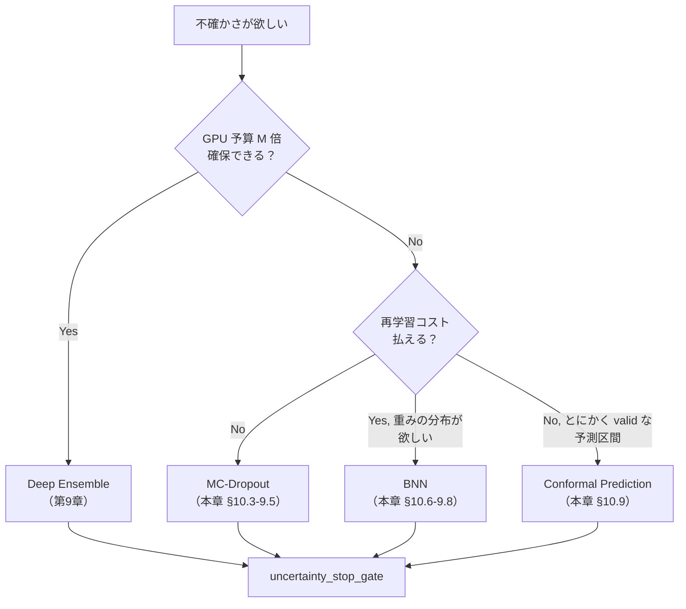

# 第10章 MC-Dropout と Bayesian Neural Net を Skill 化する — 手法選択の判断表

> [!NOTE]
> **本章の到達目標**
> - **MC-Dropout** の理論的位置づけ（近似ベイズ推論としての解釈）と実務上の限界を説明できる
> - **MC-Dropout Skill** を実装し、第9章の `uncertainty_stop_gate` に流し込める
> - **BNN**（Bayes by Backprop / Variational Inference / SG-MCMC）の 3 系統を区別し、選ぶ理由を書き分けられる
> - **`bnn_uncertainty` Skill**（Bayes by Backprop の最小実装）を、承認ゲート付きで書ける
> - **vol-02 第11-13章 PyMC/NumPyro**（本格ベイズ）と本章 BNN（近似ベイズ）の**接続と使い分け**を説明できる
> - **conformal prediction** の位置づけ（分布仮定に頼らない校正法）を把握し、比較表に組み込める
> - **「BNN vs Deep Ensemble vs MC-Dropout vs Conformal」**の 4 手法使い分け表を Skill 選択に使える
> - エージェントが **不確かさ推定手法を提案するときの判断基準**（コスト × 精度 × Human 解釈しやすさ × 停止ゲートとの相性）を YAML 契約に落とせる
>
> **本章で扱わないこと**
> - **PyMC / NumPyro の本格 MCMC** → **vol-02 第11-13章**（本章では接続点のみ）
> - **Deep Ensemble の詳細** → **第9章**
> - **conformal prediction の完全実装** → 位置づけと比較表のみ、詳細は付録・第11章 reliability diagram で補足
> - **Foundation Model の不確かさ** → **第12章**（LLM/FM 特有の hallucination 対策）
> - **Grad-CAM / attribution** → **第11章**

---

## 10.1 この章で作る Skill

2 つの **不確かさ Agentic Skill** と 1 つの **判断表** を作ります。

| Skill / 成果物 | 役割 | 入出力 |
|---|---|---|
| **`mc_dropout_predict`** | 学習済みモデルに dropout を推論時にも有効化し T 回サンプリングで不確かさを推定 | 入力: model with dropout + T + data → 出力: mean_probs / predictive_entropy / mutual_information |
| **`bnn_uncertainty`**（Bayes by Backprop 最小実装） | 重みを分布として学習し posterior サンプリング | 入力: model factory + prior + data → 出力: posterior sample の平均予測 / 分解 |
| **`uncertainty_method_selection_table`**（判断表） | 手法選択の Skill レベル決定支援 | 入力: 対象データ / GPU 予算 / Human 解釈要求 → 出力: 推奨手法 + 理由 |

前提として、第5章 provenance 3 レイヤ（GPU / 事前学習重み / 学習・推論設定）+ 第8章 Layer 4（転移学習拡張）、第5-8 章の契約群、第9章の `uncertainty_stop_gate` を継承します。**本章では BNN 用の拡張ブロック `bayesian_inference_config` を第5章スキーマに追加します（Ch07 が Layer 4 を追加したのと同じ拡張パターン）**。本章で作る Skill の出力はすべて第9章 gate に流し込める形式に揃えます（`mean_probs`, `predictive_entropy_normalized`, `mutual_information`）。ただし Conformal Prediction は予測集合を返すため別 monitor 扱いにします（§10.9 / §10.10）。

---

## 10.2 なぜこの章が必要か — Deep Ensemble だけでは足りない理由

第9章で Deep Ensemble を推奨しましたが、実務では以下の制約に直面します：

- **GPU 予算**：M=5 の Deep Ensemble は学習コスト × 5、推論コスト × 5。**ARIM 施設の共有 GPU では現実的でないケース**が多い
- **単一 checkpoint のみ許可**：組織の運用ポリシー・監査対応上、モデル配布は 1 個に絞りたい
- **posterior の解釈が欲しい**：Human に「重みそのものの分布」を提示したい（BNN）
- **分布仮定を置きたくない**：どんなモデルでも valid な予測区間が欲しい（conformal prediction）

これらの制約に対して、選択肢は 4 つあります：



> [!IMPORTANT]
> **本章の位置づけ**：4 手法は**排他ではなく組み合わせ可能**です。実務では「MC-Dropout で日次監視 + 月次で Deep Ensemble 再校正 + 予測区間は Conformal で保証」のような多層構成が現実的。**エージェントには "どの層を今回使うか" を判断させる**ための表を §10.10 で作ります。

---

## 10.3 MC-Dropout の理論的位置づけ

**MC-Dropout**（Gal & Ghahramani, 2016）は、dropout を**推論時にも有効化**し、$T$ 回サンプリングして予測分布を得る手法です。

### 3 行で書くとこう

1. 学習時と同じく dropout を **推論時にも on** にする（`model.train()` ではなく、dropout 層のみ選択的に on）
2. 同じ入力 $x$ に対して $T$ 回 forward し、$T$ 個の予測 $\{p^{(t)}(y|x)\}_{t=1}^T$ を得る
3. 平均・分散・エントロピー分解を計算（式は第9章 §9.6 の Deep Ensemble と同一）

### 理論的裏付け（近似ベイズ）

Gal & Ghahramani は、dropout つき NN の学習は**特定の事前分布を置いた Bayesian NN の変分推論と数学的に等価**であることを示しました。ゆえに MC-Dropout の $T$ 回サンプルは近似的な posterior sample と解釈できます。

> [!WARNING]
> **この "等価" は仮定込みです**：dropout rate が特定の precision parameter に対応する、prior が Gaussian、活性化関数が特定の条件を満たす、などの前提があります。**「MC-Dropout = 完全なベイズ」とは主張しない**でください。実務上は「安価な epistemic uncertainty の proxy」と扱うのが健全です。

### Deep Ensemble との違い

| 観点 | MC-Dropout | Deep Ensemble |
|---|---|---|
| **多様性の源** | 同一重みからの dropout mask のランダム性 | 初期化・data order・augmentation の違いによる異なる収束点 |
| **学習コスト** | × 1（1 モデルのみ学習） | × M |
| **推論コスト** | × T（同一モデルで T 回 forward） | × M |
| **メモリ** | × 1 | × M |
| **epistemic 表現力** | 弱い（1 つの mode 周辺のみ） | 強い（複数 mode を捉えうる） |
| **実装難度** | 極低（既存モデルにフラグ 1 つ） | 中（M 個の学習パイプライン） |

---

## 10.4 MC-Dropout Skill の実装

### モデル前提

対象モデルが **dropout 層を含んでいる**必要があります。含まないモデルには MC-Dropout は適用できません（強制的に dropout 層を挿入するのは第6-7章の契約違反）。

```python
# mc_dropout_predict.py
import torch
import torch.nn as nn


def _enable_dropout_only(model: nn.Module) -> dict[str, bool]:
    """
    model.eval() 後に、dropout 層のみを train モードに戻す。
    BatchNorm 等は eval のまま（train モードだと推論が壊れる）。
    返り値：呼び出し前の各モジュールの `.training` 状態（`_restore_module_modes` で復元）。
    """
    prev_states: dict[str, bool] = {name: m.training for name, m in model.named_modules()}
    model.eval()
    for m in model.modules():
        if isinstance(m, (nn.Dropout, nn.Dropout1d, nn.Dropout2d, nn.Dropout3d)):
            m.train()
    return prev_states


def _restore_module_modes(model: nn.Module, prev_states: dict[str, bool]) -> None:
    """`_enable_dropout_only` 呼び出し前の training/eval 状態に復元。finally で必ず呼ぶ。"""
    for name, m in model.named_modules():
        if name in prev_states:
            m.train(prev_states[name])


def _assert_mc_dropout_prerequisites(model: nn.Module, T: int) -> None:
    """契約 YAML の requires を code 側でも fatal assert。"""
    assert 10 <= T <= 100, f"T must be in [10, 100], got {T}"
    dropout_layers = [
        m for m in model.modules()
        if isinstance(m, (nn.Dropout, nn.Dropout1d, nn.Dropout2d, nn.Dropout3d))
    ]
    assert len(dropout_layers) > 0, "MC-Dropout requires at least one dropout layer"
    assert any(getattr(m, "p", 0.0) > 0.0 for m in dropout_layers), \
        "MC-Dropout requires at least one dropout layer with p > 0"


@torch.no_grad()
def mc_dropout_predict(
    model: nn.Module,
    x: torch.Tensor,
    T: int = 30,
    seed: int | None = None,
) -> dict:
    """
    x: (batch, ...) 入力
    T: サンプリング回数
    return:
      mean_probs: (batch, K)
      predictive_entropy: (batch,)
      expected_entropy: (batch,)
      mutual_information: (batch,)
      max_softmax_uncertainty: (batch,)   # 1 - max(mean_probs)
    """
    _assert_mc_dropout_prerequisites(model, T)
    prev_states = _enable_dropout_only(model)
    try:
        # dropout mask のランダム性を制御。torch.manual_seed は global RNG を変更するため、
        # 呼び出し外への副作用を避けたい場合は torch.random.fork_rng() を使うこと。
        with torch.random.fork_rng(devices=[x.device] if x.is_cuda else []):
            if seed is not None:
                torch.manual_seed(seed)
                if x.is_cuda:
                    torch.cuda.manual_seed_all(seed)

            sample_probs = []
            for _ in range(T):
                logits = model(x)
                sample_probs.append(logits.softmax(-1))
        sample_probs = torch.stack(sample_probs, dim=0)  # (T, batch, K)
    finally:
        _restore_module_modes(model, prev_states)

    mean_probs = sample_probs.mean(0)                # (batch, K)
    K = mean_probs.shape[-1]
    assert K > 1, "MC-Dropout requires K > 1"
    eps = 1e-12

    predictive_entropy = -(mean_probs * (mean_probs + eps).log()).sum(-1)          # (batch,)
    member_entropy = -(sample_probs * (sample_probs + eps).log()).sum(-1)          # (T, batch)
    expected_entropy = member_entropy.mean(0)                                      # (batch,)
    mutual_information = predictive_entropy - expected_entropy                     # (batch,)
    max_softmax_uncertainty = 1.0 - mean_probs.max(-1).values                      # (batch,)

    log_k = torch.log(torch.tensor(K, dtype=predictive_entropy.dtype, device=predictive_entropy.device))
    predictive_entropy_normalized = predictive_entropy / log_k

    return {
        "mean_probs": mean_probs,
        "predictive_entropy": predictive_entropy,
        "predictive_entropy_normalized": predictive_entropy_normalized,
        "expected_entropy": expected_entropy,
        "mutual_information": mutual_information,
        "max_softmax_uncertainty": max_softmax_uncertainty,
    }
```

### 契約 YAML

```yaml
# mc_dropout_predict.yaml
skill: "mc_dropout_predict"
version: "1.0.0"

requires:
  model_must_contain_dropout_layers: true          # fatal if false
  base_model_frozen_during_inference: true
  reject_if_dropout_rate_zero_in_all_layers: true

parameters:
  T:
    default: 30
    min: 10
    max: 100
    agent_authorization:
      L1: "read_only"
      L2: "modify_within_range"
      L3: "modify_with_prior_approval"

outputs:
  contract: "matches_uncertainty_stop_gate_input_schema"
  fields:
    - "mean_probs"
    - "predictive_entropy_normalized"
    - "mutual_information"
    - "max_softmax_uncertainty"

known_limitations:
  epistemic_expressiveness: "weak_compared_to_deep_ensemble"
  dropout_mask_diversity: "may_correlate_when_T_small"
  documented_as: "epistemic_uncertainty_proxy_not_true_bayesian"

provenance:
  record_T: true
  record_dropout_rate_per_layer: true
  record_seed: true
  record_which_layers_were_train_mode: true        # BatchNorm 等が train になっていないことを証跡化
```

> [!IMPORTANT]
> **`record_which_layers_were_train_mode` は必須**です。過去に「BatchNorm も train モードのままで MC-Dropout」を回した結果、running statistics が汚染された事故が多数報告されています。契約でログを義務化してください。

---

## 10.5 MC-Dropout の失敗パターンと対策

| 失敗 | 症状 | 対策 |
|---|---|---|
| **dropout 層がないモデルに適用** | `_assert_mc_dropout_prerequisites` で即 fatal | `requires.model_must_contain_dropout_layers` fatal assert（YAML + code 両方） |
| **BatchNorm も train モード** | running mean/var が汚染、次回 eval で予測が壊れる | `_enable_dropout_only` で dropout 層のみ選択 + `try/finally` で状態復元 |
| **推論後にモデルが train mode に残る** | 続く normal 推論で dropout が有効化されたまま | `_restore_module_modes` を必ず finally で呼ぶ |
| **dropout rate が全層 0** | dropout mask のばらつきなし → **`mutual_information ≈ 0`**（予測 entropy 自体は非ゼロたりうる） | fatal assert + provenance に per-layer rate 記録 |
| **T が小さい（<10）** | 分散推定が不安定 | `T.min: 10`、agent は L2 でも下限を下げられない、code で fatal assert |
| **T が過大（>100）** | GPU 時間浪費、性能向上飽和 | `T.max: 100`、L3 でも事前承認 |
| **MC-Dropout の epistemic を "真の epistemic" と主張** | Human が過信 | Skill ドキュメントと provenance に "proxy" と明記 |
| **`torch.manual_seed()` が global RNG を汚染** | 後続の学習/推論で乱数系列が想定外に | `torch.random.fork_rng()` で subprocess 的に隔離 |
| **推論のたびに seed 記録なし** | Human と agent で異なる結果 | seed 記録を契約で必須化 |

---

## 10.6 BNN 3 系統の位置づけ

**BNN (Bayesian Neural Network)** は重み $w$ 自体を分布として扱います。学習は事後分布 $p(w | \mathcal{D})$ の推論。実装アプローチは 3 系統：

| 系統 | 代表手法 | ライブラリ | 学習コスト | posterior 表現力 | 実務適用性 |
|---|---|---|---|---|---|
| **Variational Inference (VI)** | Bayes by Backprop, MFVI | Pyro, TyXe, blitz-bayesian-pytorch | 中（backward パス 2 倍程度） | 中（factorized Gaussian 前提） | ○ |
| **Laplace / SWAG** | Laplace 近似、SWAG | laplace-torch | 低（学習後の追加処理のみ） | 弱〜中 | ◎ |
| **SG-MCMC** | SGLD, SGHMC, cSGLD | 実装は自作か Pyro | 高（多数のサンプル保管） | 強（真の posterior 近傍） | △ |

> [!TIP]
> **本章では Bayes by Backprop（VI 系）の最小実装**を示します。理由：(1) 学習コストが Deep Ensemble に近い / (2) 実装が理解しやすい / (3) posterior が明示的で Human 説明に使える。**Laplace 近似は付録**、SG-MCMC は本書の範囲外とします。

### vol-02 PyMC/NumPyro との使い分け

| 状況 | 推奨 |
|---|---|
| モデルが小さく（数百〜数千パラメータ）、完全な posterior が欲しい | **vol-02 第11-13章 PyMC / NumPyro** |
| モデルが深層（数百万〜） | **本章 BNN**（VI 近似） |
| 深層特徴を抽出して階層構造の推論 | **第14章**（深層 → PyMC 階層モデル） |

---

## 10.7 Bayes by Backprop の最小実装

各重み $w_i$ を Gaussian $\mathcal{N}(\mu_i, \sigma_i^2)$ で表現し、$\mu_i, \sigma_i$ を学習します。

### 数式

Variational posterior $q_\theta(w) = \prod_i \mathcal{N}(w_i | \mu_i, \sigma_i^2)$、prior $p(w) = \prod_i \mathcal{N}(w_i | 0, \sigma_p^2)$ に対して ELBO を最大化：

$$
\mathcal{L}(\theta) = \mathbb{E}_{q_\theta(w)}[\log p(\mathcal{D} | w)] - \mathrm{KL}[q_\theta(w) \| p(w)]
$$

第 1 項は再パラメータ化トリック $w = \mu + \sigma \odot \epsilon, \epsilon \sim \mathcal{N}(0, I)$ で backprop 可能に。

### 実装（最小構成）

```python
# bayes_by_backprop.py
import math
import torch
import torch.nn as nn
import torch.nn.functional as F


class BayesianLinear(nn.Module):
    """重み平均 mu, 対数分散 rho（softplus で sigma）を学習可能に持つ Linear。"""
    def __init__(self, in_features: int, out_features: int, prior_sigma: float = 1.0):
        super().__init__()
        self.in_features = in_features
        self.out_features = out_features
        self.prior_sigma = prior_sigma

        # 平均・対数分散パラメータ（バイアス略）
        self.weight_mu = nn.Parameter(torch.empty(out_features, in_features).normal_(0, 0.1))
        self.weight_rho = nn.Parameter(torch.full((out_features, in_features), -5.0))
        self.bias_mu = nn.Parameter(torch.zeros(out_features))
        self.bias_rho = nn.Parameter(torch.full((out_features,), -5.0))

    def _sigma(self, rho: torch.Tensor) -> torch.Tensor:
        return F.softplus(rho)          # 常に正

    def forward(self, x: torch.Tensor) -> torch.Tensor:
        w_sigma = self._sigma(self.weight_rho)
        b_sigma = self._sigma(self.bias_rho)
        # 再パラメータ化
        w = self.weight_mu + w_sigma * torch.randn_like(w_sigma)
        b = self.bias_mu + b_sigma * torch.randn_like(b_sigma)
        return F.linear(x, w, b)

    def kl_to_prior(self) -> torch.Tensor:
        """factorized Gaussian の KL divergence（prior は等方 Gaussian）。"""
        w_sigma = self._sigma(self.weight_rho)
        b_sigma = self._sigma(self.bias_rho)
        p_sigma = self.prior_sigma

        def _kl(mu, sigma):
            return (
                torch.log(torch.tensor(p_sigma, device=mu.device) / sigma)
                + (sigma.pow(2) + mu.pow(2)) / (2 * p_sigma ** 2)
                - 0.5
            ).sum()

        return _kl(self.weight_mu, w_sigma) + _kl(self.bias_mu, b_sigma)


def elbo_loss(
    mean_log_likelihood_per_sample: torch.Tensor,
    kl: torch.Tensor,
    n_data: int,
    kl_weight: float = 1.0,
) -> torch.Tensor:
    """
    負の ELBO を最小化する形式で返す。

    重要：`mean_log_likelihood_per_sample` は **サンプル 1 個あたりの log-likelihood の平均**
    （たとえば `F.log_softmax(logits, -1).gather(...).mean()`）。
    「mini-batch 上の合計」を渡すと likelihood 項が batch size でスケールし、
    KL は `n_data` で割られるため、ELBO のバランスが崩壊する。

    合計形式で渡したい場合はこう：
        loss = -(n_data / batch_size) * batch_log_likelihood_sum + kl_weight * kl
    """
    return -mean_log_likelihood_per_sample + kl_weight * kl / n_data
```

### 推論時のサンプリング

```python
@torch.no_grad()
def bnn_predict(model: nn.Module, x: torch.Tensor, S: int = 30) -> dict:
    """
    S 回 posterior サンプリングして予測分布を得る。
    出力形式は MC-Dropout と同一（uncertainty_stop_gate 互換）。

    重要：確率性は **`BayesianLinear` の再パラメータ化のみ** に限定する。
    BatchNorm や Dropout が混在する場合、eval モードにしてそれらの寄与を止めないと、
    MI が「重み posterior 由来」なのか「他の確率層由来」なのか解釈不能になる。
    """
    prev_states = {name: m.training for name, m in model.named_modules()}
    model.eval()                                     # BN 統計凍結、Dropout 停止
    try:
        sample_probs = []
        for _ in range(S):
            logits = model(x)                        # BayesianLinear 内部で自動的に w をサンプル
            sample_probs.append(logits.softmax(-1))
        sample_probs = torch.stack(sample_probs, dim=0)  # (S, batch, K)
    finally:
        for name, m in model.named_modules():
            if name in prev_states:
                m.train(prev_states[name])

    mean_probs = sample_probs.mean(0)
    K = mean_probs.shape[-1]
    eps = 1e-12
    predictive_entropy = -(mean_probs * (mean_probs + eps).log()).sum(-1)
    member_entropy = -(sample_probs * (sample_probs + eps).log()).sum(-1)
    expected_entropy = member_entropy.mean(0)
    mutual_information = predictive_entropy - expected_entropy
    log_k = torch.log(torch.tensor(K, dtype=predictive_entropy.dtype, device=predictive_entropy.device))
    return {
        "mean_probs": mean_probs,
        "predictive_entropy_normalized": predictive_entropy / log_k,
        "mutual_information": mutual_information,
        "expected_entropy": expected_entropy,
        "max_softmax_uncertainty": 1.0 - mean_probs.max(-1).values,
    }
```

---

## 10.8 BNN Skill の契約と承認ゲート

```yaml
# bnn_uncertainty.yaml
skill: "bnn_uncertainty"
version: "1.0.0"
approach: "bayes_by_backprop"                       # 明示（Laplace / SG-MCMC と区別）

requires:
  posterior_family: "mean_field_gaussian"           # 明示
  prior:
    family: "isotropic_gaussian"
    sigma: 1.0
    documented_assumption: true                     # 事前分布の恣意性を明記
  reparameterization_trick: true

training:
  kl_weight_schedule: "linear_warmup_then_constant"
  kl_weight_final: 1.0
  n_epochs_min: 50
  monitor:
    - "elbo"
    - "log_likelihood_component"
    - "kl_component"
    - "mean_predictive_entropy_val"                 # 収束モニタ

acceptance:
  elbo_stable_last_10_epochs: true
  kl_not_collapsing_to_zero: true                   # posterior が prior に張り付く「prior 型 collapse」検知
  kl_not_exploding: true                            # σ→0 の「決定論型 collapse」で KL が爆発するのを検知
  posterior_std_range:
    min: 1e-4
    max: 5.0
  reject_if_all_sigma_approach_zero: true           # 決定論的 NN に退化していないか
  reject_if_predictions_are_sample_invariant: true  # posterior sample S 個の予測が同一 → 実質決定論

agent_authorization:
  L1: "inference_only_with_frozen_posterior"
  L2:
    can_finetune: false                             # BNN の fine-tune は L2 では不可
    can_change_prior: false
    can_change_posterior_family: false
  L3:
    can_finetune: "with_prior_approval"
    can_change_prior: "with_prior_approval"
    can_change_posterior_family: "forbidden_all_levels"  # VI → SG-MCMC 切替は Human のみ

provenance:
  bayesian_inference_config:                        # 第5章スキーマの BNN 拡張ブロック
                                                    # （Ch07 Layer 4 と同様の追加パターン）
    posterior_family: "mean_field_gaussian"
    prior_family: "isotropic_gaussian"
    prior_sigma: 1.0
    kl_weight_final: 1.0
    n_samples_S_at_inference: 30
    elbo_final: "value"
    posterior_std_summary:
      min: "value"
      p50: "value"
      max: "value"
    monte_carlo_seed: "value"
```

> [!WARNING]
> **BNN の "確率" は "prior + variational family の関数" です**。prior を変えれば数字が変わります。**Human に見せるときは prior の設定を必ず併記**し、"事前分布を変えれば予測分布も変わる" ことを説明してください。エージェントが prior を勝手に変えることは全レベルで禁止。

---

## 10.9 Conformal Prediction の位置づけ（比較表準備）

**Conformal Prediction (CP)** は「モデルに依存しない予測区間の保証」を与える枠組みです。詳細は本書の範囲外ですが、比較表に載せるため要点だけ：

- **分布仮定不要**（任意のモデルに valid）
- **exchangeability 前提**（i.i.d. と近い仮定）
- **保証は marginal**（サンプルごとではなくカバレッジ率）
- **予測集合（分類）または予測区間（回帰）**を出力

### 分類での使用イメージ

```
入力 x
  → base classifier で class probability を得る
  → calibration set の nonconformity score から threshold を決める
  → 予測集合 C(x) = { y : score(x, y) <= threshold } を返す
  → P(y_true ∈ C(x)) >= 1 - α を保証（α = 0.1 → 90% 保証）
```

> [!TIP]
> **CP は他手法と直交**します。Deep Ensemble / MC-Dropout / BNN の出力に対して conformal を後付けできます。**「不確かさ推定 = 内在的手法（Ensemble/MC-Dropout/BNN）」と「予測区間の保証 = CP」は別問題**として設計してください。

### CP の落とし穴

- **exchangeability 崩壊で保証消失**（分布シフト時に無効化）→ 第8章 `domain_gap_gate` を通過したサンプルにのみ CP を適用する運用が現実的
- **`domain_gap_gate` は exchangeability 集合を変える**：CP を gate 通過後に運用するなら、**calibration set も同じ gate を通したサンプルで再校正**すること。得られる保証は "gate を通ったサンプル母集団の operational coverage" であり、gate 前の元母集団の保証ではないと Human 資料に明記する
- **予測集合が大きすぎて実用性なし**（class 数が多い場合）→ adaptive CP / class-conditional CP を検討
- **calibration set の汚染**（第6章 anti-leakage 違反）→ 契約で必ず分離

---

## 10.10 4 手法使い分け表

エージェントが不確かさ推定手法を選ぶときの判断表。

| 観点 | Deep Ensemble | MC-Dropout | BNN (Bayes by Backprop) | Conformal Prediction |
|---|---|---|---|---|
| **学習コスト** | × M（例: × 5） | × 1 | × 1.5〜2（VI overhead） | × 1（後付け） |
| **推論コスト** | × M | × T（例: × 30） | × S（例: × 30） | × 1 + 校正 |
| **GPU メモリ** | × M | × 1 | × 2〜（μ, σ 保持） | × 1 |
| **モデルの前提** | 制約なし | dropout 層必須 | Bayesian 層への置換必須 | 制約なし |
| **epistemic 表現力** | 強（複数 mode） | 弱〜中（1 mode 周辺） | 中（factorized Gaussian） | N/A（保証は別軸） |
| **aleatoric 分解** | 可（第9章） | 可 | 可 | ✕（予測集合のみ） |
| **予測区間の保証** | ✕（校正で近似） | ✕ | ✕（prior 依存） | **○（marginal coverage）** |
| **Human 解釈** | 中（M モデルの多様性） | 低（proxy） | 高（重み分布 μ, σ を提示） | 高（予測集合の大きさ） |
| **`uncertainty_stop_gate` との相性** | ◎ | ○ | ○ | 予測集合サイズを別 monitor に |
| **分布シフト時の頑健性** | 中（epistemic 上昇で検知） | 弱 | 中 | ✕（保証消失） |
| **実装難度** | 中 | 極低 | 高 | 中 |
| **監査ログ量** | 大（M × provenance） | 中 | 中〜大（posterior sample） | 中 |
| **契約破損時の危険度** | 中（M メンバー間 correlation） | 高（BN 汚染など） | 高（posterior collapse） | 中（exchangeability） |

### エージェントの提案ロジック（YAML）

```yaml
# uncertainty_method_selection.yaml
skill: "uncertainty_method_selection_table"
version: "1.0.0"

inputs:
  - gpu_budget_multiplier_available: "float, e.g. 1.0, 3.0, 5.0"
  - human_interpretability_priority: "low|medium|high"
  - regulatory_coverage_guarantee_required: "bool"
  - existing_model_has_dropout: "bool"
  - can_replace_layers_with_bayesian: "bool"
  - distribution_shift_expected: "bool"

decision_rules:
  - if:
      regulatory_coverage_guarantee_required: true
      distribution_shift_expected: true
    then:
      primary: "route_to_human_no_valid_automatic_method"
      reason: "shift 下で CP の marginal coverage 保証は消失、他手法も保証を提供しない。Human が再校正/停止を決定"

  - if:
      regulatory_coverage_guarantee_required: true
      distribution_shift_expected: false
    then:
      primary: "conformal_prediction"
      secondary: "deep_ensemble_or_mc_dropout_for_internal_uncertainty"
      caveat: "calibration set と本番の exchangeability を運用で担保"

  - if:
      gpu_budget_multiplier_available: ">= 3.0"
      distribution_shift_expected: true
    then:
      primary: "deep_ensemble"
      reason: "epistemic を強く推定できる、shift 検知に有利"

  - if:
      gpu_budget_multiplier_available: "< 3.0"
      existing_model_has_dropout: true
    then:
      primary: "mc_dropout"
      caveat: "epistemic は proxy であること Human に明示"

  - if:
      human_interpretability_priority: "high"
      can_replace_layers_with_bayesian: true
    then:
      primary: "bnn_bayes_by_backprop"
      caveat: "prior 設定を Human 説明資料に必ず含める"

  - fallback:
      when: "existing_model_has_dropout: true"
      primary: "mc_dropout"
      reason: "実装コスト最小の baseline"
  - fallback_final:
      when: "no other rule matched"
      primary: "single_model_max_softmax_uncertainty_with_domain_gap_gate"
      reason: "MC-Dropout 不可・BNN 化不可の場合の最小構成。第8章 domain_gap_gate と第9章 max_softmax_uncertainty のみで運用し、Human 監視頻度を上げる"

agent_authorization:
  L1: "propose_method_only, no_execution"
  L2: "execute_within_proposed_set"
  L3: "execute_and_override_with_prior_approval"

output_provenance:
  record_all_inputs: true
  record_decision_rule_matched: true
  record_alternatives_considered: true
  record_human_review_ref_if_L3_override: true
```

---

## 10.11 vol-02 PyMC/NumPyro との接続点

vol-02 では階層モデルの完全な posterior を得るために PyMC / NumPyro を使いました。深層 × BNN との接続は**「深層特徴 → 階層モデル」**という段構成が実務的です（第14章 capstone で詳細）。


### 接続時の注意

| 論点 | 対処 |
|---|---|
| 深層側の epistemic が階層側で aleatoric として扱われる | 深層 uncertainty を階層モデルの観測分散に組み込む（第14章） |
| BNN prior と PyMC prior の二重設定 | 深層側は "特徴抽出"、階層側は "階層効果" と役割を分ける |
| 深層 fine-tune のたびに階層モデル再校正 | `training_config.yaml` に依存関係を宣言、agent は L2 でもトリガ不可 |

---

## 10.12 失敗パターンと対策

| 失敗 | 症状 / 兆候 | 対策 |
|---|---|---|
| MC-Dropout で BatchNorm も train モード | eval 時の予測が非決定的に壊れる | `_enable_dropout_only` で dropout 層のみ切替、per-layer state を provenance に記録 |
| BNN の **決定論型 posterior collapse** | 全 σ が 0 に近づき決定論的 NN と同じ挙動、posterior sample S 個の予測が同一 | `reject_if_all_sigma_approach_zero` + `reject_if_predictions_are_sample_invariant`、KL weight schedule 見直し |
| BNN の **prior 型 posterior collapse** | KL が 0 に近づき q(w) ≈ p(w)、posterior が学習に失敗 | `kl_not_collapsing_to_zero` acceptance、prior sigma と KL warmup を再設計 |
| BNN の **prior 支配**（prior domination） | prior sigma を変えると予測分布が大きく変わる | Human 説明資料に prior 設定を必須記載、prior 変更は L3 でも要承認 |
| Conformal set が全 class を含む | 予測集合の実用性ゼロ | α, calibration set size, model quality を再検討 |
| Conformal の exchangeability 崩壊 | shift 下で coverage が保証値を下回る | `domain_gap_gate` 通過後のみ CP を有効化 |
| MC-Dropout の T が過小で分散不安定 | 再実行で結果がぶれる | `T.min` 契約強制、seed 記録 |
| BNN の重みサンプル S を Human と agent で変える | 数字が合わない | S を Skill レベルで固定、変更は L3 承認必須 |
| 4 手法を **混ぜて "総合スコア"** を作る | 意味論が壊れ、監査で説明不能 | 各手法の出力は**別 monitor** として `uncertainty_stop_gate` に流す、混ぜない |
| 手法選択の記録なし | なぜその手法を選んだか監査で説明できない | `uncertainty_method_selection` の decision provenance を必ず保存 |
| Deep Ensemble を装って MC-Dropout で運用 | Human 資料に "ensemble" と書きつつ実装は MC-Dropout | Skill 名を厳密に区別、レポートに手法名を fatal assert で刻印 |

---

## 10.13 まとめ

- MC-Dropout は「dropout 層を推論時 on にする」だけの安価な epistemic uncertainty proxy。ただし理論的裏付けには仮定が多く、**真のベイズではない**
- BNN（Bayes by Backprop）は重み分布を学習する近似ベイズ。VI / Laplace / SG-MCMC の 3 系統があり、本書は VI 系（Bayes by Backprop）を最小実装
- Conformal Prediction は分布仮定に頼らない予測区間の保証。**他手法と直交**し、後付けで組み合わせられる
- 4 手法を比較する使い分け表を Skill として実装し、エージェントは L1〜L3 権限に応じて提案・実行
- vol-02 PyMC/NumPyro との接続は「深層特徴 → 階層モデル」の段構成が実務的（第14章 capstone で完成）

## 10.14 章末チェックリスト

- [ ] MC-Dropout Skill の `_enable_dropout_only` は BatchNorm を train にしないことを確認したか
- [ ] MC-Dropout の T は契約範囲内か（min ≤ T ≤ max）
- [ ] `record_which_layers_were_train_mode` が provenance に記録されているか
- [ ] BNN の posterior collapse チェック（σ が 0 に近づいていないか）
- [ ] BNN の prior 設定を Human 説明資料に明記したか
- [ ] Conformal Prediction を使う場合、`domain_gap_gate` 通過後に限定されているか
- [ ] 4 手法選択の decision rule が provenance に記録されているか
- [ ] エージェント権限（L1-L3）と `agent_authorization` YAML が一致しているか
- [ ] 手法出力はすべて第9章 `uncertainty_stop_gate` 互換の schema か（`mean_probs`, `predictive_entropy_normalized`, `mutual_information`）。**ただし Conformal Prediction のみ例外**で、`prediction_set_size` / `interval_width` / `coverage_alpha` を別 monitor として gate に追加すること
- [ ] 手法を混ぜず、各 monitor 独立で gate に流しているか

## 10.15 ワーク

**W9-1**: 既存の CNN（第7章）に MC-Dropout を適用し、T=10, 30, 100 で `predictive_entropy_normalized` の分散を比較せよ。T の下限を決める根拠を書き、`mc_dropout_predict.yaml` の `T.min` に反映せよ。

**W9-2**: BayesianLinear で MLP を書き、MNIST または ARIM 風合成データで学習せよ。学習曲線に ELBO / log-likelihood / KL の 3 曲線を重ねてプロットし、KL が collapse していないことを確認せよ。

**W9-3**: 同一の val セットに対し、MC-Dropout / BNN / Deep Ensemble（第9章）の `mutual_information` 分布をヒストグラムで重ね描きし、"どの手法が epistemic を強く見せるか" を Human に説明せよ。

**W9-4**: `uncertainty_method_selection_table` の YAML を、ARIM の 6 データ型テンプレート（vol-01 第13章）ごとに埋めよ。各データ型で primary 手法と caveat を書け。

## 10.16 参考資料

- Gal, Y., & Ghahramani, Z. (2016). Dropout as a Bayesian Approximation: Representing Model Uncertainty in Deep Learning. ICML.
- Blundell, C., et al. (2015). Weight Uncertainty in Neural Networks (Bayes by Backprop). ICML.
- Maddox, W. J., et al. (2019). A Simple Baseline for Bayesian Uncertainty in Deep Learning (SWAG). NeurIPS.
- Daxberger, E., et al. (2021). Laplace Redux — Effortless Bayesian Deep Learning. NeurIPS.
- Angelopoulos, A. N., & Bates, S. (2023). A Gentle Introduction to Conformal Prediction and Distribution-Free Uncertainty Quantification.
- Fort, S., Hu, H., & Lakshminarayanan, B. (2019). Deep Ensembles: A Loss Landscape Perspective. arXiv.
- vol-02 第11-13章（PyMC / NumPyro による本格ベイズ推論）
- 本書 第9章（Deep Ensemble と `uncertainty_stop_gate`）
- 本書 第14章（深層特徴 × 階層モデル capstone）
- 本書 付録B（Pyro / NumPyro / laplace-torch チートシート）
