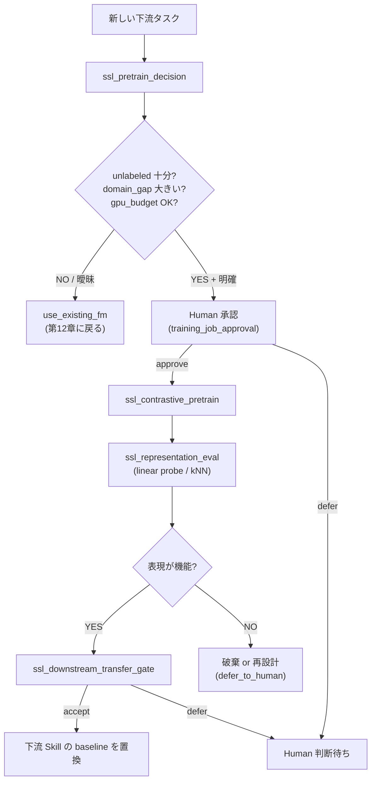

# 第13章 自己教師あり学習と対比学習を Skill 化する — 「作る側」の判断契約

> [!NOTE]
> **本章の到達目標**
> - **SimCLR / BYOL / MoCo** の 3 系統を区別し、材料応用における使い分けを書き分けられる
> - **「事前学習を作る」vs「既存 Foundation Model を使う」の判断ゲート**を Skill 化できる
> - **ラベルなし顕微鏡データからの表現学習**を、augmentation 契約・checkpoint 上書き承認・GPU 予算とセットで設計できる
> - **小規模 SSL の限界**（GPU 1 枚 / 数千枚 / 数日）を数値で示し、エージェントに「SSL を提案する / しない」の根拠を持たせられる
> - **`ssl_pretrain_decision`** で SSL 実行前の Human 承認ゲートを設計できる
> - **`ssl_representation_eval`** で「事前学習が機能したか」を linear probe / kNN で客観評価できる
>
> **本章で扱わないこと**
> - **既存 FM の呼び出しと重み署名検証** → **第12章**（本章は「自組織で FM を作る側」）
> - **FM を使った capstone**（深層特徴 → PyMC 階層） → **第14章**
> - **深層 × Agentic の特有失敗（GPU 占有・checkpoint 改ざん・augmentation 契約違反）** → **第15章**（本章は設計側の予防）
> - **大規模 SSL（数十〜数百 GPU / 数億枚）** → 本書の想定外（Meta / DeepMind 論文を参照）

---

## 13.1 この章で作る Skill

4 つの **SSL / 対比学習用 Agentic Skill** を作ります。

| Skill / 成果物 | 役割 | 入出力 |
|---|---|---|
| **`ssl_pretrain_decision`** | 「事前学習を作るべきか、既存 FM を使うべきか」を意思決定する判断ゲート | 入力: unlabeled_count + labeled_count + domain_gap + gpu_budget → 出力: `pretrain` \| `use_existing_fm` \| `defer_to_human` |
| **`ssl_contrastive_pretrain`** | SimCLR / BYOL / MoCo で自組織の unlabeled 画像から表現を学習 | 入力: dataset + method + augmentation_config + training_job_approval → 出力: encoder checkpoint + provenance |
| **`ssl_representation_eval`** | 学習された表現が下流タスクで機能するかを linear probe / kNN / few-shot で評価 | 入力: encoder + labeled_downstream → 出力: eval_report + representation_quality_flag |
| **`ssl_downstream_transfer_gate`**（契約） | SSL 重みを下流 Skill の baseline と置き換えてよいかの判断 | 入力: baseline metric + ssl metric + calibration → 出力: accept \| defer_to_human \| reject |

前提として、第5章 3 レイヤ provenance + Ch7 Layer 4 + Ch9 `bayesian_inference_config` + Ch10 `layer_attribution` / `layer_human_review` + Ch11 `foundation_model_provenance` を継承。**本章では SSL 用の拡張ブロック `ssl_pretrain_provenance` と `ssl_representation_eval_provenance` を導入**します（Ch11 と同じ拡張パターン）。

---

## 13.2 なぜこの章が必要か — 「作る側」に立つ判断

第12章までは **既存 Foundation Model を "使う側"** の設計でした。しかし、以下の場面では **自組織で SSL 事前学習を作る**方が合理的になります：

- 対象がニッチで、既存 FM の pretraining data に類似データが含まれていない（例：特殊な電子顕微鏡像、特定装置固有のノイズパターン）
- ラベルは少数しかないが、**ラベルなしデータが大量にある**（顕微鏡は画像を撮り続けている）
- ドメインギャップが大きく（Ch7 `domain_gap_gate` で defer 判定）、fine-tune では埋まらない

しかし、**SSL 事前学習は GPU 予算 / 時間 / エンジニアリング工数を大きく消費**し、エージェントが自律的に「事前学習を回そう」と判断してよい範囲を厳密に定義しないと、GPU クラスタが SSL job で埋め尽くされます。



> [!IMPORTANT]
> **本章の主題は「SSL のアルゴリズム解説」ではなく「SSL を Agentic Skill として安全に回す契約」**です。SimCLR の loss 式は §13.4 で最小限、判断ゲート・augmentation 契約・GPU 予算・承認プロセスに紙面を割きます。

---

## 13.3 SimCLR / BYOL / MoCo の位置づけ

SSL 対比学習の主要 3 系統：

| 手法 | Negative サンプル | Momentum encoder | Batch size 依存 | 材料応用の適性 |
|---|---|---|---|---|
| **SimCLR** | 同 batch 内の他サンプル | なし | **非常に強い**（4096+ 推奨） | GPU 1 枚では厳しい。中規模 SSL の入門に |
| **BYOL** | 使わない（negative-free） | あり | 弱め（256〜） | 小規模 SSL に向く。degenerate collapse に注意 |
| **MoCo v2/v3** | queue（大規模メモリバンク） | あり | 弱め（256〜） | GPU 1 枚でも実用的、材料 SEM で実績あり |

### 使い分け早見表

| 条件 | 推奨手法 | 補足 |
|---|---|---|
| GPU 8 枚以上・batch 4096+ 可能 | **SimCLR** | 論文再現しやすい、比較のベースライン |
| GPU 1〜4 枚・batch 256〜1024 | **MoCo v3** | Queue で negative を確保、実装成熟 |
| GPU 1 枚・batch 256 以下 | **BYOL** | Negative 不要、ただし collapse 検知必須 |
| 事前学習後は既存 FM と組み合わせたい | どれでも可 | 表現は encoder のみ引き継ぐ |
| ラベルなしデータ < 5,000 枚 | SSL 非推奨 | `ssl_pretrain_decision` で `use_existing_fm` |

> [!WARNING]
> **BYOL の representation collapse** は SSL 特有の "静かな失敗" です。loss は下がるが表現は全て同一ベクトルに退化。§13.6 `ssl_representation_eval` の linear probe が chance level に留まることで検知します。

---

## 13.4 対比学習の最小定式化

理解を最小限に留めるため、SimCLR の NT-Xent loss だけを示します：

```
loss_i = -log( exp(sim(z_i, z_i+) / τ) / Σ_{k≠i} exp(sim(z_i, z_k) / τ) )
```

- `z_i, z_i+`：同一画像に異なる augmentation をかけた 2 表現（**positive pair**）
- `z_k`：batch 内他サンプル（**negative pair**）
- `τ`：温度（0.1〜0.5、材料 SEM では 0.2〜0.3 が経験則）
- `sim`：cosine similarity

**重要な帰結**：SSL の性能は **augmentation の質**にほぼ全て依存します。augmentation が下流タスクの invariance と矛盾すると、事前学習は下流を悪化させます（例：向きが物性と結びつく材料で random rotation を強く入れると失敗）。

### 材料 SEM で「使ってはいけない augmentation」

| Augmentation | 一般画像では OK | 材料 SEM では |
|---|---|---|
| 色相反転 / channel shuffle | OK | **禁止**（グレースケール想定、意味論が崩壊） |
| Vertical flip | OK | **タスク依存**（重力方向に意味があれば禁止） |
| Random rotation 360° | 多くの場合 OK | **タスク依存**（結晶方位が特徴なら制限） |
| CutMix / MixUp | 分類で OK | 表現学習では基本的に不使用（対比学習の pair 意味論を壊す） |
| Gaussian noise | OK | OK（装置ノイズを模擬する範囲で） |
| Random crop | OK | OK（ただし crop 後にスケールバー情報が失われる問題は別途処理） |

> [!IMPORTANT]
> **augmentation は "Skill 契約" の一部**として YAML に固定し、Human 承認なしにエージェントが変更できないようにします（§13.5 `augmentation_config_hash`）。

---

## 13.5 `ssl_pretrain_decision` — 事前学習を "回す vs 回さない" 判断

SSL 事前学習は **GPU 予算 / エンジニアリング工数 / 数日〜数週間の時間** を消費します。エージェントが自律的に「SSL を回そう」と判断してよい条件を、契約で厳密化します。

### 判断ロジック

```python
# ssl_pretrain_decision.py
from dataclasses import dataclass, field


@dataclass
class PretrainPlan:
    """先に計画を立ててから gpu_hours を見積もる（決定と見積もりの分離）。"""
    method: str                       # "simclr" | "byol" | "mocov3"
    encoder_arch: str                 # "resnet50" | "resnet18" | "vit_b_16" ...
    batch_size: int
    epochs_min: int
    image_size: int
    expected_throughput_imgs_per_sec: float
    hardware_profile: str             # "1x_rtx4090" | "8x_a100" ...
    estimator_confidence: str         # "high" | "medium" | "low"


@dataclass
class Ch7DomainGapResult:
    """Ch7 domain_gap_gate の完全な結果オブジェクトを引き渡す（score だけでは不十分）。"""
    domain_gap_score: float
    action: str                       # "allow" | "review" | "block"
    method: str
    calibration_set_hash: str
    thresholds_used: dict
    provenance_ref: str


@dataclass
class SSLPretrainInputs:
    unlabeled_count: int
    labeled_count: int
    ch7_domain_gap_result: Ch7DomainGapResult   # score だけでなく action も含める
    existing_fm_available: bool
    existing_fm_provenance_ref: str | None
    pretrain_plan: PretrainPlan | None          # 計画がないと gpu_hours は見積もれない
    gpu_hours_available: float                  # 承認済み予算
    labeled_downstream_dataset_id: str | None   # boolean ではなく実 ID を要求


def _estimate_gpu_hours(plan: PretrainPlan, unlabeled_count: int) -> float:
    """plan と unlabeled_count から GPU 時間を見積もる。式は組織で校正。"""
    imgs = unlabeled_count * plan.epochs_min
    return imgs / max(plan.expected_throughput_imgs_per_sec, 1.0) / 3600.0


def ssl_pretrain_decision(inp: SSLPretrainInputs) -> dict:
    """
    「事前学習を作る」vs「既存 FM を使う」vs「Human 判断」vs「その他」を決める。

    契約：
      - 下流タスクの実 ID が未指定なら評価不能 → defer
      - Ch7 action が "block" なら SSL の話以前に defer
      - unlabeled < 5,000 かつ既存 FM あり → use_existing_fm
      - unlabeled < 5,000 かつ既存 FM なし → defer_to_human（"do not exist" 問題の解消）
      - pretrain_plan が無いと gpu_hours 見積もり不可 → defer
      - GPU 予算不足 → defer
      - existing_fm があり domain_gap < 0.4 → use_existing_fm
      - domain_gap >= 0.6 かつ unlabeled >= 20,000 → pretrain 推奨
      - それ以外は defer_to_human
    """
    reasons = []

    if inp.labeled_downstream_dataset_id is None:
        reasons.append("no_downstream_task_defined")
        return _decision("defer_to_human", reasons)

    if inp.ch7_domain_gap_result.action == "block":
        reasons.append("ch7_domain_gap_gate_blocked")
        return _decision("defer_to_human", reasons)

    if inp.unlabeled_count < 5000:
        if inp.existing_fm_available:
            reasons.append("unlabeled_too_small_but_existing_fm_available")
            return _decision("use_existing_fm", reasons)
        else:
            # 「存在しない FM を使え」を返さない
            reasons.append("no_existing_fm_and_unlabeled_too_small")
            return _decision("defer_to_human", reasons)

    if inp.pretrain_plan is None:
        reasons.append("no_pretrain_plan_for_estimation")
        return _decision("defer_to_human", reasons)

    gpu_hours_estimated = _estimate_gpu_hours(inp.pretrain_plan, inp.unlabeled_count)
    if gpu_hours_estimated > inp.gpu_hours_available:
        reasons.append("insufficient_gpu_budget")
        return _decision("defer_to_human", reasons, gpu_hours_estimated=gpu_hours_estimated)

    if inp.existing_fm_available and inp.ch7_domain_gap_result.domain_gap_score < 0.4:
        reasons.append("existing_fm_close_enough")
        return _decision("use_existing_fm", reasons, gpu_hours_estimated=gpu_hours_estimated)

    if inp.ch7_domain_gap_result.domain_gap_score >= 0.6 and inp.unlabeled_count >= 20000:
        # Ch7 action が review なら defer に降格
        if inp.ch7_domain_gap_result.action == "review":
            reasons.append("large_domain_gap_but_ch7_review_flag")
            return _decision("defer_to_human", reasons, gpu_hours_estimated=gpu_hours_estimated)
        reasons.append("large_domain_gap_and_sufficient_unlabeled")
        return _decision("pretrain", reasons, gpu_hours_estimated=gpu_hours_estimated)

    reasons.append("ambiguous_region")
    return _decision("defer_to_human", reasons, gpu_hours_estimated=gpu_hours_estimated)


def _decision(action: str, reasons: list[str], **extras) -> dict:
    return {
        "action": action,   # "pretrain" | "use_existing_fm" | "defer_to_human"
        "reasons": reasons,
        "requires_human_approval_before_pretrain": (action == "pretrain"),
        **extras,
    }
```

### 契約 YAML

```yaml
# ssl_pretrain_decision.yaml
skill: "ssl_pretrain_decision"
version: "1.0.0"

requires:
  ch7_domain_gap_full_result_required: true          # score だけでなく action も
  gpu_budget_pre_approved: true                      # 予算は Human 承認済みのみ
  downstream_task_dataset_id_required: true          # boolean ではなく実 ID
  pretrain_plan_required_before_estimation: true     # 循環見積もり防止

thresholds:                                          # 開発用デフォルト。組織で校正すること
  calibration_note: "these are defaults; each organization must calibrate on pilot runs"
  threshold_profile_id: "default_v1"
  unlabeled_min: 5000
  unlabeled_pretrain_recommended: 20000
  domain_gap_use_existing_max: 0.4
  domain_gap_pretrain_recommended_min: 0.6

decision_matrix:
  pretrain:
    condition: "domain_gap >= 0.6 AND unlabeled >= 20000 AND gpu_ok AND downstream_id AND ch7_action != review AND ch7_action != block"
    always_requires_human_approval: true
  use_existing_fm:
    condition: "existing_fm AND (domain_gap < 0.4 OR unlabeled < 5000)"
  defer_to_human:
    conditions:
      - "no downstream task ID"
      - "ch7 action = block or review"
      - "no existing FM AND unlabeled < 5000"
      - "no pretrain plan for estimation"
      - "insufficient GPU budget"
      - "ambiguous region"

agent_authorization:
  L1: "read_decision_only"
  L2: "read_and_prepare_pretrain_plan_but_not_launch"
  L3:
    can_recommend_pretrain: true
    cannot_launch_pretrain_without_human: "forbidden_all_levels"
    cannot_bypass_gpu_budget_check: "forbidden_all_levels"
  never_allowed:
    - "launch_pretrain_without_approval"
    - "override_unlabeled_min"
    - "invent_domain_gap_score"
    - "silently_shrink_downstream_task"
    - "recommend_nonexistent_fm"                     # 「存在しない FM を使え」を出さない

provenance:
  ssl_pretrain_decision_provenance:
    unlabeled_count: "int"
    labeled_count: "int"
    ch7_domain_gap_result:
      domain_gap_score: "float"
      action: "allow | review | block"
      method: "str"
      calibration_set_hash: "str"
      thresholds_used: "dict"
      provenance_ref: "id"
    existing_fm_available: "bool"
    existing_fm_provenance_ref: "id (if exists)"
    pretrain_plan:
      method: "str"
      encoder_arch: "str"
      batch_size: "int"
      epochs_min: "int"
      image_size: "int"
      expected_throughput_imgs_per_sec: "float"
      hardware_profile: "str"
      estimator_confidence: "high | medium | low"
    gpu_hours_estimated: "float (derived from plan)"
    gpu_hours_available: "float"
    gpu_budget_approver_hashed: "str"
    threshold_profile_id: "str"
    decision: "pretrain | use_existing_fm | defer_to_human"
    reasons: "list"
    decision_timestamp: "iso8601"
```

> [!WARNING]
> **`domain_gap_score` を独立計算しない**でください。第8章 `domain_gap_gate` が出した数字とその provenance を必ず引き渡します。エージェントが独立に "domain_gap は 0.3 くらい" と推定すると、SSL 判断が systematic bias を持ちます。

---

## 13.6 `ssl_contrastive_pretrain` — augmentation 契約と checkpoint 上書き承認

事前学習の実装は既存ライブラリ（`solo-learn`, `lightly`, `pytorch-lightning-bolts`）で十分ですが、**Skill として運用するには以下 4 点が本質的**です：

1. **augmentation_config を YAML で固定**し、hash を provenance に残す
2. **training_job_approval**（Ch4 §5.7 の agent authorization）で Human 承認済みでないと起動しない
3. **checkpoint_overwrite_policy** で既存重みを勝手に上書きしない
4. **GPU 予算 monitor** で見積もり超過時に停止

### 契約 YAML

```yaml
# ssl_contrastive_pretrain.yaml
skill: "ssl_contrastive_pretrain"
version: "1.0.0"

requires:
  ssl_pretrain_decision_result: "pretrain"           # 直前の decision が pretrain 以外は起動不可
  training_job_approval_signed: true                 # Human 承認済み job ID 必須
  augmentation_config_pre_approved: true             # augmentation は Human 承認済み hash と一致
  downstream_task_reference: true                    # 評価対象の下流タスク ID を必須引き渡し

method:
  choices: ["simclr", "byol", "mocov3"]
  default: "mocov3"                                  # GPU 1 枚を想定
  batch_size_min:
    simclr: 1024
    byol: 256
    mocov3: 256
  epochs_min: 200                                    # collapse リスク低減の下限
  epochs_default: 200
  early_stop_only_on_collapse: true                  # epochs 早期打ち切りは collapse 検知経由のみ

augmentation_config:
  required_fields:                                   # 契約が要求するフィールド一覧
    - "resize_size"
    - "crop_size"
    - "crop_scale_min_max"
    - "horizontal_flip_prob"
    - "vertical_flip_prob"
    - "rotation_max_deg"
    - "gaussian_blur_sigma_min_max"
    - "gaussian_noise_sigma_max"
    - "config_hash"
  enforced_values:                                   # 材料 SEM 想定の強制値
    color_jitter_disabled_for_grayscale: true
    config_hash_algorithm: "sha256"
    hash_input: "canonicalized_parsed_yaml"          # 空白差で hash が変わるのを防ぐ

checkpoint_policy:
  states:                                            # ライフサイクル状態を明示
    - "intermediate"                                 # resume 用一時 checkpoint（同 run_id で上書き可）
    - "resumable"                                    # crash recovery 用（同 run_id 内）
    - "budget_stopped"                               # hard_stop で強制終了、eval は許可・transfer は defer
    - "final_accepted"                               # 評価と gate を通過したもの
    - "discarded"                                    # collapse 等で破棄
  final_uri_never_overwrite: true                    # final_accepted の URI は絶対上書き禁止
  uri_pattern: "s3://ssl-checkpoints/{project}/{method}/{unlabeled_dataset_id}/{run_id}/{state}/"
  resume_within_same_run_id_allowed: true            # crash recovery を許可
  require_signed_run_id: true

gpu_budget_monitor:
  budget_hours: "from ssl_pretrain_decision"
  soft_stop_at_ratio: 0.9                            # 予算の 90% 到達で warn
  hard_stop_at_ratio: 1.0                            # 100% 到達で強制停止
  partial_checkpoint_on_hard_stop: "budget_stopped"  # 破棄せず eval 用に保存
  require_reapproval_if_stopped: true

collapse_detection:                                  # BYOL / MoCo で必須
  metric_layer: "backbone_output_after_global_pool"  # projection / predictor ではなく backbone 出力
  metric: "std_of_l2_normalized_representations_per_batch"
  stop_if_std_below: 0.01
  min_epochs_before_check: 20                        # 初期エポックの安定期は除外
  also_log:                                          # 診断用に他層も記録
    - "projection_head_output_std"
    - "predictor_output_std_if_byol"

transfer_artifact_policy:
  downstream_uses: "backbone_encoder_only"           # projection / predictor は転移しない
  projection_and_predictor: "training_only"
  separate_approval_required_for_projection_transfer: true

agent_authorization:
  L1: "read_config_only"
  L2: "prepare_and_dry_run_but_not_launch"
  L3:
    can_launch_with_signed_approval: true
    cannot_modify_augmentation_config: "forbidden_all_levels"
    cannot_overwrite_final_checkpoint: "forbidden_all_levels"
    cannot_extend_gpu_budget_without_reapproval: "forbidden_all_levels"
  never_allowed:
    - "launch_without_training_job_approval"
    - "silently_change_augmentation"
    - "overwrite_final_checkpoint_uri"
    - "disable_collapse_detection"
    - "continue_after_hard_gpu_stop"
    - "transfer_projection_head_without_approval"

acceptance:
  collapse_check_passed_at_end: true
  gpu_hours_within_budget: true
  augmentation_config_hash_matches_approved: true
  final_checkpoint_written_to_new_uri: true

provenance:
  ssl_pretrain_provenance:                           # 拡張ブロック（Ch11 pattern）
    method: "simclr | byol | mocov3"
    encoder_arch: "str (e.g., resnet50, vit_b_16)"
    projection_head_config: "dict (training-only, not transferred)"
    unlabeled_dataset_id: "str"
    unlabeled_dataset_snapshot:                      # Ch11 manifest registry と同水準
      manifest_uri: "str (append-only registry)"
      merkle_root_sha256: "str"                      # 全ファイル hash の Merkle root
      file_count: "int"
      approver_hashed: "str"
    unlabeled_count: "int"
    augmentation_config_yaml_hash:                   # 空白差を除いた canonical hash
      hash: "sha256"
      canonicalization: "yaml_parsed_then_json_sorted_keys"
    batch_size: "int"
    epochs_completed: "int"
    checkpoint_state: "intermediate | resumable | budget_stopped | final_accepted | discarded"
    temperature_tau: "float (SimCLR/MoCo)"
    ema_momentum: "float (BYOL/MoCo)"
    optimizer_config: "dict"
    lr_schedule: "dict"
    seed_per_worker: "list of int"
    gpu_backend: "cuda | rocm | mps"
    cudnn_deterministic: "bool"
    mixed_precision: "bool"
    gpu_hours_consumed: "float"
    gpu_hours_budget: "float"
    training_job_approval:                           # Ch11 と同じ signed registry
      approval_id: "str"
      signed_by_registry: true
      approvers_quorum_hashed: "list (min 2)"
      registry_signature_verified: true
    final_checkpoint_uri: "str"
    final_checkpoint_sha256: "str"
    downstream_task_reference_id: "str"
    collapse_detection:
      final_backbone_std: "float"
      final_projection_std: "float"
      final_predictor_std: "float (if byol)"
```

> [!WARNING]
> **`augmentation_config` を "エージェントが自律的にチューニングする" のは禁止**です。augmentation の変更は下流タスクの invariance を変えるため、Human 承認プロセスに戻す必要があります。エージェントは augmentation 案を提示できますが、変更した config で起動することは全レベル forbidden。

---

## 13.7 `ssl_representation_eval` — 「事前学習が機能したか」を客観評価

SSL は loss が下がるだけでは意味がありません。**下流タスクの少数ラベルで linear probe / kNN を回して表現の質を測る**のが標準です。

### 評価プロトコル

```python
# ssl_representation_eval.py
import numpy as np
from collections import Counter
from sklearn.linear_model import LogisticRegression
from sklearn.neighbors import KNeighborsClassifier
from sklearn.preprocessing import StandardScaler


def ssl_representation_eval(
    encoder,                                        # backbone のみ（projection head は使わない）
    train_loader,                                   # 固定 train split（few-shot はここから subsample）
    val_loader,                                     # 固定 val split（評価はここで）
    test_loader=None,                               # optional 最終評価用
    n_labels_per_class_grid: list[int] = (5, 20, 100),
    knn_k: int = 20,
    knn_eval_max_samples: int = 10000,              # LOO の quadratic を防ぐ
    linear_probe_max_iter: int = 5000,
    subsample_seed: int = 0,                        # SSL / 対照 で共通シード
    baseline_random_encoder_metrics: dict = None,   # 同 arch のランダム初期化 encoder の結果
) -> dict:
    """
    encoder が学習した表現を、下流タスクの少数ラベルで評価。

    重要な設計：
      - train / val (/ test) split は呼び出し側で固定（immutable）
      - few-shot subsample は train_loader からのみ抽出、val で評価
      - SSL encoder と対照 encoder は同一 split・同一 subsample seed を使う
      - encoder は backbone のみ（projection head / predictor は含めない）
    """
    encoder.eval()
    emb_train, lbl_train = _extract_embeddings(encoder, train_loader)
    emb_val, lbl_val = _extract_embeddings(encoder, val_loader)

    # 特徴量標準化（linear probe の収束を安定化）
    scaler = StandardScaler().fit(emb_train)
    emb_train_s = scaler.transform(emb_train)
    emb_val_s = scaler.transform(emb_val)

    # 表現の分散（collapse 判定用）— L2 正規化後の std を測る
    emb_train_norm = emb_train / (np.linalg.norm(emb_train, axis=1, keepdims=True) + 1e-8)
    mean_std = float(np.mean(np.std(emb_train_norm, axis=0)))
    collapsed = mean_std < 0.01

    # クラスごとのサンプル数から adaptive な n_grid を作る
    class_counts = Counter(lbl_train.tolist())
    min_class_count = min(class_counts.values())
    valid_ns = [n for n in n_labels_per_class_grid if n <= min_class_count]
    if not valid_ns:
        return {
            "representation_quality_flag": "insufficient_labels_for_n",
            "min_class_count": min_class_count,
            "mean_embedding_std": mean_std,
            "collapsed": collapsed,
        }

    results = {"linear_probe": {}, "knn": {}, "convergence": {}}
    for n in valid_ns:
        sub_emb, sub_lbl = _stratified_subsample(
            emb_train_s, lbl_train, n_per_class=n, seed=subsample_seed
        )
        clf = LogisticRegression(max_iter=linear_probe_max_iter, solver="lbfgs")
        clf.fit(sub_emb, sub_lbl)
        # 評価は val split で（train データの再スコアではない）
        val_acc = clf.score(emb_val_s, lbl_val)
        results["linear_probe"][n] = float(val_acc)
        results["convergence"][n] = {
            "n_iter": int(getattr(clf, "n_iter_", [linear_probe_max_iter])[0]),
            "converged": bool(
                getattr(clf, "n_iter_", [linear_probe_max_iter])[0] < linear_probe_max_iter
            ),
        }

    # kNN 評価：train を index、val をクエリ（LOO ではなく train→val 方向）
    # 大規模データセット用に上限を設ける
    if len(emb_train) > knn_eval_max_samples:
        idx = np.random.default_rng(subsample_seed).choice(
            len(emb_train), size=knn_eval_max_samples, replace=False
        )
        knn_train_emb, knn_train_lbl = emb_train[idx], lbl_train[idx]
    else:
        knn_train_emb, knn_train_lbl = emb_train, lbl_train
    knn = KNeighborsClassifier(n_neighbors=knn_k)
    knn.fit(knn_train_emb, knn_train_lbl)
    results["knn"][knn_k] = float(knn.score(emb_val, lbl_val))

    # baseline_delta（provided されていれば計算）
    baseline_delta = None
    if baseline_random_encoder_metrics is not None:
        top_n = max(valid_ns)
        baseline_delta = {
            f"linear_probe_{top_n}": (
                results["linear_probe"][top_n]
                - baseline_random_encoder_metrics["linear_probe"][top_n]
            )
        }

    # convergence check：どれか未収束なら flag を defer 相当に
    any_non_converged = not all(c["converged"] for c in results["convergence"].values())

    n_classes = int(len(set(lbl_val)))
    chance = 1.0 / n_classes
    # chance-scale threshold：chance が高い（少クラス）場合は絶対マージンも要求
    top_n = max(valid_ns)
    lp_top = results["linear_probe"][top_n]
    scale_margin = max(chance * 0.5, 0.1)             # chance の 50% 上 or 絶対 10pt のうち大きい方

    if collapsed:
        flag = "collapsed"
    elif any_non_converged:
        flag = "non_converged_defer_to_human"
    elif lp_top < chance + scale_margin:
        flag = "collapsed"
    elif baseline_delta is not None and list(baseline_delta.values())[0] < 0.05:
        flag = "marginal"                             # ランダム encoder より 5pt 未満
    else:
        flag = "good"

    return {
        "n_used_grid": valid_ns,
        "linear_probe_val_acc_by_n": results["linear_probe"],
        "linear_probe_convergence": results["convergence"],
        "knn_val_acc": results["knn"],
        "mean_embedding_std_l2_normalized": mean_std,
        "collapsed": collapsed,
        "baseline_delta": baseline_delta,
        "representation_quality_flag": flag,
        "chance_level": chance,
        "scale_margin_used": scale_margin,
        "min_class_count": min_class_count,
    }
```

### 契約 YAML（要旨）

```yaml
# ssl_representation_eval.yaml
skill: "ssl_representation_eval"
version: "1.0.0"

requires:
  encoder_provenance_ref: true                       # どの pretrain 実行に対する評価か
  labeled_downstream_dataset_id: true
  labeled_downstream_split_immutable: true           # train/val(/test) split は固定・共通
  baseline_random_encoder_comparison: true           # ランダム encoder との比較必須
  baseline_random_encoder_uses_same_split_and_seed: true  # 交絡防止
  encoder_input_is_backbone_only: true               # projection head 含めない

evaluation:
  n_labels_per_class_grid_default: [5, 20, 100]      # few-shot 3 段階（adaptive で縮小可）
  adaptive_grid_on_class_imbalance: true             # min_class_count 未満の n はスキップ
  knn_k: 20
  knn_eval_max_samples: 10000                        # LOO の quadratic を回避
  linear_probe_max_iter: 5000                        # 収束確認と併用
  require_feature_standardization: true              # StandardScaler 適用
  require_convergence_check: true                    # n_iter_ < max_iter を verify
  collapse_metric: "std_of_l2_normalized_embeddings"
  collapse_std_threshold: 0.01
  marginal_baseline_delta_max: 0.05                  # 5pt 未満は marginal
  chance_scale_margin: "max(chance * 0.5, 0.10)"     # クラス数に応じたスケール補正

decision:
  quality_flag_mapping:
    good: "representation is usable"
    marginal: "may be usable but does not clearly beat random encoder"
    collapsed: "representation degenerated, discard checkpoint"
    non_converged_defer_to_human: "linear probe did not converge; results unreliable"
    insufficient_labels_for_n: "downstream has fewer labels than min grid; recompute"

agent_authorization:
  L1: "read_eval_report"
  L2: "run_eval_on_approved_downstream"
  L3:
    can_recommend_transfer: true
    cannot_hide_marginal_or_collapsed_result: "forbidden_all_levels"
    cannot_use_different_split_between_ssl_and_baseline: "forbidden_all_levels"
  never_allowed:
    - "cherry_pick_downstream_task_to_hide_collapse"
    - "compare_ssl_encoder_to_untrained_baseline_only"
    - "silently_drop_low_n_results"
    - "evaluate_on_train_split"
    - "include_projection_head_in_transfer_eval"

provenance:
  ssl_representation_eval_provenance:
    encoder_provenance_ref: "id"
    encoder_input: "backbone_only"
    labeled_downstream_dataset_id: "str"
    labeled_downstream_split_manifest_hash: "sha256"
    subsample_seed: "int"
    n_used_grid: "list"
    linear_probe_val_acc_by_n: "dict"
    linear_probe_convergence: "dict of {n: {n_iter, converged}}"
    knn_val_acc: "dict"
    mean_embedding_std_l2_normalized: "float"
    baseline_random_encoder_metrics: "dict (same split, same seed)"
    baseline_delta: "dict"
    representation_quality_flag: "good | marginal | collapsed | non_converged_defer_to_human | insufficient_labels_for_n"
    chance_level: "float"
    scale_margin_used: "float"
    eval_timestamp: "iso8601"
```

> [!IMPORTANT]
> **`baseline_random_encoder_comparison` を義務化**する理由は、ランダム初期化の同一アーキテクチャ encoder でも意外に高い linear probe accuracy が出ることがあるためです。**「事前学習が効いた」ことを示すには、必ずランダム encoder との差分**を報告します。

---

## 13.8 `ssl_downstream_transfer_gate` — 下流 baseline 置換の判断

SSL encoder が eval で "good" と出ても、**下流 Skill の baseline を置き換えるかは別判断**です。以下 5 条件で判定：

| 条件 | 閾値 | 補足 |
|---|---|---|
| 下流 primary metric の改善 | CI 下限 > task-specific margin | 単純な point estimate ではなく統計的下限 |
| Calibration（Ch8 ECE）の悪化なし | `ece_abs_increase_max` かつ `ece_relative_increase_max` の両方 | ECE ≈ 0 付近での相対比較の不安定性を回避 |
| 評価サンプル数 | `min_eval_samples_per_class` 以上 | 少数サンプルの偽陽性を防ぐ |
| Representation quality flag | `good` のみ acceptable | marginal / collapsed / non_converged は不可 |
| Human 承認 | 必須（automated accept 禁止） | Ch11 fm_update_gate と同水準 |

### 契約 YAML（要旨）

```yaml
# ssl_downstream_transfer_gate.yaml
skill: "ssl_downstream_transfer_gate"
version: "1.0.0"

requires:
  baseline_downstream_metrics: true
  ssl_encoder_downstream_metrics: true
  calibration_delta_from_ch8: true                   # ECE 絶対 + 相対両方
  ssl_representation_eval_result: "good"
  primary_metric_specified: true
  evaluation_uses_immutable_test_split: true

metric_schema:                                       # metric の方向・スケール曖昧性を排除
  primary_metric:
    name: "str (e.g., accuracy, macro_f1, auroc, rmse)"
    direction: "higher_is_better | lower_is_better"
    absolute_or_relative: "absolute | relative"
  secondary_metrics:                                 # 参考値、決定には使わない
    type: "list of metric_schema"

decision_matrix:
  metric_improvement:
    minimum_absolute_or_relative_by_task: "task-specific margin (approved separately)"
    require_ci_lower_bound_above_margin: true        # point estimate ではなく CI 下限
    ci_method: "paired_bootstrap"
    ci_level: 0.95
    bootstrap_samples: 1000
    min_eval_samples_per_class: 50
  calibration_guard:
    ece_abs_increase_max: 0.02                       # 絶対値の上昇上限（epsilon floor）
    ece_relative_increase_max: 0.20                  # 相対値の上昇上限
    both_must_pass: true                             # 絶対 + 相対の両方
  representation_quality_required: "good"
  human_approval_required: true
  reviewers_min: 2

  outcomes:
    accept: "全条件クリア + Human approve (reviewers >= 2)"
    defer_to_human: "1 条件でも境界、CI 下限が margin をまたぐ、または marginal representation"
    reject: "metric CI 下限が悪化 or ECE 絶対 or 相対が上限超過 or collapsed"

agent_authorization:
  L3:
    can_recommend_transfer: true
    cannot_switch_baseline_without_human: "forbidden_all_levels"
    cannot_silently_downgrade_calibration: "forbidden_all_levels"
    cannot_use_point_estimate_only: "forbidden_all_levels"
  never_allowed:
    - "auto_replace_baseline"
    - "cherry_pick_metric_to_hide_ece_regression"
    - "ignore_marginal_representation"
    - "skip_ci_computation"
    - "use_train_split_for_transfer_decision"

provenance:
  ssl_downstream_transfer_gate_decision:
    primary_metric_schema: "dict"
    baseline_metric: "float"
    ssl_metric: "float"
    metric_improvement: "float"
    baseline_ece: "float"
    ssl_metric: "float"
    metric_improvement_point_estimate: "float"
    metric_improvement_ci_lower_95: "float"
    metric_improvement_ci_upper_95: "float"
    task_specific_margin: "float"
    bootstrap_samples: "int"
    eval_samples_per_class: "dict"
    baseline_ece: "float"
    ssl_ece: "float"
    ece_absolute_change: "float"
    ece_relative_change: "float"
    representation_quality_flag: "str"
    decision: "accept | defer_to_human | reject"
    human_reviewers_hashed: "list (min 2)"
    decision_timestamp: "iso8601"
```

---

## 13.9 小規模 SSL の限界 — GPU 1 枚で何ができるか

材料研究室で現実的な設定を数値で示します。以下の値は **参考目安**であり、image_size / precision / dataloader IO / storage throughput / optimizer に強く依存します：

| 資源 | 条件 | 実務目安 |
|---|---|---|
| GPU 1 枚（RTX 4090 相当、mixed precision, 224x224） | MoCo v3 / ResNet-50 / batch 256 | 100k 枚 × 200 epoch で **約 5〜7 日** |
| 同上 | MoCo v3 / ResNet-50 / batch 256 | 10k 枚 × 200 epoch で **約 12〜18 時間** |
| 同上 | BYOL / ResNet-18 / batch 256 | 5k 枚 × 300 epoch で **約 6〜10 時間** |
| GPU 8 枚（A100 相当、LARS optimizer 必須） | SimCLR / ResNet-50 / batch 4096 | 100k 枚 × 200 epoch で **約 1 日** |

> [!IMPORTANT]
> 上記は **image_size=224x224 / mixed precision / SSD ストレージ / prefetch 十分**の前提。画像サイズ 512 以上、fp32、HDD ストレージ、IO ボトルネックあり等の条件では **2〜5 倍伸びる**ことがあります。実測 throughput は `pretrain_plan.expected_throughput_imgs_per_sec` に記録してください。

**含意**：

- **GPU 1 枚では 5,000〜100,000 枚が現実的な上限**。それ以下は既存 FM、それ以上はクラスタ SSL を検討
- **ViT-B クラス以上の SSL は GPU 1 枚では基本的に非推奨**（batch サイズ確保が困難）。ただし **ViT-S / DINO-style / gradient accumulation 併用**で 1 枚でも成立する場合があり、`pretrain_plan` に throughput 実測を残せば検討可能
- **大 batch SSL（>= 1024）は LARS / LAMB optimizer が事実上必須**（`optimizer_config` に記録）
- **200 epoch 未満で打ち切ると collapse リスクが上がる**（early stop は collapse 検知経由で行う）
- **ストレージ IO ボトルネック**は SSL では顕在化しやすい。100k 枚 × 224x224 × 3ch で数十 GB、prefetch 不足でも GPU が待ち時間になる

> [!WARNING]
> **エージェントが "とりあえず SSL を回してみる" と提案するのは危険**です。GPU 1 枚を 1 週間占有する判断は、`ssl_pretrain_decision` の `pretrain` 分岐 + Human 承認を必ず通します。

---

## 13.10 エージェントが SSL 起動を提案してよい場面

`ssl_pretrain_decision` が `pretrain` を返しても、それは **推奨** であって **起動命令ではありません**。エージェントが SSL 起動を **人間に提案してよい**具体シーン：

| シーン | エージェントの提案内容 |
|---|---|
| 新しい装置で unlabeled 画像が 5 万枚溜まった | 「既存 FM の domain_gap は 0.7 で大きい。MoCo v3 で ResNet-50 の SSL を提案。GPU 予算見積 60 時間」 |
| 下流タスクで既存 FM の linear probe が chance level ギリギリ | 「既存 FM の表現が下流に効いていない可能性。SSL 事前学習を検討値としてご提案」 |
| ラベルは 100 枚しかないが unlabeled が 20 万枚ある | 「few-shot linear probe を最終評価にする前提で、MoCo v3 SSL を提案」 |

**逆に、エージェントが SSL を提案してはいけない場面**：

- unlabeled が 5,000 未満（`ssl_pretrain_decision` が却下）
- GPU 予算が未承認
- 下流タスクが未定義
- 既存 FM の linear probe が既に "good"
- 現在の期限内に評価まで完走できない見込み

---

## 13.11 失敗パターンと対策

| 失敗 | 症状 / 兆候 | 対策（参照する契約フィールド） |
|---|---|---|
| unlabeled < 5000 で SSL 起動 | collapse か chance level | `ssl_pretrain_decision.thresholds.unlabeled_min` + `override_unlabeled_min: never_allowed` |
| augmentation を勝手にチューニング | 下流 invariance が壊れる | `augmentation_config_pre_approved` + `silently_change_augmentation: never_allowed` |
| checkpoint を既存 URI に上書き | 前回実行の重みが失われる | `checkpoint_overwrite_policy.never_overwrite_existing_uri` + `overwrite_checkpoint_uri: never_allowed` |
| BYOL representation collapse を見逃す | loss は下がるが linear probe が chance | `collapse_detection.stop_if_std_below: 0.01` + `ssl_representation_eval.collapsed` flag |
| GPU 予算超過で silent に継続 | 他ジョブ圧迫、クラスタ運用崩壊 | `gpu_budget_monitor.hard_stop_at_ratio: 1.0` + `continue_after_hard_gpu_stop: never_allowed` |
| ランダム encoder 比較なしで "SSL 成功" と報告 | 事前学習効果が測れていない | `baseline_random_encoder_comparison: true` + `compare_ssl_encoder_to_untrained_baseline_only: never_allowed` |
| Marginal representation で下流置換 | 実質改善なしで運用切替 | `ssl_downstream_transfer_gate.representation_quality_required: "good"` + `ignore_marginal_representation: never_allowed` |
| ECE 悪化を隠して metric 改善だけ報告 | Calibration が退化 | `ece_relative_increase_max: 0.20` + `cherry_pick_metric_to_hide_ece_regression: never_allowed` |
| SSL 起動時に downstream task 未定義 | 評価軸なしで GPU 消費 | `downstream_task_defined: true` + `no_downstream_task_defined` を defer 直行 |
| domain_gap を独立推定 | systematic bias で SSL 判断歪む | `domain_gap_score_from_ch7_domain_gap_gate: true` + `invent_domain_gap_score: never_allowed` |
| 色相 augmentation を SEM に適用 | グレースケール仮定崩壊、SSL 学習不成立 | `color_jitter_disabled_for_grayscale: true` |
| Human 承認なしで training job 起動 | 権限逸脱・監査崩壊 | `training_job_approval_signed: true` + `launch_without_training_job_approval: never_allowed` |
| Pretraining unlabeled と downstream test が重複 | ラベル漏洩、SSL が実質 "test を見て" 学習 | `unlabeled_dataset_snapshot` の Merkle root と downstream split manifest を比較する pre-eval check |
| Encoder eval 時に BN が train mode | val 上のバッチ統計が推論に混入 | `encoder.eval()` を eval Skill 冒頭で強制、`evaluate_in_train_mode: never_allowed` |
| 大 batch SSL で LARS/LAMB 未使用 | 収束せず collapse・時間浪費 | `optimizer_config` に `optimizer_type` を必須記録、batch >= 1024 で SGD/Adam は warn |
| Unlabeled と labeled で domain 分布が異なる | SSL 表現が下流に効かない | Ch7 `domain_gap_gate` を **unlabeled → downstream 方向でも実行** し、gap 大なら pretrain を defer |
| 転移時に projection head も持ち出す | 学習時 head の副作用が下流に持ち込まれる | `transfer_artifact_policy.downstream_uses: backbone_encoder_only` + `transfer_projection_head_without_approval: never_allowed` |
| Linear probe が未収束のまま "SSL 成功" と報告 | 表現の質を測れていない | `require_convergence_check: true` + `non_converged_defer_to_human` flag |
| Point estimate だけで下流置換 | ノイズで偽の改善が accept | `require_ci_lower_bound_above_margin: true` + `skip_ci_computation: never_allowed` |

---

## 13.12 まとめ

- SSL は **「作る側」の判断が主題**：`ssl_pretrain_decision` で SSL を回すか既存 FM を使うかを厳格化
- **SimCLR / BYOL / MoCo** は GPU 予算・batch サイズで使い分け、GPU 1 枚なら **MoCo v3 が第一候補**
- **augmentation は Skill 契約の一部**、Human 承認なしにエージェントが変更できない
- **checkpoint 上書き禁止**、GPU 予算 hard_stop、collapse 検知を契約で強制
- **`ssl_representation_eval`** はランダム encoder との比較を義務化し、"効いた" を客観化
- **`ssl_downstream_transfer_gate`** は metric 改善 + calibration 悪化なし + Human 承認の 3 点セット
- SSL 特有の失敗パターン 12 件を Skill 契約で予防

## 13.13 章末チェックリスト

- [ ] `ssl_pretrain_decision` を通してから SSL 起動しているか（自律起動禁止）
- [ ] `domain_gap_score` は第8章 `domain_gap_gate` の出力を使っているか（独立推定禁止）
- [ ] `augmentation_config` の hash が Human 承認済みと一致しているか
- [ ] `checkpoint_overwrite_policy.never_overwrite_existing_uri` が有効か
- [ ] GPU 予算の soft_stop / hard_stop が設定され、hard_stop 後の継続禁止か
- [ ] BYOL / MoCo で `collapse_detection` が有効か
- [ ] `ssl_representation_eval` でランダム encoder との比較をしているか
- [ ] linear probe / kNN / few-shot の 3 種を並行報告しているか
- [ ] `ssl_downstream_transfer_gate` の 4 条件（metric / ECE / quality / Human）を全部通っているか
- [ ] SEM グレースケール想定なら `color_jitter_disabled_for_grayscale: true` か
- [ ] Unlabeled と downstream test の重複チェック（Merkle root 比較）が済んでいるか
- [ ] 転移するのは backbone のみか（projection head / predictor は含めない）
- [ ] 大 batch (>= 1024) の場合、`optimizer_config` に LARS / LAMB を明示しているか
- [ ] 下流評価は immutable な train/val/test split で、SSL と対照 encoder が同一 split・同一 seed を使っているか
- [ ] Linear probe の convergence check + feature standardization が有効か
- [ ] Transfer gate で point estimate ではなく CI 下限で判定しているか
- [ ] ECE guard は絶対値 + 相対値の両方を通しているか

## 13.14 ワーク

**W12-1**: `ssl_pretrain_decision` を実装せよ。unlabeled = {3k, 10k, 50k}, domain_gap = {0.2, 0.5, 0.8}, existing_fm = {True, False}, gpu_hours_available/estimated = {50/30, 20/30} の全組合せで decision と reasons を出力し、判断表を作成せよ。

**W12-2**: ARIM 風合成 SEM 画像（vol-02 の `data/synthetic-hierarchy/` を拡張）で unlabeled 5,000 枚を用意し、MoCo v3 で ResNet-18 を SSL せよ。GPU 1 枚での実測時間・GPU 使用率・最終 collapse std を報告せよ。

**W12-3**: W12-2 の encoder を `ssl_representation_eval` で評価せよ。同アーキのランダム encoder と比較し、few-shot linear probe (5/20/100 labels/class) の改善幅を報告せよ。

**W12-4**: BYOL を意図的に collapse させる augmentation（例：identity 変換を positive pair に使う）で実行し、`ssl_representation_eval.collapsed` flag が発火することを確認せよ。

**W12-5**: `ssl_downstream_transfer_gate` の decision matrix を実装し、accept / defer_to_human / reject の 3 パターンをそれぞれ再現するテストケースを書け（metric improvement, ECE regression, quality flag の組合せで）。

## 13.15 参考資料

- Chen, T., Kornblith, S., Norouzi, M., & Hinton, G. (2020). A Simple Framework for Contrastive Learning of Visual Representations (SimCLR). ICML.
- Grill, J.-B., et al. (2020). Bootstrap Your Own Latent (BYOL): A New Approach to Self-Supervised Learning. NeurIPS.
- He, K., Fan, H., Wu, Y., Xie, S., & Girshick, R. (2020). Momentum Contrast for Unsupervised Visual Representation Learning (MoCo v1). CVPR.
- Chen, X., Xie, S., & He, K. (2021). An Empirical Study of Training Self-Supervised Vision Transformers (MoCo v3). ICCV.
- Ericsson, L., Gouk, H., Loy, C. C., & Hospedales, T. M. (2022). Self-Supervised Representation Learning: Introduction, Advances, and Challenges. IEEE SPM.
- solo-learn ライブラリ: https://github.com/vturrisi/solo-learn
- lightly ライブラリ: https://github.com/lightly-ai/lightly
- 本書 第8章（domain_gap_gate）、第9章（calibration/ECE）、第11章（deep_report_template）、第12章（fm_fetch_and_verify との対比）
- vol-01 第6章（Human-in-the-loop 承認プロセス）
- vol-02 第14章（合成階層データ）
- 本書 第14章（capstone で SSL encoder → PyMC 階層に接続する可能性）
