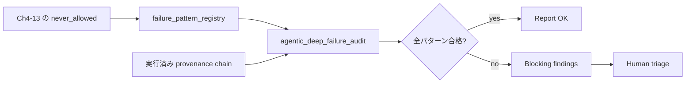
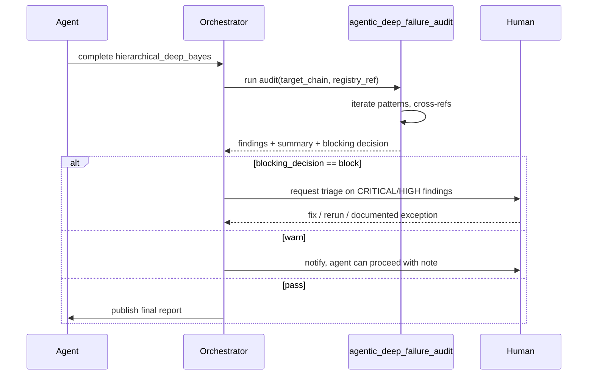

# 第14章 深層 × Agentic 特有の失敗パターンと監査

> [!NOTE]
> **この章の到達目標**
>
> - 深層学習を Agentic ワークフローに載せた際に生じる **2 種類の失敗**（深層一般 / Agentic 特有）を体系化する
> - Ch4-13 で導入した `never_allowed` 契約フィールドを **1 つの失敗パターンレジストリ**に集約する
> - **監査 Skill `agentic_deep_failure_audit`** を導入し、実行後の provenance を静的にチェックする
> - Experiment tracking（MLflow / W&B）を導入すべき判断基準を示す
>
> **扱わないこと**
>
> - 個別モデル固有のハイパーパラメータ調整（vol-02 で扱い済み）
> - セキュリティ脆弱性（付録 C で扱う）
> - LLM プロンプトインジェクション（本書スコープ外）

---

## 14.1 この章で作る Skill

| Skill | 役割 |
|---|---|
| `agentic_deep_failure_audit` | 実行済み Skill の provenance chain を舐めて、失敗パターンレジストリ照合を行う静的監査 Skill |
| `failure_pattern_registry` | 深層一般 + Agentic 特有の失敗パターンを ID 付きで一元管理し、各パターンを検出するための `signal_selector` を提供する |

vol-03 全体の各章で登場した `never_allowed` / `forbidden_all_levels` / 失敗パターン表を、この章で **1 本のレジストリに正規化**して集約します。

## 14.2 なぜ「失敗パターン章」が必要か

第4-13章では、各章末に失敗パターン表を置いてきました。しかし実際の運用では、**複数の章にまたがる複合失敗**が発生します。例：

- Ch11 で FM を fetch した SHA が Ch11 registry と一致しているが、**Ch12 SSL pretrain が別 SHA で走った**（章単位ではどちらも合格、chain 単位で不整合）
- Ch13 の Gate 2 を通過したが、**通過時の high_uncertainty_sample_ids と、Bayes に渡された known_high_uncertainty_mask の差集合が非空**（章単位では両方合格）
- Ch4 の Layer 2 augmentation が signed 済みだが、**Ch7 fine-tune 中に agent が別 augmentation policy をロード**（Layer 2 契約違反だが Ch7 の acceptance では検出できない）

このような **章間・Skill 間の整合性違反**は、章単位のチェックリストでは捕まえられません。第14章では：

1. **横断的な失敗パターン**を分類（深層一般 8 + Agentic 特有 9 = 17 パターン）
2. 各パターンに **provenance 上のシグナル**を割り当て
3. **監査 Skill** で自動検出



---

## 14.3 失敗パターンの分類

### カテゴリ

| ID prefix | カテゴリ | 対象 |
|---|---|---|
| **DG-** | Deep General | GPU / 重み / データ / 特徴 / 不確かさ の技術的失敗 |
| **AG-** | Agentic-Specific | 権限 / 承認 / 履歴 / 監査 の運用的失敗 |
| **MX-** | Mixed | 深層 × Agentic の複合（章間で発生） |

### 重大度

| Severity | 意味 | 監査時の扱い |
|---|---|---|
| **CRITICAL** | 監査根拠が失われる、Human bypass、silent data corruption | pipeline を halt、要 Human triage |
| **HIGH** | 統計的 / 科学的に無効な結論を生む | pipeline を halt、rerun 推奨 |
| **MEDIUM** | 結果は妥当だが再現性 / 説明可能性を毀損 | warning、承認付きで進行可 |
| **LOW** | ベストプラクティス逸脱 | log 記録のみ |

---

## 14.4 Section 1 — 深層一般の失敗（DG-xx）

### DG-01: GPU 非決定性による結果ずれ

| 項目 | 内容 |
|---|---|
| **症状** | 同じ seed / 同じデータで学習しても、GPU / cuDNN / TF32 の設定が違うと最終 loss / metrics が 1〜3% ずれる |
| **原因** | cuDNN の非決定的アルゴリズム、`torch.backends.cudnn.benchmark=True`、TF32 の暗黙有効化、混合精度の非対称丸め |
| **検出シグナル** | Ch4 Layer 3 provenance の `torch_deterministic`, `cudnn_deterministic`, `tf32_allowed`, `cuda_version`, `gpu_arch` が欠落 or 不一致 |
| **対策契約** | Ch4 `gpu_environment_provenance_required: true`, `deterministic_config_signed: true` |
| **Severity** | MEDIUM |

### DG-02: 事前学習重みの汚染

| 項目 | 内容 |
|---|---|
| **症状** | ImageNet pretrained や FM の重みが、後段 fine-tune の対象データにすでに含まれていた（重複データ汚染）。test set の一部が pretrain set に混入している |
| **原因** | web スクレイピング型データセット（例：LAION）と学術データセットの間で暗黙の重複 |
| **検出シグナル** | Ch11 `fm_data_lineage_provenance` が未取得、または `overlap_with_downstream_test_split_verified: false` |
| **対策契約** | Ch11 `fm_data_lineage_check_required: true`, Ch7 `pretrained_weights_downstream_overlap_forbidden` |
| **Severity** | HIGH |

### DG-03: Fine-tune のデータリーク

| 項目 | 内容 |
|---|---|
| **症状** | val / test split のサンプルが、fine-tune 中に augmentation 経由や near-duplicate 経由で train に混入 |
| **原因** | Split を hash lock していない、augmentation で強い変換をかけると別サンプルと衝突、SMOTE / mixup 系で境界がまたがる |
| **検出シグナル** | Ch4 Layer 3 `train_split_hash` / `val_split_hash` / `test_split_hash` の非重複証明が欠落、Ch5 `augmentation_provenance` の `cross_split_check` が pass でない |
| **対策契約** | Ch4 `split_hashes_pairwise_disjoint_verified: true`, Ch5 `no_augmentation_across_splits: never_allowed` |
| **Severity** | CRITICAL |

### DG-04: Foundation Model の分布外運用

| 項目 | 内容 |
|---|---|
| **症状** | FM の pretrain 領域と ARIM の対象測定領域が大きく離れているのに、そのまま frozen で使い、特徴が意味を持たない |
| **原因** | Ch7 domain_gap_gate をスキップしたか、`action='review'` を無視して proceed した |
| **検出シグナル** | Ch7 `domain_gap_gate_result` が欠落、または `action='review'` / `action='block'` に対する Gate 承認が provenance に無い |
| **対策契約** | Ch11 → Ch7 のパスを execution_order で強制、Ch13 の Gate 1 |
| **Severity** | HIGH |

### DG-05: Hallucinatory feature attribution

| 項目 | 内容 |
|---|---|
| **症状** | Grad-CAM / IG などの attribution マップが、モデルが実際に見ていない領域を highlight する（sanity check 失敗） |
| **原因** | ReLU の勾配飽和、batch statistics 依存、attribution アルゴリズムそのものの limitations |
| **検出シグナル** | Ch10 `layer_attribution_provenance` の `sanity_check_results` が pass でない（model randomization / data randomization test） |
| **対策契約** | Ch10 `attribution_sanity_checks_required: [model_randomization, data_randomization]`, `attribution_reported_as_evidence_without_sanity_check: never_allowed` |
| **Severity** | HIGH |

### DG-06: Augmentation 契約違反

| 項目 | 内容 |
|---|---|
| **症状** | 論文報告時の augmentation policy と、実際に走った augmentation が異なる（意図しない変換が入る、色空間が違う、正規化 mean/std が違う） |
| **原因** | Config drift、library default 変更、agent-side による追加 |
| **検出シグナル** | Ch5 `augmentation_provenance.policy_hash` と registered signed policy hash の不一致 |
| **対策契約** | Ch5 `augmentation_policy_signed_hash_matched_at_runtime: true`, `agent_added_augmentation_without_approval: never_allowed` |
| **Severity** | HIGH |

### DG-07: Deep Ensemble の過信

| 項目 | 内容 |
|---|---|
| **症状** | Deep ensemble の分散が small でも、実際の予測誤差は大きい（uncertainty が calibrate されていない） |
| **原因** | Ensemble members が同じ init から派生している、同じ augmentation で学習、data-level diversity が無い |
| **検出シグナル** | Ch8/Ch9 の `ensemble_diversity_metrics` が欠落、`calibration.ece_absolute` が閾値超過 |
| **対策契約** | Ch8 `ensemble_diversity_min_required: true`, `deep_ensemble_reported_without_calibration: never_allowed` |
| **Severity** | HIGH |

### DG-08: BNN の未収束

| 項目 | 内容 |
|---|---|
| **症状** | Variational BNN の posterior が prior に張り付いたまま、学習が進んでいない（KL term が支配的） |
| **原因** | KL annealing の失敗、prior が狭すぎ、likelihood scale が小さすぎ |
| **検出シグナル** | Ch9 `bnn_convergence_metrics.kl_to_likelihood_ratio` が過大、`posterior_effective_variation_low_flag: true` |
| **対策契約** | Ch9 `bnn_convergence_check_required: true`, `report_bnn_uncertainty_without_convergence: never_allowed` |
| **Severity** | HIGH |

---

## 14.5 Section 2 — Agentic 特有の失敗（AG-xx）

### AG-01: エージェントが GPU を占有し続ける

| 項目 | 内容 |
|---|---|
| **症状** | Agent が学習ジョブを起動したまま、失敗検知しても kill せず、GPU リソースを占有 |
| **原因** | Agent 側の `on_job_failure` ハンドラが実装されていない、または `restart_on_failure_forever: true` |
| **検出シグナル** | Ch4 `job_lifecycle_provenance.max_gpu_hours_per_signed_run` 超過、または `explicit_termination_recorded: false` |
| **対策契約** | Ch4 `gpu_budget_signed_and_enforced: true`, `agent_ignoring_gpu_budget: never_allowed`, `restart_on_failure_without_human_approval: never_allowed` |
| **Severity** | HIGH |

### AG-02: エージェントが勝手にモデルを更新する

| 項目 | 内容 |
|---|---|
| **症状** | Human 承認を得ていない timing で FM や downstream model を新 SHA に差し替える（Ch11 `fm.set_default_version` を勝手に呼ぶ） |
| **原因** | Agent tier L3 が MCP `fm.set_default_version` を叩ける権限に誤設定、または `fm_update_gate` を bypass |
| **検出シグナル** | Ch11 `fm_update_gate_provenance` が欠落 or approver が agent identity |
| **対策契約** | Ch11 `fm_update_gate_required_before_default_version_change: true`, `self_sign_as_approver: never_allowed`, `fm_default_version_change_without_gate: never_allowed` |
| **Severity** | CRITICAL |

### AG-03: Checkpoint を無承認で上書き

| 項目 | 内容 |
|---|---|
| **症状** | Fine-tune 中の checkpoint URI が signed registry と異なる path に書き込まれる、あるいは既存 checkpoint を silent に上書き |
| **原因** | Agent が「良い val loss が出たら best として保存」を独自ルールで実装 |
| **検出シグナル** | Ch12 / Ch7 の `checkpoint_registry_provenance` に登録されていない URI に書き込みが発生、または同じ URI に対する複数の hash が記録される |
| **対策契約** | Ch4 `checkpoint_overwrite_policy.write_once_or_signed_versioning_only: true`, `agent_silent_checkpoint_overwrite: never_allowed` |
| **Severity** | HIGH |

### AG-04: 学習ログの改ざん / 選択的報告

| 項目 | 内容 |
|---|---|
| **症状** | 発散した run を **公開レポート**からは削除、または best run のみを提示（cherry-picking） |
| **原因** | Agent が report generation ステップで `runs_summary` を独自にフィルタ |
| **検出シグナル** | 実行 registry の run 数と、レポート内の run 数が不一致 |
| **対策契約** | Ch10 `report_must_include_all_registered_runs: true`, `agent_cherry_picking_runs_in_report: never_allowed`, `run_selection_criterion_provenance_required` |
| **Severity** | CRITICAL |

### AG-05: 未承認重みでの推論

| 項目 | 内容 |
|---|---|
| **症状** | Production 推論が、承認された FM SHA と異なる weight を使っている |
| **原因** | Agent が rollback を独自判断で発動、または新しい checkpoint を "shadow deploy" と称して本番に流す |
| **検出シグナル** | Inference request log の `model_sha` が Ch11 `fm_default_version_registry` の current entry と不一致 |
| **対策契約** | Ch11 `inference_sha_must_match_signed_default: true`, `shadow_deploy_confused_with_production: never_allowed`, `rollback_without_gate: never_allowed` |
| **Severity** | CRITICAL |

### AG-06: Human-in-the-loop バイパス

| 項目 | 内容 |
|---|---|
| **症状** | Agent が Gate に "確認済み" フラグを立てて後段に進行する。あるいは threshold を下げて trigger しないようにする |
| **原因** | Approval registry が role-agnostic、agent が config file を書き換えられる、threshold が provenance に固定されていない |
| **検出シグナル** | Ch13 `gate_state_machine` の `approvers` が空 or agent identity、または `threshold_provenance` が実行時に変化 |
| **対策契約** | Ch13 `gate1/2/3` の role-aware approval + `self_sign_by_agent_forbidden` + `bypass_gate_by_downgrading_thresholds: never_allowed` |
| **Severity** | CRITICAL |

### AG-07: Augmentation の agent-side 強化による精度偽装

| 項目 | 内容 |
|---|---|
| **症状** | Test-time augmentation を強化して metrics を持ち上げる、あるいは train augmentation を弱めて overfit を悪化させて発表用の train loss を下げる |
| **原因** | Agent が best metrics を最大化するように augmentation policy を「最適化」 |
| **検出シグナル** | Ch5 `augmentation_provenance.policy_hash` が実行間で変化しているのに、change 承認 provenance が無い |
| **対策契約** | Ch5 `augmentation_policy_change_requires_gate: true`, `agent_added_augmentation_without_approval: never_allowed` (DG-06 と重複、しかし責任元は agent 側) |
| **Severity** | HIGH |

### AG-08: Foundation Model の署名検証スキップ

| 項目 | 内容 |
|---|---|
| **症状** | Ch11 の `fm_fetch_and_verify` を通らずに FM を直接ロードして inference / fine-tune |
| **原因** | Agent が HuggingFace hub API を直接叩く、あるいは cache path から読み込むだけで verify を省く |
| **検出シグナル** | Ch11 `fm_fetch_and_verify_provenance` が欠落、または 40-hex SHA が provenance に無い |
| **対策契約** | Ch11 `_COMMIT_SHA_RE == ^[0-9a-f]{40}$`, `fm_load_without_verify: never_allowed`, `direct_hub_api_call_bypassing_registry: never_allowed` |
| **Severity** | CRITICAL |

### AG-09: 「自律的に再学習した」ことを Human に伝えない

| 項目 | 内容 |
|---|---|
| **症状** | Agent が deploy 後に drift を検知し、silent に continual learning を回して重みを更新。Human は「同じモデル」だと思って使っている |
| **原因** | Continual learning / online learning のトリガーが agent 内部イベント、Human への通知が無い |
| **検出シグナル** | Model registry の version 履歴に、Gate 承認履歴が対応していない version が存在 |
| **対策契約** | Ch11 `model_version_bump_requires_gate: true`, `continual_learning_without_notification: never_allowed`, `silent_re_learning_event: never_allowed` |
| **Severity** | CRITICAL |

---

## 14.6 Section 3 — 章間複合失敗（MX-xx）

### MX-01: Chain 内の SHA 不整合

| 項目 | 内容 |
|---|---|
| **症状** | Ch11 で fetch した FM の SHA と、Ch12 SSL pretrain の base_model_sha が異なる |
| **検出シグナル** | `capstone_integrated_provenance.hash_chain` の entry 間で `foundation_model_sha` の cross-reference が不一致 |
| **対策契約** | Ch13 `integrated_provenance_chain` の canonical_manifest + cross-reference verification |
| **Severity** | HIGH |

### MX-02: Gate 通過時の集合と後段入力の集合が違う

| 項目 | 内容 |
|---|---|
| **症状** | Ch13 Gate 2 で human が確認した `high_uncertainty_sample_ids` と、Bayes モデルに渡された `known_high_uncertainty_mask` の差集合が非空 |
| **検出シグナル** | Set diff 検査で mismatch |
| **対策契約** | Ch13 `capstone_hierarchical_bayes_provenance.known_high_uncertainty_samples_source: gate2_approved_list_only` |
| **Severity** | CRITICAL |

### MX-03: 承認済み augmentation を後段章が変更

| 項目 | 内容 |
|---|---|
| **症状** | Ch5 で signed した augmentation policy を、Ch7 fine-tune が独自 policy に置き換え |
| **検出シグナル** | Ch7 `fine_tune_provenance.augmentation_policy_hash` != Ch5 signed hash |
| **対策契約** | Ch7 `fine_tune_must_use_ch5_signed_augmentation: true` |
| **Severity** | HIGH |

### MX-04: Provenance chain の途中 block を null_sentinel で誤魔化す

| 項目 | 内容 |
|---|---|
| **症状** | 実際は存在する Ch10 attribution を「今回は不要」として null_sentinel で埋める |
| **検出シグナル** | Ch13 Gate 2 が発火しているのに Ch10 attribution が null_sentinel |
| **対策契約** | Ch13 `null_sentinel.reason_field_required: true` + audit で reason の妥当性を検査 |
| **Severity** | HIGH |

---

## 14.7 失敗パターンレジストリ Skill

```yaml
# failure_pattern_registry.yaml
skill: "failure_pattern_registry"
version: "1.0.0"

registry_format:
  entry_schema:
    id: "str (DG-xx | AG-xx | MX-xx)"
    category: "deep_general | agentic_specific | mixed"
    severity: "CRITICAL | HIGH | MEDIUM | LOW"
    summary: "str"
    symptom: "str"
    root_cause: "str"
    signal_selectors:                                # provenance 上のシグナル
      - path: "jsonpath expression"
        expect: "presence | value_match | hash_match | set_relation"
        fail_condition: "str"
    contract_defenses:                               # 対策として引く never_allowed / required フィールド
      - "path.to.contract.field"
    linked_chapters: ["ch04", "ch05", ...]
    example_provenance_fixture_id: "sha256 (optional)"

registry_entries_count:                              # 監査時にレジストリ完全性を確認
  deep_general_min: 8
  agentic_specific_min: 9
  mixed_min: 4

acceptance:
  every_never_allowed_in_ch04_to_ch13_is_mapped_to_at_least_one_pattern: true
  every_pattern_has_at_least_one_signal_selector: true
  every_pattern_has_at_least_one_contract_defense: true

agent_authorization:
  L1: "read_registry"
  L2: "propose_new_pattern"
  L3:
    can_add_or_edit_pattern_via_pr_only: true
    cannot_edit_registry_in_place_at_runtime: "forbidden_all_levels"
  never_allowed:
    - "delete_pattern_without_gate"
    - "downgrade_severity_without_gate"
    - "modify_registry_entries_during_audit_run"

provenance:
  failure_pattern_registry_provenance:
    registry_hash: "sha256 of canonical_json"
    registry_version: "semver"
    signed_by: "list of maintainer hashed IDs"
    signed_at: "iso8601"
```

## 14.8 監査 Skill `agentic_deep_failure_audit`

```yaml
# agentic_deep_failure_audit.yaml
skill: "agentic_deep_failure_audit"
version: "1.0.0"

purpose: "実行後の provenance chain を舐めて failure_pattern_registry の全パターンを照合する静的監査"

inputs:
  target_provenance_chain: "capstone_integrated_provenance or equivalent chain"
  registry_ref: "failure_pattern_registry provenance ref"
  audit_scope:
    include_severities: ["CRITICAL", "HIGH", "MEDIUM"]
    exclude_categories: []
    strict_mode: true                                # LOW も blocking

execution:
  for_each_pattern_in_registry:
    step_1: "resolve signal_selectors against target chain"
    step_2: "evaluate fail_condition"
    step_3: "record finding: pass | fail | not_applicable"
    step_4: "if fail: attach evidence pointers (jsonpath + observed value)"
  cross_reference_checks:
    - "SHA cross-refs between Ch11 and Ch12 base_model_sha"
    - "set relations: gate approval list ⊆ known_high_uncertainty_mask source"
    - "hash chain canonical_manifest root re-computation"

reporting:
  findings_format:
    - id: "str (pattern ID)"
      status: "pass | fail | not_applicable"
      severity: "same as registry entry"
      evidence:
        signal_path: "jsonpath"
        observed_value: "any"
        expected: "str"
      remediation_suggestion: "str (from registry)"
  summary:
    critical_fail_count: "int"
    high_fail_count: "int"
    medium_fail_count: "int"
    low_fail_count: "int"
    pass_count: "int"
    not_applicable_count: "int"

blocking_policy:
  block_report_publication_if:
    - "critical_fail_count > 0"
    - "high_fail_count > 0 AND strict_mode == true"
  warn_only_if:
    - "medium_fail_count > 0"
    - "low_fail_count > 0 AND strict_mode == false"
  agent_cannot_override_blocking: "forbidden_all_levels"

acceptance:
  every_registry_pattern_evaluated: true
  cross_reference_checks_all_run: true
  audit_report_generated_and_signed: true

agent_authorization:
  L1: "read_audit_report"
  L2: "run_audit_and_produce_report"
  L3:
    can_propose_registry_extension_via_pr: true
    cannot_skip_patterns_at_audit_time: "forbidden_all_levels"
    cannot_edit_registry_during_audit: "forbidden_all_levels"
    cannot_publish_report_if_critical_fail: "forbidden_all_levels"
  never_allowed:
    - "silent_skip_of_registry_patterns"
    - "audit_report_edited_after_signing"
    - "block_override_by_agent"
    - "reuse_stale_registry_hash"

provenance:
  agentic_deep_failure_audit_provenance:
    audit_id: "sha256"
    target_chain_root: "sha256 (from capstone_integrated_provenance)"
    registry_hash: "sha256"
    registry_version: "semver"
    findings: "list (see reporting.findings_format)"
    summary_counts: "dict"
    blocking_decision: "block | warn | pass"
    signed_by: "list of hashed IDs (agent + reviewer if HIGH+)"
    signed_at: "iso8601"
    audit_report_uri: "str"
    audit_report_sha256: "str"
```

### 監査呼び出しタイミング



## 14.9 Ch4-13 の `never_allowed` をレジストリに正規化

vol-03 の各章で `never_allowed` / `forbidden_all_levels` として書かれてきたフィールドを、失敗パターン ID に対応付けます（抜粋）：

| 章 | never_allowed フィールド | 対応する pattern ID |
|---|---|---|
| Ch4 | `agent_ignoring_gpu_budget` | AG-01 |
| Ch4 | `agent_silent_checkpoint_overwrite` | AG-03 |
| Ch5 | `agent_added_augmentation_without_approval` | DG-06, AG-07 |
| Ch5 | `no_augmentation_across_splits` | DG-03 |
| Ch7 | `pretrained_weights_downstream_overlap_forbidden` | DG-02 |
| Ch7 | `fine_tune_must_use_ch5_signed_augmentation` | MX-03 |
| Ch8 | `deep_ensemble_reported_without_calibration` | DG-07 |
| Ch9 | `report_bnn_uncertainty_without_convergence` | DG-08 |
| Ch10 | `attribution_reported_as_evidence_without_sanity_check` | DG-05 |
| Ch10 | `agent_cherry_picking_runs_in_report` | AG-04 |
| Ch11 | `fm_load_without_verify` | AG-08 |
| Ch11 | `fm_default_version_change_without_gate` | AG-02 |
| Ch11 | `shadow_deploy_confused_with_production` | AG-05 |
| Ch11 | `continual_learning_without_notification` | AG-09 |
| Ch12 | `unlabeled_test_overlap` | DG-03 |
| Ch13 | `bypass_gate_by_downgrading_thresholds` | AG-06 |
| Ch13 | `self_sign_as_approver` | AG-06 |
| Ch13 | `collapse_hierarchy_to_avoid_divergences` | DG-08 (関連) |
| Ch13 | `drop_known_high_uncertainty_samples` | MX-02 |
| Ch13 | `pass_variance_as_sigma_to_pm_normal` | DG-08 (実装レベル) |

> [!IMPORTANT]
> **`failure_pattern_registry` の `acceptance.every_never_allowed_in_ch04_to_ch13_is_mapped_to_at_least_one_pattern: true`** により、章側で新規に `never_allowed` を追加した場合、レジストリ側にもエントリを追加しない限り audit が pass しない構造にします。

---

## 14.10 Experiment tracking (MLflow / W&B) の導入判断基準

| 判断軸 | Tracking 必要 | Tracking 不要（capstone provenance で十分） |
|---|---|---|
| **同時実行 run 数** | > 10 / 日 | ≤ 3 / 日 |
| **hyperparameter search** | grid / Bayesian search 常用 | 手動調整のみ |
| **run 間比較 UI 要求** | Human が dashboard で比較したい | レポートベースで十分 |
| **メトリクス時系列** | epoch 単位の loss curve が必要 | 最終 metrics のみで判断 |
| **artifact 管理** | 大量の checkpoint / plot を保管 | 少数の signed checkpoint |
| **provenance chain との統合** | 統合可能な仕組みを持つ（MLflow model registry + tags） | – |

> [!TIP]
> **導入するなら MLflow を推奨**（open source、model registry と tags で provenance chain と連動しやすい）。W&B は UI が優れるが SaaS ロックインを検討要。**tracking 導入は provenance chain を代替するものではなく、補完的である**ことを Skill 契約で明記する（`experiment_tracking_provenance` は `foundation_model_provenance` 等を代替できない）。

```yaml
# experiment_tracking_integration.yaml (optional)
skill: "experiment_tracking_integration"
version: "1.0.0"

integration_role: "complementary_not_substitutive"

requires:
  provenance_chain_present: true                     # tracking だけで運用禁止
  tracking_run_id_recorded_in_capstone_provenance: true

acceptance:
  tracking_can_be_disabled_without_breaking_audit: true    # 依存禁止
  tracking_run_metrics_hash_matches_provenance: true       # 改ざん検知

never_allowed:
  - "replace_capstone_provenance_with_tracking_ui_only"
  - "delete_tracking_run_that_contains_evidence"
  - "edit_tracking_run_metrics_post_hoc_without_audit_entry"
```

---

## 14.11 失敗パターンからの防御パターン集

| 攻撃面 | 典型的な agent の抜け穴 | 防御 |
|---|---|---|
| Config drift | Runtime に config を差し替え | `signed_config_hash_verified_at_runtime` + `runtime_config_immutable` |
| Registry poisoning | 悪意ある entry の追加 | `registry_edit_via_pr_only` + `signed_by` |
| Approval spoofing | Agent が human ID を騙る | Public key 検証 + `self_sign_by_agent_forbidden` + rate limit |
| Provenance omission | 「軽量化」で block を省く | `chain_entries_ordered` + `null_sentinel with reason_required` |
| Silent rollback | Agent が rollback を発動して隠蔽 | `rollback_contract` + Gate + notification |
| Metric cherry-pick | 良い run のみを表示 | `report_must_include_all_registered_runs` + registry cross-check |
| Threshold gaming | 閾値を実行時に下げる | `threshold_provenance_signed` + `runtime_threshold_change_forbidden` |
| Duplicate approver | 同一人物が 2 回 sign | `duplicate_identity_forbidden` |

---

## 14.12 まとめ

- 深層 × Agentic の失敗は **章単位のチェックでは検出できない** 複合パターンを含む
- `failure_pattern_registry` で **DG (8) + AG (9) + MX (4) = 21 パターン**を一元管理
- `agentic_deep_failure_audit` は provenance chain 全体に対する静的監査を行い、CRITICAL/HIGH 発見時は report 発行を block
- Ch4-13 の `never_allowed` は全てレジストリの signal と対策契約にマップ
- Experiment tracking は provenance chain を補完するもので、代替してはいけない

## 14.13 章末チェックリスト

- [ ] Ch4-13 の全 `never_allowed` フィールドがレジストリに mapping されているか
- [ ] `failure_pattern_registry` が canonical JSON で hash 化されているか
- [ ] `agentic_deep_failure_audit` が capstone chain 全体を舐めたか
- [ ] Cross-reference チェック（SHA 一致、set 関係、Merkle root 再計算）が全て走ったか
- [ ] CRITICAL / HIGH の finding が 0 か、あるいは human triage 済みか
- [ ] Blocking decision に agent が override をかけていないか
- [ ] Experiment tracking を導入した場合、`experiment_tracking_provenance` が capstone chain に組み込まれているか（代替ではなく補完）
- [ ] レジストリの `signed_by` が maintainer role の人物か
- [ ] 新規 `never_allowed` を追加したときにレジストリも同時更新したか（PR で）

## 14.14 ワーク

**W14-1**: `failure_pattern_registry` の canonical JSON を書き、DG-01 〜 AG-09 + MX-01 〜 MX-04 の 21 エントリを埋めよ。各エントリの `signal_selectors` に、Ch4-13 の provenance フィールドを jsonpath で指定せよ。

**W14-2**: Ch13 の合成 capstone provenance を 3 通り生成せよ（① 全て合格、② AG-06 self-sign 違反、③ MX-02 gate approval と bayes mask の集合不一致）。`agentic_deep_failure_audit` に食わせて、それぞれ pass / block / block になることを確認せよ。

**W14-3**: DG-05（hallucinatory attribution）の signal_selector を実装せよ。`layer_attribution_provenance.sanity_check_results` の `model_randomization_test.correlation` が 0.3 以上なら fail とする。

**W14-4**: AG-04 (log 改ざん / cherry-picking) を検知するために、実行 registry の run 数とレポート内の runs_summary の run 数を比較する signal を実装せよ。差集合が空でない場合、report 発行を block せよ。

**W14-5**: MX-01 (chain 内 SHA 不整合) を検知するため、`foundation_model_provenance.commit_sha` と `ssl_pretrain_provenance.base_model_sha` を突合するチェックを実装せよ。不一致時、監査レポートに evidence を添えて HIGH で fail するように書け。

**W14-6**: Experiment tracking (MLflow) を導入した場合と導入しない場合で、同じ研究プロジェクトの provenance chain がどう変わるかを diff せよ。tracking run ID が capstone provenance に追記される場所を特定し、`replace_capstone_provenance_with_tracking_ui_only: never_allowed` の妥当性を議論せよ。

## 14.15 参考資料

- Amodei, D., et al. (2016). Concrete Problems in AI Safety. arXiv:1606.06565.
- Sculley, D., et al. (2015). Hidden Technical Debt in Machine Learning Systems. NeurIPS.
- Adebayo, J., et al. (2018). Sanity Checks for Saliency Maps. NeurIPS. (attribution sanity)
- Guo, C., et al. (2017). On Calibration of Modern Neural Networks. ICML. (DG-07)
- Ovadia, Y., et al. (2019). Can You Trust Your Model's Uncertainty? Evaluating Predictive Uncertainty Under Dataset Shift. NeurIPS.
- Sambasivan, N., et al. (2021). "Everyone wants to do the model work, not the data work": Data Cascades in High-Stakes AI. CHI.
- The MLflow Project — <https://mlflow.org/>
- Weights & Biases — <https://wandb.ai/>
- 本書 全章（Ch4-13）— 特に Ch4（3-layer provenance）、Ch7（domain_gap）、Ch10（attribution + human review）、Ch11（FM + registry）、Ch13（3 gate orchestrator）
- vol-01 第6章（Human-in-the-loop 承認プロセス）、第9章（監査記録の設計）
