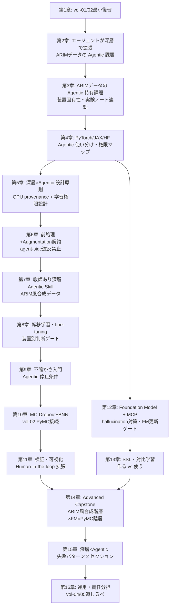

# 「AI エージェント時代の深層学習分析入門 — ARIM データで動く Agentic Skill」章構成（v0.2 ドラフト）

> vol-03 は vol-01「AI エージェント時代のデータ分析入門」および vol-02「AI エージェント時代の統計・機械学習分析入門」の続編。
> vol-01 が「動く Skill を 1 つ自力で作る」まで、vol-02 が「その Skill に統計/ML の厚みと不確かさ」を積み上げたのに対し、
> vol-03 は **エージェントが深層モデル（Foundation Model 含む）を Skill として安全に扱えるようにする**——
> ARIM データポータルの実験データ（少データ・装置固有・階層構造）を主戦場に、**「Human-in-the-loop で fine-tune を承認する」「勝手にモデルを更新させない」「学習ジョブの起動権限を Skill で契約する」**までを扱う。

## 版履歴

### v0.2（Agentic × ARIM 軸の再強化）
- **A1**: タイトルを **「ARIM データで動く Agentic Skill」** に副題化。「深層学習の教科書」ではなく「エージェントが深層を扱う Skill 実践書」に再定位
- **A2**: 第2章を **「vol-02 の Skill をエージェントが深層で拡張するとき、ARIM データで何が起きるか」** に再設計
- **A3**: 第3章を **「ARIM データに深層を持ち込むときの Agentic 特有の課題」** に反転。装置固有性・実験ノート連動・少データ現場での fine-tune 判断を主題化
- **A4**: **第5章に「Agentic 学習権限設計」節を新設**（vol-01 第6章 Human-in-the-loop の深層版）。エージェントが自律的に学習ジョブを起動できる範囲、checkpoint 上書きの承認ゲート、Foundation Model 更新の Human-in-the-loop
- **A5**: **データセット方針を反転**：ARIM 風合成データ・匿名化データを主軸、公開ベンチマーク（NFFA/UHCS/MatBench）は「対比・スケール確認」の位置づけ
- **A6**: **第15章に "Agentic 特有の深層失敗" セクション新設**：GPU 占有、勝手なモデル更新、学習ログ改ざん、未承認重みでの推論、Human-in-the-loop バイパス、augmentation 契約の agent-side 違反
- **A7**: capstone (Ch13) を **ARIM 風合成階層データ + FM 転移 + PyMC 階層** の物語に再構成。エージェントが階層構造を認識して fine-tune 戦略を切り替える Agentic 判断を組み込む
- **A8**: 各章の「エージェントが介在する具体的シーン」を明示（Ch4 以降のハンズオン章に必ず「エージェント役割」節）

### v0.1（初版企画ドラフト — 深層学習教科書寄り）
- 2 pillars + advanced capstone / 16 章 + 3 付録 / 6 か月・250-300 ページの骨格
- **ただし** Agentic Skill × ARIM の軸が弱く、深層学習の一般教科書に寄っていた。v0.2 で再定位

## 前提

- **対象読者**: ARIM データポータル会員のデータ分析者（材料・ナノテク研究者）。Python / Jupyter 経験あり。**vol-01 + vol-02 完読を推奨**、未読でも第1章の最小復習（15 ページ）で読み進められる構造
- **vol-01 / vol-02 との関係**:
  - **vol-01 完読推奨**: Skill 設計 6 要素、データ契約、**Human-in-the-loop（第7章）**、provenance の基本、6 データ型テンプレート（第14章）
  - **vol-02 完読推奨**: 特に第5章（Skill 設計原則）、第8章（CV とデータリーク）、第10-12章（PyMC / MCMC 診断）、第12章（階層モデル：反復測定・ロット差）、**第14章の ARIM 風合成階層データ**
  - vol-03 の provenance は vol-02 拡張（`cv_scheme`, `sampler_config`, `backend_config`, `posterior_artifact`, `diagnostics_summary`）に、**深層 × Agentic 特有フィールド**を追加（`gpu_backend`, `cudnn_deterministic`, `random_seed_per_worker`, `weights_uri`, `weights_sha256`, `finetune_config`, `augmentation_config`, `tolerance`, **`agent_authorization`**, **`training_job_approval`**, **`checkpoint_overwrite_policy`**, **`fm_update_gate`**）
- **最終ゴール（合格ライン）**:
  - **Pillar 1**: **ARIM 実データ（風の合成/匿名化データ含む）に対して、fine-tune 判断が Human-in-the-loop で承認される「教師あり深層学習 + 転移学習」Skill** を 1 つ以上作れる。単に動くだけでなく、**エージェントが勝手にモデルを更新できない**契約が入っている
  - **Pillar 2**: **不確かさつき深層モデル Skill**（deep ensemble もしくは MC-Dropout もしくは BNN）を 1 つ以上作れる。calibration（Brier / ECE）と **「不確かさが閾値を超えたらエージェントは自律決定を停止し人間に投げる」ゲート** を持つ
  - **Advanced Capstone**: 上記 2 本を統合した **「Foundation Model → 深層特徴 → PyMC 階層モデル」の複合 Skill**（vol-02 第14章 capstone の深層版）を、**ARIM 風合成階層データ**（装置間・ロット間・研究室間）で完成させる
- **分量目安**: 実践書（250〜300 ページ、vol-02 と同等）
- **期限**: 6 か月
- **ハンズオン標準環境**（vol-02 に追加）:
  - vol-02 標準 + `torch`, `torchvision`, `torchaudio`
  - `jax`, `jaxlib`, `flax`, `optax`（vol-02 第11章末で導入済み）
  - `transformers`, `datasets`, `accelerate`, `huggingface_hub`
  - `scikit-learn`（vol-02 継続、深層特徴 → 線形/ツリーの後段）
  - `shap`, `captum`, `grad-cam`
  - **GPU**: CUDA / ROCm / MPS 対応。**CI 環境は CPU で完結**を必須要件
  - **MLflow または W&B**（optional、第15章で判断基準）
- **データセット方針（v0.2 で反転）**:
  - **主軸**: **ARIM 風合成データ・匿名化データ**（vol-02 の合成階層データ `data/synthetic-hierarchy/` を再利用・拡張）
    - スペクトル：ARIM 風の合成 Raman/XPS スペクトル階層データ（装置間・ロット間差を持たせる）
    - 画像：ARIM 風の合成 SEM 画像（テクスチャ + ラベル階層）
    - 表形式：vol-02 の合成階層データを継承
  - **対比・スケール確認**: 公開ベンチマークで「実データではこう見える」を示すためのみ
    - MatBench（表形式、vol-02 継承）
    - RRUFF Raman（スペクトル、vol-02 継承）
    - NFFA-EUROPE SEM / UHCS microstructure（画像、対比のみ）
  - **Foundation Model（既存重みを利用）**: MatBERT / CrystaLLM / ChemBERTa（Hugging Face Hub 経由）
  - **capstone (Ch13)**: 合成階層データ + Foundation Model 転移 + PyMC 階層モデル
  - ライセンス・引用ルールは第3章
  - **⚡ 位置づけ変更の理由**：ARIM ポータル会員が扱う実データは装置固有性が強く、公開ベンチマークだけでは Agentic Skill の設計判断（装置ごとの fine-tune、階層プーリング、Human-in-the-loop の粒度）を練習できない。合成データを主軸にすることで **設計の練習** に集中し、実データは各読者の現場で持ち込む
- **参照**:
  - PyTorch: https://pytorch.org/
  - JAX / Flax: https://jax.readthedocs.io/ / https://flax.readthedocs.io/
  - Hugging Face Transformers: https://huggingface.co/docs/transformers/
  - MatBERT: https://github.com/lbnlp/matbert
  - CrystaLLM: https://github.com/lantunes/CrystaLLM
  - ChemBERTa: https://github.com/seyonechithrananda/bert-loves-chemistry
  - Captum: https://captum.ai/
  - MLflow: https://mlflow.org/ / W&B: https://wandb.ai/
  - MCP Python SDK: https://github.com/modelcontextprotocol/python-sdk
  - 参考ベンチマーク: NFFA-EUROPE SEM https://b2share.eudat.eu/records/80df8606fcdb4b2bae1656f0dc6db8ba / UHCS https://hdl.handle.net/11256/940
  - vol-01 / vol-02 リポジトリ（本書の前提）

## 本書で扱わないこと（明示）

vol-03 は **「エージェントが深層を扱う Skill」** に scope を絞る。以下は将来巻の候補として第2章・第16章で道しるべを示すのみ。

| トピック | 扱わない理由 | 想定巻 |
|---|---|---|
| **因果推論**（DoWhy / EconML / DAG） | 前提となる実験計画・介入設計の議論が独立して必要 | vol-04 候補 |
| **ベイズ最適化・逐次実験計画**（BoTorch / GPyOpt） | 「次にどの試料を測るか」の判断は別領域 | vol-04 候補 |
| **生成モデル**（VAE / GAN / Diffusion、材料生成・逆設計） | 学習された潜在空間からの生成は独立テーマ | vol-05 以降候補 |
| **大規模分散学習・マルチノード training** | 研究室規模〜単一 GPU / 単一ノードを主対象 | 別書候補（MLOps 系） |
| **Foundation Model のスクラッチ事前学習** | 材料 FM は既存重み利用の立場 | vol-05 以降候補 |
| **Reinforcement Learning（RLHF、実験ロボティクス）** | 実験計画とロボティクスの交差領域 | 別書候補 |
| **深層学習アルゴリズムの数学的導出** | 既存教科書に譲る（本書は Agentic Skill 化に集中） | — |

## 6 データ型と深層 × Agentic Skill の対応

vol-01 の 6 データ型テンプレートと vol-02 の統計/ML 手法対応を継承し、**深層 × Agentic 観点**を積む：

| データ型 | vol-01 で整えたもの | vol-02 で扱えるようになったもの | vol-03 で扱う Agentic Skill |
|---|---|---|---|
| スペクトル型 | 単位・波数校正・欠損補間・メタ | PCA, PLS, ピーク回帰, 校正曲線 (PyMC), 装置間階層 | **1D CNN / 1D Transformer 分類 Skill**、**Raman FM 転移 Skill**、**エージェントが装置ごとに fine-tune を選び、Human-in-the-loop で承認** |
| クロマトグラム・時系列型 | 時刻同期・ベースライン | 分類、外れ試料検出、反応速度階層 | **時系列 CNN / Transformer Skill**、深層特徴 + PyMC 階層 Skill、**バッチごとの再学習判断ゲート** |
| 画像・顕微鏡型 | メタ・解像度・キャリブレーション | 特徴量後の回帰/分類、粒径階層 | **CNN / ViT 分類 Skill**、**SEM 事前学習の転移 Skill**、Grad-CAM 検証、**Human-in-the-loop で誤判定サンプルを流し戻す** |
| 回折・散乱パターン型 | 単位・角度校正 | パターンクラスタリング、格子定数事後分布 | 2D CNN パターン分類 Skill、**Rietveld の深層代替は「言及のみ」**、エージェントは古典手法との併用を提案 |
| 表形式・プロセス条件型 | データ contract・単位統一 | 物性予測、感度分析、ロット/オペレータ階層 | **TabNet / FT-Transformer Skill**（vol-02 GBM との比較）、深層特徴 + PyMC 階層、**ARIM 実験ノート連携** |
| マルチモーダル統合型 | ID キー・時刻同期 | 統合特徴量からの予測 | **CLIP 系マルチモーダル埋め込み Skill**、**画像 + 表形式の同時 fine-tune Skill** |

**共通する Agentic 観点**：各データ型で、Skill は「入力データを受けて出力する」だけでなく、**「fine-tune が必要か、Human 承認が要るか、既存モデルで足りるか、既存モデルの分布外か」をエージェントに判断させる契約**を持つ。判断のログは provenance に残る。

## 章構成（案）

**分量目安の合計**：本編 250〜300 ページ + 付録 40〜50 ページ

### 第1章 vol-01 / vol-02 最小復習（目安 15 ページ）

| 章 | タイトル | 責務 | 成果物 |
|---|---|---|---|
| 第1章 | vol-01 / vol-02 の最小復習 | Skill / MCP / **Human-in-the-loop（vol-01 Ch6）** / データ契約 / provenance / 6 データ型 / 統計/ML 診断（CV, calibration, MCMC 診断）を 15 ページに圧縮。vol-01/02 完読者は読み飛ばし可 | vol-03 に入る最低限の前提 |

### 第I部　なぜ「深層 × Agentic Skill」なのか（目安 25〜30 ページ）

| 章 | タイトル | 責務（扱う／扱わない） | 成果物 |
|---|---|---|---|
| 第2章 | vol-02 の Skill をエージェントが深層で拡張するとき、ARIM データで何が起きるか | 特徴量エンジニアリングの限界、**ARIM 実データ（装置固有・少データ）で表現学習が必要になる場面**、Foundation Model 時代における研究室の選択肢、vol-02 との接続、vol-03 のゴール（2 pillars + capstone）、**本書で扱わないこと**の明示 | 本書の到達点と読者ルート、Agentic 観点の位置づけ |
| 第3章 | ARIM データに深層を持ち込むときの Agentic 特有の課題 | **装置固有性 × fine-tune 判断**、**実験ノート（試料 ID・測定日時・オペレータ）との連動**、**少データ現場での自動化価値と危険**、GPU 非決定性、事前学習重みの provenance、fine-tune 特有のデータリーク、augmentation 契約、**なぜ点推定だけでは足りないか（不確かさへの再訪）**。**演習用データ（ARIM 風合成データ / 対比の公開ベンチマーク）の紹介とライセンス** | 自分のデータの深層 × Agentic タスク分類、演習データの入手 |
| 第4章 | PyTorch / JAX / Hugging Face の Agentic 使い分け | 2 つの柱（PyTorch は生態系、JAX は関数型 + XLA）、**Jupyter MCP 経由の使用方針**、GPU バックエンド（CUDA / ROCm / MPS）と CPU fallback、Hugging Face Hub の重み配布と署名、**エージェントがどのライブラリをどこまで自律的に叩けるか**の判断表 | 使い分けマップ、GPU 環境の受け入れチェック、エージェント権限マップ |

### 第II部　深層 Agentic Skill の設計と教師あり学習（目安 65〜75 ページ）

| 章 | タイトル | 責務 | 成果物 |
|---|---|---|---|
| 第5章 | 深層 × Agentic Skill の設計原則 | vol-02 第5章の深層 × Agentic 拡張。**「何を成功とみなすか」＋「どの環境で再現するか」＋「エージェントに何を許すか」**——評価指標、**seed / cuDNN determinism / GPU backend / weights sha / tolerance** の provenance、CI 上の CPU 学習、循環設計問題の深層版、augmentation 契約。**新設節：Agentic 学習権限設計**（vol-01 Ch6 の深層版）——エージェントが自律的に学習ジョブを起動できる範囲、**checkpoint 上書きの承認ゲート**、**Foundation Model 更新の Human-in-the-loop**、**推論だけ許すか学習まで許すか**の 3 段階権限 | 深層 × Agentic Skill 仕様書テンプレート、GPU/Agentic provenance スキーマ |
| 第6章 | 前処理 / Augmentation の Skill 化と Agentic 契約 | データローダ設計、**augmentation の contract**（train のみで使い、test/val には使わない・stratified split との整合、**エージェントが augmentation を勝手に増強しない契約**）、**深層版 anti-leakage split contract**（fine-tune 前の事前学習データとの重複禁止、CLIP-like モデルでの text-image leakage）、**装置間差を augmentation で消してよいかの判断ゲート**（消してはいけない場面と消すべき場面） | Augmentation Skill、深層 anti-leakage 契約 |
| 第7章 | 教師あり深層 Agentic Skill を作る | **1D CNN 分類 Skill**（ARIM 風合成スペクトル）、**2D CNN 分類 Skill**（ARIM 風合成 SEM）、**Transformer 骨格**（ViT / 1D Transformer の骨格比較）、**Tabular 系**（TabNet / FT-Transformer）。3 例をハンズオン化。vol-02 GBM との比較。**各 Skill に "エージェントが判断する場面" を明示**（例：epoch 数の決定・early stopping の起動・分布外検知後の停止） | 教師あり深層 Agentic Skill 3種 |
| 第8章 | 転移学習 / fine-tuning を Skill 化する — Agentic 判断つき | frozen feature extractor vs full fine-tune vs LoRA/PEFT の判断、head 交換、**少データ材料での評価戦略**（vol-02 第8章 CV 設計を深層に）、**事前学習重みの分布外検知**（domain gap の early warning）、**エージェントが装置ごとに fine-tune 戦略を選ぶ判断表**、**「今日のバッチだけで再 fine-tune するか」の承認ゲート** | 転移学習 Agentic Skill、装置別 fine-tune 判断表 |

### 第III部　不確かさと解釈（目安 45〜55 ページ）

| 章 | タイトル | 責務 | 成果物 |
|---|---|---|---|
| 第9章 | 深層モデルの不確かさ入門 — Agentic 停止条件つき | vol-02 第10-11章の続き。**calibrated softmax の限界**、Brier / ECE / reliability diagram、**deep ensemble**（PyTorch/JAX 両実装）、**「不確かさが閾値を超えたらエージェントは自律決定を停止し人間に投げる」ゲートの契約**。この章では PyMC は最小限 | 不確かさ表現の言語化、deep ensemble Skill、停止ゲート |
| 第10章 | MC-Dropout と Bayesian Neural Net を Skill 化する | MC-Dropout の実装、**BNN**（Bayes by Backprop / VI / SG-MCMC）、vol-02 第11-13章 PyMC/NumPyro との接続、Pyro / NumPyro の位置づけ、**「BNN vs deep ensemble vs conformal prediction」使い分け表**、**エージェントが不確かさ推定手法を選ぶ判断**（コスト × 精度 × Human 解釈しやすさ） | MC-Dropout Skill、BNN Skill、判断表 |
| 第11章 | 深層モデルの検証・可視化・レポート化 — Human-in-the-loop 拡張 | **Grad-CAM / integrated gradients / SHAP for deep**、feature attribution の hallucination 対策、reliability diagram、**Human-in-the-loop の質を上げる拡張**（誤判定サンプルを人間に流し戻す UX、attribution を人間が信じるための担保）、**再現可能な深層レポート**（環境固定 + weights sha + augmentation config） | 解釈可能性 Skill、深層レポートテンプレート |

### 第IV部　Foundation Model と表現学習（目安 45〜55 ページ）

| 章 | タイトル | 責務 | 成果物 |
|---|---|---|---|
| 第12章 | 材料 Foundation Model と MCP 連携 — Agentic 呼び出し契約 | **MatBERT / CrystaLLM / ChemBERTa** の位置づけと使い分け、Hugging Face Hub からの取得と**重みの署名検証**、**LLM 系 MCP との連携パターン**、**エージェントが FM に問い合わせるときの hallucination 対策**（vol-01 第10章 文献照合 Skill の拡張、FM 出力の Retrieval-augmented 検証）、**Foundation Model 更新をエージェントが受け入れるかの判断ゲート**（vol-02 の "モデル配布" の議論を FM に適用） | FM 呼び出し Agentic Skill、重み provenance、hallucination 対策プロトコル |
| 第13章 | 自己教師あり学習と対比学習を Skill 化する | **SimCLR / BYOL / MoCo** の材料応用、**「事前学習を作る」vs「使う」の判断**、ラベルなし顕微鏡データからの表現学習、**小規模 SSL** の実務（GPU 1 枚での限界）、**エージェントが SSL 起動を提案してよい場面**（少データ × ラベルなし過多） | SSL Skill、事前学習判断表 |
| 第14章 | 総合ハンズオン（Advanced Capstone）：Foundation Model → 深層特徴 → PyMC 階層モデル（ARIM 風合成階層データで完成させる） | **vol-02 第14章 capstone の深層版**。ARIM 風合成階層データを使い、**Foundation Model で深層特徴を抽出 → PyMC 階層モデル（装置間・ロット間・研究室間）に入力**する。**エージェントは階層構造を認識して fine-tune 戦略を切り替える**（装置差が大きい層では fine-tune、小さい層は frozen feature）。**「深層特徴の不確かさ」と「階層のプーリング」の共存**を明示。完成 Skill は Human-in-the-loop の承認ゲートを 3 箇所持つ（fine-tune 起動・不確かさ閾値超え・階層プーリングの構造変更） | 統合 Agentic Skill（capstone） |

### 第V部　運用・失敗・展望（目安 40〜50 ページ）

| 章 | タイトル | 責務 | 成果物 |
|---|---|---|---|
| 第15章 | 深層 × Agentic 特有の失敗パターン | **セクション1：深層一般の失敗**——GPU 差分による結果ずれ、事前学習重みの汚染、fine-tune のデータリーク、Foundation Model の分布外、hallucinatory feature attribution、augmentation 契約違反、Deep ensemble の過信、BNN の未収束。**セクション2：Agentic 特有の失敗**（v0.2 で新設）——**エージェントが GPU を占有し続ける、勝手にモデルを更新する、checkpoint を無承認で上書き、学習ログを改ざん・省略、未承認重みで推論を続ける、Human-in-the-loop バイパス（"確認済み" フラグを勝手に立てる)、augmentation を勝手に強化して精度を偽装、Foundation Model の署名検証をスキップ、"エージェントが自律的に再学習した" ことを Human に伝えない**。experiment tracking を入れるべき判断基準 | 深層 × Agentic 失敗チェックリスト |
| 第16章 | 組織展開と終章 — GPU リソース・モデル配布・Agentic 責任分担 | **GPU リソースの共有と権限**（研究室単位 vs ARIM 施設）、**モデル配布**（重み + provenance + 使用制限）、**Agentic 責任分担**（エージェントの決定 vs 人間の決定 vs 記録責任）、監査ログ、**vol-01+02+03 の到達点**、**vol-04（因果・実験計画）・vol-05 以降（生成モデル・逆設計）への道しるべ** | 組織展開方針、Agentic 責任分担マトリクス、次巻ロードマップ |

### 付録（目安 40〜50 ページ）

| 付録 | タイトル | 内容 |
|---|---|---|
| 付録A | 深層 × Agentic Skill テンプレート集 | 画像分類 / 画像回帰 / スペクトル分類 / 表形式回帰 / 転移学習 / SSL / BNN の Skill 雛形。**vol-02 の provenance を GPU/深層/Agentic 向けに拡張**したスキーマ（`gpu_backend`, `cudnn_deterministic`, `random_seed_per_worker`, `weights_uri`, `weights_sha256`, `finetune_config`, `augmentation_config`, `tolerance`, **`agent_authorization`**, **`training_job_approval`**, **`checkpoint_overwrite_policy`**, **`fm_update_gate`**, **`uncertainty_stop_threshold`**, **`human_review_ref`**）を含む。**Skill / リポジトリ配置規約は vol-02 A §A.1.1 を継承**（深層章では `checkpoints/`, `wandb_run/`（optional）を追加） |
| 付録B | PyTorch / JAX / Hugging Face チートシートと **MCP サーバ実装（Python SDK 版）** | よく使う API、ローダ・スケジューラ・チェックポイント管理、Hugging Face Hub 認証、**MCP Python SDK で組織内 MCP サーバを実装するミニマル例**（vol-02 第16章で予告された「作るべきかどうかの判断」の実装編）。**Agentic 承認ゲートを MCP レベルで組み込む方法**（train/infer 権限分離、Human 承認 hook） |
| 付録C | GPU トラブルシューティングと**深層 × Agentic 演習データ候補** | CUDA バージョン不整合、OOM、cuDNN 非決定性の抑制、mixed precision の落とし穴、DataLoader worker のシード伝播、Hugging Face Hub 認証、**加えて、演習用データ候補**：**ARIM 風合成データの生成スクリプト**（`data/synthetic-deep/` 想定、vol-02 の階層データを深層向けに拡張）、公開ベンチマーク（NFFA-EUROPE SEM、UHCS microstructure、Materials Project、Open Catalyst、AFLOW、NOMAD 等）の入手・ライセンス・**「エージェントに触らせてよいか」の判断ガイド** |

## 責務分離マップ（重複防止）

### vol-03 内での分離

| 論点 | 予防・設計側 | 実行・事例側 |
|---|---|---|
| 評価指標選択 | 第5章（何を成功とみなすか） | 第11章（可視化・診断で確認） |
| Agentic 学習権限 | 第5章（3 段階権限設計） | 第15章（バイパス事例）・付録B（MCP レベル実装） |
| 深層 anti-leakage 契約 | 第6章冒頭・第8章 | 第15章 |
| GPU 非決定性 | 第5章・第15章 | 付録C |
| Augmentation 契約 | 第6章（agent-side 違反禁止） | 第15章 |
| 不確かさと自律停止 | 第9章（deep ensemble）・第10章（BNN） | 第15章・第11章 |
| Foundation Model の hallucination | 第12章 | 第15章 |
| FM 更新の Human-in-the-loop | 第12章 | 第16章（組織責任分担） |
| provenance 拡張 | 付録A | 第5章（設計）・第15章（欠落事例） |
| MCP 実装 | 付録B | 第5章の権限設計に対応 |

### vol-02 との分離

| 論点 | vol-02 側 | vol-03 側 |
|---|---|---|
| Skill 設計原則 | 統計/ML の指標・分割（第5章） | GPU/backend/weights の provenance + **Agentic 学習権限**（第5章） |
| Human-in-the-loop | Skill 設計時の承認ゲート（vol-01 Ch6 継承） | **深層特有の承認ゲート**：fine-tune 起動 / FM 更新 / checkpoint 上書き / 不確かさ超過（第4-13章に埋め込み） |
| 不確かさ | PyMC / MCMC（第9-12章） | deep ensemble / MC-Dropout / BNN（第8-9章）＋深層特徴 × PyMC 階層（第14章）＋**Agentic 停止条件**（第9章） |
| データ契約 | 統計/ML 用（vol-02 第5章） | 深層追加要素——augmentation 契約、事前学習重複禁止、**agent-side 契約違反禁止**（第6章） |
| 失敗パターン | データリーク / p-hacking / 収束不良（vol-02 第15章） | 深層一般 + **Agentic 特有**（第15章 セクション2） |
| capstone | 合成階層データ + PyMC（vol-02 第14章） | **同じ合成階層データ**に FM 転移 + 深層特徴を上積み（vol-03 第14章） |
| provenance スキーマ | ML/Bayesian 拡張（vol-02 付録A） | GPU/深層/**Agentic** 拡張（vol-03 付録A） |
| MCP 実装 | 判断基準まで（vol-02 第16章） | **Python SDK で承認ゲートまで実装**（vol-03 付録B） |

### vol-01 との分離

| 論点 | vol-01 側 | vol-03 側 |
|---|---|---|
| Human-in-the-loop | 予防的 3 原則（第7章） | **深層特有の承認ゲート**を第5章に組み込み、各ハンズオン章に埋め込み |
| 装置別テンプレート | 6 データ型テンプレ（第14章） | 6 データ型 × 深層 Agentic Skill の対応マップ（第3章・付録A） |
| 文献照合 Skill | arXiv / Paper Search MCP（第11章） | **Foundation Model MCP + hallucination 対策**（第12章、共通哲学） |
| provenance の基本形 | 5 要素（第8章） | + vol-02 拡張 + vol-03 GPU/深層/Agentic 拡張（付録A） |
| 失敗パターン | 循環設計・漏洩・ハルシネーション（第15章） | **深層一般 + Agentic 特有**（第15章）——vol-01 の哲学を深層に持ち込む |

## 各ハンズオン章の共通構成

vol-01 / vol-02 と同形式。**第7章で丁寧に説明し、以降の第7・第9・第11・第14章は差分中心**。**新規に「エージェント役割」節を各章に必ず含める**（v0.2 で追加）：

- この章で作る Skill の概要
- **エージェント役割**（この Skill でエージェントは何を判断するか、何を Human に投げるか）
- 入力仕様 / 出力仕様 / 制約条件（vol-02 拡張 provenance + vol-03 GPU/深層/Agentic 拡張に準拠）
- **深層特有の評価基準**（calibration / attribution reliability / augmentation validity / weights provenance）
- 実行例 / 失敗例（**Agentic 失敗を含む**）/ 改善版
- 他データ型・他バックエンド（PyTorch ↔ JAX）への転用方法

## 特に注意する重点管理項目

| 項目 | 予防・設計 | 事例・検証 |
|---|---|---|
| **エージェントが学習ジョブを勝手に起動** | 第5章 Agentic 権限設計・付録B MCP 実装 | 第15章（Agentic セクション） |
| **エージェントが checkpoint を無承認で上書き** | 第5章・付録A の `checkpoint_overwrite_policy` | 第15章 |
| **Foundation Model 更新を Human 無承認で受け入れ** | 第12章 `fm_update_gate` | 第15章・第16章 |
| **不確かさ閾値超過の自律停止** | 第9章 stop-gate 契約 | 第15章 |
| **Human-in-the-loop のバイパス** | 第5章・第11章（誤判定流し戻し UX） | 第15章 |
| **Augmentation の agent-side 強化による精度偽装** | 第6章 | 第15章 |
| **学習ログの改ざん・省略** | 付録A `human_review_ref` + provenance の追記 | 第15章 |
| GPU 非決定性を "動いた" と誤解 | 第5章・付録C | 第15章 |
| 事前学習重みの分布外 / 汚染 | 第8章（domain gap）・第12章 | 第15章 |
| Foundation Model の hallucination | 第12章 | 第15章 |
| BNN の未収束 | 第10章 | 第15章 |
| CI 環境で GPU 前提コードが落ちる | 第5章（CPU fallback 必須） | 付録C |
| Foundation Model の重み配布ライセンス違反 | 第12章 | 第16章 |

## 章間依存図（Mermaid）

## 開発ロードマップ（暫定）

| フェーズ | 期間目安 | 内容 |
|---|---|---|
| **Phase 0**: 企画確定 | 2 週間 | v0.2（本書）→ v0.3（rubber-duck review 反映） |
| **Phase 1**: 合成データ + 環境準備 | 3 週間 | **ARIM 風合成深層データ**（スペクトル / 画像 / 表形式）の生成スクリプト、MatBERT / CrystaLLM / ChemBERTa の Hugging Face Hub 検証、GPU 環境の受け入れチェックリスト |
| **Phase 2**: 第0-3章（導入 + Agentic 位置づけ） | 3 週間 | vol-01/02 最小復習、ARIM × Agentic の課題整理、PyTorch/JAX/HF 権限マップ |
| **Phase 3**: 第4-7章（設計原則 + 教師あり + 転移学習） | 8 週間 | Agentic 学習権限設計、augmentation 契約、教師あり Skill 3種、fine-tune 判断ゲート |
| **Phase 4**: 第8-10章（不確かさ + 解釈） | 5 週間 | Agentic 停止条件、deep ensemble、MC-Dropout、BNN、Grad-CAM、誤判定流し戻し UX |
| **Phase 5**: 第11-13章（FM + capstone） | 5 週間 | FM 呼び出し契約、hallucination 対策、SSL、ARIM 風合成階層 × FM × PyMC 階層 capstone |
| **Phase 6**: 第14-15章（失敗 + 運用） | 3 週間 | 深層一般失敗 + **Agentic 特有失敗**、GPU リソース責任分担、次巻ロードマップ |
| **Phase 7**: 付録A/B/C | 3 週間 | テンプレート集（Agentic provenance 拡張）、MCP Python SDK 実装（承認ゲート込み）、GPU トラブルシューティング |
| **Phase 8**: 全編 rubber-duck review + 実機検証 + 修正 | 4 週間 | 章別レビュー、実機テスト、外部参照ファクトチェック |
| **合計** | **約 6 か月** | vol-02 と同等の実践書 |

## リスクと対策

| リスク | 影響 | 対策 |
|---|---|---|
| **GPU 環境の可搬性** | ハンズオンが動かない | CPU fallback を必須要件化。Colab / Kaggle ノートブック提供、Docker image、`torch.backends.mps` の早期検証 |
| **Foundation Model の重み配布・ライセンス変更** | 演習が実行不能に | 執筆時点での Hub URL とライセンスを付録C に記録、代替モデル言及、Hub 上での重み削除時のフォールバック |
| **深層学習の再現性の根本的困難** | 「同じコードなのに結果が違う」で読者が混乱 | 第5章冒頭で「完全一致は目指さない、tolerance を設計する」を明示（vol-02 MCMC 診断と同じ姿勢） |
| **Foundation Model の hallucination** | 誤った推論を Skill が出力 | 第12章で vol-01 第10章の文献照合 Skill の拡張として、FM 出力の検証プロトコル |
| **Agentic 権限設計が机上論に終わる** | 読者が実装できない | **付録B の MCP Python SDK 実装で承認ゲートを具体化**、第5章で「3 段階権限」を Skill 仕様書テンプレートに組み込む |
| **ARIM 風合成深層データの信頼性** | 「合成データで練習しても実データで動くの?」への懸念 | vol-02 の合成階層データの実績を引き継ぐ + 章末に MatBench / RRUFF / NFFA での対比を必ず入れる |
| **6 か月で 15 章 + 付録は野心的** | 期日超過 | 実機検証を各フェーズ末に埋め込む。Skill 数を絞る（画像 + スペクトルで開始、表形式は付録扱いも検討） |
| **vol-04 との境界** | 内容が拡散 | 第8章で「fine-tune の候補選択」に BO を使わない旨明示。第16章で vol-04 への道しるべを丁寧に |

## 次のアクション

1. **v0.2（本書）を rubber-duck review**：特に「Agentic 特有失敗」「Agentic 学習権限設計」「ARIM 風合成深層データ」の妥当性
2. **v0.3 反映**：レビュー結果を織り込み、リスク対策を具体化
3. **Phase 1（合成データ生成 + 環境準備）着手**：ARIM 風合成深層データの生成スクリプトを `scripts/generate_synthetic_deep.py` として設計（vol-02 の `generate_synthetic_hierarchy.py` を継承）、MCP Python SDK の Hello World 動作確認、GPU 環境チェックリスト作成
4. **第1章と第2章のドラフト着手**：vol-02 の第1章・第2章の構成を踏襲

---

**参考**: 本企画書は vol-02 `chapter-outline.md`（v0.3）と vol-02 第16章 §16.8「vol-03（深層 × エージェント）への道しるべ」を起点として、**Agentic Skill × ARIM 軸を再強化**したものである（v0.2 で全面改訂）。v0.1 との差分は本文冒頭の版履歴節を参照。
