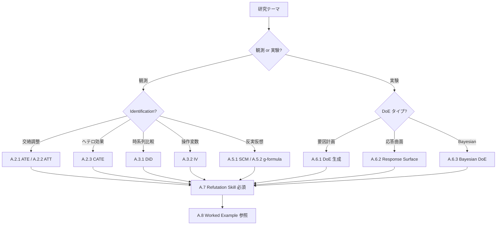

# 付録 A：因果 × Agentic Skill テンプレート集 + 介入承認フロー worked example

> [!NOTE]
> **本付録の位置付け**：Ch4 §4.9 の Skill 契約テンプレート（① 目的 / ② 入力 / ③ 出力 / ④ 成功 / ⑤ 外部妥当性 / ⑥ 禁止 / ⑦ 再現性 / ⑧ 承認 / ⑨ agent_action_log / ⑩ egress / ⑪ estimator_provenance / ⑫ DoE 拡張）を、**因果推論・DoE の 10 パターン** に具体化した雛形集。読者は自分のテーマに応じて **1 つ選び、埋めて Skill 化する** ことを想定する。すべての canonical 名は vol-04 本編の SoT に準拠する（Ch15 §15.1.1 Canonical Schema クイックリファレンス参照）。

## A.1 テンプレート索引

| # | Skill 名 | 目的 | SoT 章 | 対象 identification_strategy |
|---|---|---|---|---|
| A.2.1 | `ate_estimation_skill` | ATE 推定 | Ch6 | backdoor |
| A.2.2 | `att_estimation_skill` | ATT 推定（PSM） | Ch6 | backdoor + matching |
| A.2.3 | `cate_estimation_skill` | CATE 推定（DR-Learner / DML） | Ch8 | backdoor + ML |
| A.3.1 | `did_skill` | Difference-in-Differences | Ch7 | did |
| A.3.2 | `iv_skill` | 操作変数（2SLS） | Ch7 | iv |
| A.4.1 | `dag_proposal_skill` | DAG 候補提案（自律） | Ch5 §5.6.1 | — |
| A.4.2 | `dag_approval_skill` | DAG 承認（Human） | Ch5 §5.6.2 | — |
| A.5.1 | `scm_counterfactual_skill` | SCM 反実仮想シミュレーション | Ch5 §5.7 / Ch13 Phase 3 | scm |
| A.5.2 | `gformula_skill` | g-formula 標準化 | Ch8 §8.4 | g_formula |
| A.6.1 | `doe_generation_skill` | 実験計画生成 | Ch10 | randomized_experiment |
| A.6.2 | `response_surface_skill` | 応答曲面推定 | Ch11 | randomized_experiment |
| A.6.3 | `bayesian_doe_skill` | Bayesian DoE（one-shot） | Ch12 | randomized_experiment |
| A.7 | `refutation_skill` | 感度分析 gate | Ch9 | — |
| A.8 | Worked example | DAG 提案 → 承認 → 推定 → refutation → 介入承認 の 1 サイクル | Ch5 / Ch6 / Ch9 / Ch10 | 統合例 |

---

## A.2 効果推定 Skill テンプレート

### A.2.1 `ate_estimation_skill`（backdoor + IPW / DR）

```yaml
skill:
  name: ate_estimation_skill
  version: 0.1.0
  purpose: |
    観測データから ATE を backdoor adjustment set で推定する。
    推定量は IPW または DR で、refutation gate pass が release 前提条件。

  # === ① 目的 ===
  estimand_type: ate                                 # canonical enum (Ch4 §4.4)
  mediation_role: not_applicable
  causal_question_type: type_a_observational

  # === ② 入力条件（L1 識別レイヤ）===
  identification_strategy: backdoor                   # canonical (Ch4 §4.2)
  dag_of_record_uri: <artifact_uri>
  dag_of_record_sha256: <sha256>
  adjustment_set_approval_uri: <artifact_uri>         # variable_selection_authorization の証跡
  confounders_declared: [X1, X2, X3]
  mediators_declared: []
  colliders_declared: []
  treatment_variable: T
  outcome_variable: Y

  # === ③ 出力形式 ===
  outputs:
    estimand: E[Y(1) - Y(0)]                          # 数式で明示
    estimate: <float>
    ci_lower: <float>
    ci_upper: <float>
    ci_level: 0.95
    estimator_family: dr                              # ipw | dr | psm | doubly_robust_ml
    test_results:                                     # Ch9 §9.7.1 canonical
      e_value: {status: pass, evidence_uri: ...}
      placebo: {status: pass, evidence_uri: ...}
      random_common_cause: {status: pass, evidence_uri: ...}

  # === ④ 成功条件（Ch4 §4.3）===
  success_criteria:
    identification_validity: {status: checked, evidence_uri: ...}
    positivity_check: {status: checked, evidence_uri: ...}
    positivity_by_stratum:                            # canonical shape (Ch4 §4.4.1)
      shape: per_stratum_dict
      strata:
        stratum_1: {n_treated: 45, n_control: 52, min_ps: 0.12, max_ps: 0.88}
    refutation_pass: {status: pass, evidence_uri: ...}
    external_validity: {status: pass, evidence_uri: ...}  # counterfactual_scope_gate

  # === ⑤ 外部妥当性 ===
  counterfactual_scope_gate:
    mahalanobis_check: {threshold: 3.0, cluster_conditional: true}
    variance_check: {threshold: 0.25}
    knn_density_check: {k: 20, knn_min: 5}
    support_envelope_check: {envelope_report_uri: ...}
    aggregate_policy: {pass_requires: all_four_pass}
    fallback: human_review

  # === ⑥ 禁止事項（Ch4 §4.8 抜粋。cross-chapter reference のため Ch{n}. prefix を付与）===
  prohibited_actions:
    - Ch4.silent_identification_switch: fatal
    - Ch4.unauthorized_dag_modification: fatal
    - Ch5.collider_adjustment_unauthorized: fatal
    - Ch9.refutation_skip: fatal
    - Ch4.execute_estimator_without_variable_selection_authorization: fatal
    - Ch7.positivity_violation_ignored: fatal

  # === ⑦ 再現性条件 ===
  library_stack:
    identification: dowhy==0.11.1
    estimation: econml==0.15.0
    refutation: dowhy==0.11.1
  random_seed: 42
  container_sha256: <sha256>

  # === ⑧ 承認ゲート（Ch4 §4.6.1-§4.6.2）===
  authorization_gates:
    dag_authorization:
      required_for: [dag_of_record_uri_change, identification_strategy_change]
      approver: research_lead
    variable_selection_authorization:
      required_for: [confounders_declared_change, adjustment_set_approval_uri_change]
      approver: research_lead

  # === ⑨ agent_action_log ===
  agent_action_log:
    log_uri: <string>
    log_sha256: <string>
    log_append_only: true

  # === ⑪ estimator_provenance ===
  estimator_provenance_reference:
    estimator_contract_sha256: <string>
    dag_of_record_sha256: <string>
    adjustment_set_approval_uri: <string>
```

### A.2.2 `att_estimation_skill`（PSM）

`ate_estimation_skill` からの差分のみ：

```yaml
skill:
  name: att_estimation_skill
  estimand_type: att                                  # ATE ではなく ATT
  outputs:
    estimand: E[Y(1) - Y(0) | T=1]
    estimator_family: psm
  # PSM 固有
  matching_config:
    method: nearest_neighbor_caliper                  # or optimal | mahalanobis
    caliper: 0.2
    replacement: false
    balance_check_uri: <artifact>                     # SMD < 0.1 の証跡
  test_results:
    rosenbaum_bounds: {status: pass, gamma_break: 1.4, evidence_uri: ...}  # PSM のみ
```

### A.2.3 `cate_estimation_skill`（DR-Learner）

```yaml
skill:
  name: cate_estimation_skill
  version: 0.1.0
  estimand_type: cate
  mediation_role: not_applicable
  causal_question_type: type_c_heterogeneous

  identification_strategy: backdoor
  dag_of_record_uri: <artifact>
  adjustment_set_approval_uri: <artifact>
  approved_meta_learner_covariate_set: [X1, X2, X3, X4]  # facility_scope で承認済み

  # DR-Learner 特有
  meta_learner:
    type: dr_learner                                  # or t_learner | s_learner | x_learner
    outcome_model: xgboost                            # 個別モデルは estimator_provenance で hash
    propensity_model: logistic
    cross_fitting_folds: 5
    cross_fitting_seed: 42

  # Ch8 covariates_deep 拡張（該当時）
  covariates_deep:
    feature_pipeline_sha256: <sha256>                 # Ch8 §8.4.3
    feature_extractor_sha256: <sha256>                # foundation model / DINO 等
    preprocessing_config_sha256: <sha256>

  outputs:
    estimand: E[Y(1) - Y(0) | X=x]
    cate_predictions_uri: <artifact>
    heterogeneity_significance_uri: <artifact>        # HTE 検定
    ite_labeled_prediction: false                     # true なら ite_prediction_coverage_refutation 必須

  test_results:
    e_value: {status: pass, evidence_uri: ...}
    placebo: {status: pass, evidence_uri: ...}
    scope_gate_reverification: {status: pass, evidence_uri: ...}  # Ch8 CATE 必須

  prohibited_actions:
    - Ch8.use_meta_learner_covariate_not_in_approved_set: fatal
    - Ch8.ite_coverage_refutation_missing_when_ite_labeled_prediction: fatal
    - Ch14.silent_confounder_removal_check: fatal        # silently_remove_covariate_from_approved_adjustment_set
```

---

## A.3 特殊 identification Skill

### A.3.1 `did_skill`（Difference-in-Differences）

```yaml
skill:
  name: did_skill
  version: 0.1.0
  estimand_type: att                                  # DiD は post 期の treated 平均
  identification_strategy: did

  # DiD 固有
  did_config:
    pre_period: [2020-01, 2021-12]
    post_period: [2022-01, 2023-12]
    treatment_start_date: 2022-01
    parallel_trends_test_uri: <artifact>              # 事前トレンド一致の証跡
    parallel_trends_p_value: 0.31                     # > 0.05 で pass
    library: linearmodels                             # linearmodels or dowhy

  prohibited_actions:
    - Ch7.shift_pre_post_window_after_seeing_result: fatal
    - Ch7.claim_did_without_parallel_trends_evidence: fatal
    - Ch7.use_post_treatment_covariate_in_did: fatal

  authorization_gates:
    variable_selection_authorization:
      required_for: [design_parameter_change]         # DiD window 変更
      approver: research_lead
```

### A.3.2 `iv_skill`（操作変数、2SLS）

```yaml
skill:
  name: iv_skill
  version: 0.1.0
  estimand_type: late                                 # local average treatment effect
  identification_strategy: iv

  # IV 固有
  iv_config:
    instrument_variable: Z1                           # canonical 名
    approved_instruments_uri: <artifact>              # variable_selection_authorization で承認
    exclusion_restriction_evidence_uri: <artifact>    # 理論的正当化
    first_stage_f_statistic: 47.3                     # > 10 が weak IV でない必要条件
    first_stage_f_threshold: 10.0
    weak_iv_test_uri: <artifact>
    library: linearmodels                             # or dowhy

  prohibited_actions:
    - Ch7.use_iv_with_first_stage_f_below_threshold: fatal
    - Ch7.claim_iv_without_exclusion_argument: fatal
    - Ch7.promote_iv_candidate_to_approved_without_review: fatal
```

---

## A.4 DAG Skill（提案 + 承認、Ch5 §5.6）

### A.4.1 `dag_proposal_skill`（自律）

```yaml
skill:
  name: dag_proposal_skill
  version: 0.1.0
  skill_type: dag_proposal
  role: agent_autonomous                              # Ch13 canonical enum
  action_class: propose_only                          # Ch4 §4.9 canonical enum

  inputs:
    dataset_uri: <artifact>
    domain_knowledge_uri: <artifact>                  # 先行研究、ドメイン知識
    variable_definitions_uri: <artifact>              # 各変数の測定タイミング（temporal ordering）

  outputs:
    dag_candidate_uri: <artifact>                     # .dot / .mmd / GML
    dag_candidate_sha256: <sha256>
    proposal_report_uri: <artifact>                   # 各エッジの根拠
    graph_type: dag                                   # dag | cpdag | pag
    proposal_bundle_sha256: <sha256>
    library_used: causal-learn                        # or pgmpy | manual

  prohibited_actions:
    - Ch5.propose_cpdag_as_dag_without_orientation_procedure: fatal
    - Ch5.hide_undirected_edges_in_final_dag: fatal
    - Ch13.modify_dag_after_proposal_bundle_sha256_published: fatal
```

### A.4.2 `dag_approval_skill`（Human）

```yaml
skill:
  name: dag_approval_skill
  version: 0.1.0
  skill_type: dag_approval
  role: human_required
  action_class: propose_and_execute_with_gate

  authorization_gates:                                # canonical plural (Ch4 §4.9, N-13)
    dag_authorization:
      approver: research_lead
      required_for:
        - dag_of_record_uri_change
        - dag_of_record_sha256_mismatch
        - identification_strategy_change
      approval_evidence:
        - approver_signature
        - approval_timestamp
        - approval_scope

  approver_independence:
    conflict_policy: independent_reviewer_required_if_approver_is_data_producer
    fallback_approver: facility_causal_review_board   # facility_scope_escalation

  inputs:
    dag_candidate_uri: <artifact>
    dag_candidate_sha256: <sha256>
    proposal_bundle_sha256: <sha256>                  # 提案側 bundle の整合性を再検証
    dataset_sha256: <sha256>
    preprocessing_pipeline_sha256: <sha256>

  outputs:
    approved_dag_uri: <artifact>                      # = dag_of_record_uri
    approved_dag_sha256: <sha256>                     # = dag_of_record_sha256
    dag_authorization_provenance_uri: <artifact>
    approved_at: <timestamp>
    approved_by: <string>
    approval_scope:                                   # どの変更を承認したか
      - initial_dag_registration
      - edge_addition
      - variable_role_change

  prohibited_actions:
    - Ch5.approve_dag_without_temporal_ordering_review: fatal
    - Ch5.approve_dag_with_undeclared_variables: fatal
    - Ch13.modify_approved_dag_after_downstream_start: fatal   # Ch13 §13.5
```

---

## A.5 反実仮想 Skill（SCM / g-formula）

### A.5.1 `scm_counterfactual_skill`（Ch5 §5.7 / Ch13 Phase 3）

```yaml
skill:
  name: scm_counterfactual_skill
  version: 0.1.0
  estimand_type: counterfactual_prediction
  identification_strategy: scm                        # Structural Causal Model

  scm_config:
    scm_uri: <artifact>                               # Y = f(T, X, U) の関数形
    scm_sha256: <sha256>
    structural_equations_uri: <artifact>              # 各 node の SEM
    exogenous_noise_distribution_uri: <artifact>
    identification_evidence_uri: <artifact>           # 3-step: abduction → action → prediction

  counterfactual_query:
    intervention: {T: t_star}
    context: {X: x_observed}
    output: E[Y | do(T=t_star), X=x_observed]

  counterfactual_scope_gate:                          # Ch13 §13.4.3 5-check
    mahalanobis_check: {status: pass}
    variance_check: {status: pass}
    knn_density_check: {status: pass}
    support_envelope_check: {status: pass}
    operational_distinctness_check: {status: pass}    # Ch13 Phase 3 で追加
    aggregate_policy: {pass_requires: all_five_pass}

  prohibited_actions:
    - Ch13.report_counterfactual_outside_scope_gate: fatal
    - Ch13.modify_scm_after_counterfactual_query: fatal
    - Ch5.use_undeclared_exogenous_variables: fatal
```

### A.5.2 `gformula_skill`（Ch8 §8.4）

```yaml
skill:
  name: gformula_skill
  version: 0.1.0
  estimand_type: ate                                    # canonical enum (Ch7 §7.2)
  identification_strategy: g_formula                    # method は identification_strategy が担う

  gformula_config:
    integration_distribution_uri: <artifact>           # P(X) の empirical or model-based
    integration_distribution_sha256: <sha256>
    outcome_model_uri: <artifact>
    outcome_model_sha256: <sha256>
    monte_carlo_samples: 10000
    monte_carlo_seed: 42

  test_results:
    scope_gate_reverification: {status: pass}          # g-formula 必須
    e_value: {status: pass}

  prohibited_actions:
    - Ch9.swap_integration_distribution_after_estimation: fatal
    - Ch7.use_outcome_model_with_treatment_leakage: fatal
```

---

## A.6 DoE Skill（Ch10-12）

### A.6.1 `doe_generation_skill`（Ch10 §10.8 SoT）

```yaml
skill:
  name: doe_generation_skill
  version: 0.1.0
  estimand_type: ate
  identification_strategy: randomized_experiment
  causal_question_type: type_e_doe

  experimental_design_provenance:
    design_type: fractional_factorial                  # or full_factorial | central_composite | plackett_burman
    factors_declared: [temperature, pressure, catalyst_ratio]
    levels_per_factor: [3, 3, 2]                       # 3^2 × 2 = 18 runs
    resolution: iv                                     # fractional のみ
    randomization_seed: 42
    randomization_seed_pinned_at: <timestamp>
    blocking_factors_declared: [batch_id]
    assignment_log_uri: <artifact>
    assignment_log_header_uri: <artifact>              # Ch10 §10.5.3
    design_matrix_uri: <artifact>
    design_matrix_sha256: <sha256>
    permutation_library: numpy.random.default_rng      # canonical string (Ch10 §10.5.3 SoT)
    permutation_library_version: numpy==1.26.4
    replay_policy: byte_exact                          # Ch10 §10.5.3 canonical
    information_gain_metric: d_efficiency
    information_gain_threshold: 0.85

  prohibited_actions:
    - Ch10.modify_factors_or_levels_after_design_freeze: fatal
    - Ch10.reduce_n_runs_after_partial_execution: fatal
    - Ch10.randomization_seed_override: fatal
    - Ch10.ignore_blocking_factor_in_analysis: fatal
    - Ch10.assignment_log_row_reorder_after_execution: fatal       # Ch10 §10.5.3
    - Ch10.execution_record_missing_design_matrix_sha256: fatal
    - Ch10.assignment_log_missing_header_record: fatal
    - Ch10.silent_deletion_of_failed_runs_without_design_matrix_recompute: fatal

  library_stack:
    design_generation: pyDOE2==1.3.0
```

### A.6.2 `response_surface_skill`（Ch11 §11.8 SoT）

```yaml
skill:
  name: response_surface_skill
  version: 0.1.0
  estimand_type: ate
  identification_strategy: randomized_experiment

  response_surface_config:
    surrogate_model: gaussian_process                  # gp | polynomial | rbf
    kernel: matern52
    gp_hyperparameter_pin_uri: <artifact>              # Ch11 §11.4
    alpha_pinned_at: <timestamp>
    optimum_estimate: {temperature: 173.2, pressure: 4.5}
    optimum_ci_uri: <artifact>

  counterfactual_scope_gate:
    support_envelope_check:
      envelope_report_uri: <artifact>
      convex_hull_boundary_uri: <artifact>
      strict: true                                     # 外挿禁止

  prohibited_actions:
    - Ch11.report_optimum_outside_convex_hull_without_scope_gate_pass: fatal
    - Ch11.modify_scope_gate_threshold_without_calibration_evidence: fatal
    - Ch11.update_gp_alpha_after_publication_without_recalibration: fatal

  library_stack:
    surrogate: smt==2.4.0
```

### A.6.3 `bayesian_doe_skill`（Ch12 §12.8 SoT）

```yaml
skill:
  name: bayesian_doe_skill
  version: 0.1.0
  estimand_type: ate
  identification_strategy: randomized_experiment
  causal_question_type: type_e_doe

  bayesian_doe_config:
    prior_family: informative_prior_from_prior_batches
    prior_uri: <artifact>
    prior_sha256: <sha256>
    prior_predictive_check:                            # Ch12 §12.2.3
      p_value: 0.42                                    # > 0.05 で pass
      status: pass
    n_runs: 20
    acquisition: information_gain_maximization         # one-shot（vol-05 で BO 拡張）
    posterior_diagnostic_uri: <artifact>               # R̂, ESS

  test_results:
    prior_predictive_check: {status: pass}
    prior_data_alignment: {status: pass}               # canonical enum (§12.7.2 operational: prior_data_alignment_check)

  prohibited_actions:
    - Ch12.modify_prior_after_execution_started: fatal
    - Ch12.swap_prior_family_between_design_and_analysis: fatal
    - Ch12.modify_prior_after_alignment_check_failure: fatal
    - Ch12.report_posterior_action_without_alignment_pass: fatal
    - Ch12.use_improper_prior_without_documented_rationale: fatal

  library_stack:
    design_generation: pyDOE2==1.3.0
    bayesian_inference: pymc==5.10.0
    diagnostic: arviz==0.16.0
```

---

## A.7 感度分析 Skill（Ch9）

```yaml
skill:
  name: refutation_skill
  version: 0.1.0
  purpose: |
    estimator の refutation_gate（Ch9 §9.7.1 canonical, enum_version: ch09_v0_3）を
    gate として運用し、pass しない限り downstream への estimate release を封じる。

  role: agent_autonomous
  action_class: propose_and_execute_with_gate

  refutation_gate:
    enum_version: ch09_v0_3                            # canonical
    preregistration_manifest_uri: <artifact>
    preregistration_manifest_sha256: <sha256>
    applicability_manifest_uri: <artifact>             # 各 test の not_applicable 事前宣言
    applicability_manifest_sha256: <sha256>

    estimator_provenance_reference:                     # Ch4 §4.9 template ⑪
      estimator_contract_sha256: <sha256>
      dag_of_record_sha256: <sha256>
      adjustment_set_approval_uri: <artifact>

    declared_required_tests:                            # 事前登録された必須 refutation
      - e_value
      - placebo
      - random_common_cause
      - data_subset_validation

    test_results:
      e_value:
        value: 2.1                                      # E-value
        threshold: 1.5                                  # 自研究室基準
        effect_direction: risk_increase
        ci_bound_closest_to_null: 1.05                  # RR CI の下限
        smd_to_rr_conversion: exp_smd_times_sqrt3       # 連続 outcome の場合
        status: pass
        evidence_uri: <artifact>
      placebo: {status: pass, evidence_uri: ...}
      random_common_cause: {status: pass, evidence_uri: ...}
      data_subset_validation: {status: pass, evidence_uri: ...}

    aggregate_status: pass
    aggregate_policy:
      pass_requires: all_declared_required_tests_status_pass
      fail_when_any_required_test_status_is_fail: true
      fail_when_any_required_test_status_is_insufficient_data: true
      not_applicable_requires_preregistered_applicability_manifest: true

  prohibited_actions:
    - Ch9.refutation_skip: fatal                            # Ch4 §4.8 item 5
    - Ch9.reclassify_failed_required_test_as_not_applicable_post_hoc: fatal
    - Ch4.preregistration_manifest_post_hoc_modification: fatal
    - Ch14.downgrade_declared_required_tests_enum_version_silently: fatal  # Ch14 §14.3.3

  library_stack:
    refutation: dowhy==0.11.1
```

---

## A.8 Worked Example：DAG 提案 → 変数選択承認 → 効果推定 → refutation → 介入承認

### A.8.1 シナリオ

**課題**：ペロブスカイト太陽電池の V_OC（開放電圧）に対する **アニール温度 T** の因果効果を推定し、次の実験（介入）を計画する。

- **観測データ**：過去 3 バッチの実験ログ（150 サンプル）
- **観測変数**：T（temperature）, P（pressure）, C（catalyst_ratio）, R（room_humidity）, Y（V_OC）
- **仮説**：R は confounder（湿度が高いと operator が低温設定を選ぶ + 湿度が Y に直接影響）

### A.8.2 Phase 1：DAG 提案（`dag_proposal_skill`）

Skill が観測データ + ドメイン知識から DAG 候補を出力：

```yaml
# Skill output
dag_candidate:
  nodes: [T, P, C, R, Y]
  edges:
    - {from: T, to: Y, evidence: pearl_2000_perovskite_annealing}
    - {from: P, to: Y, evidence: literature_review}
    - {from: C, to: Y, evidence: literature_review}
    - {from: R, to: T, evidence: operator_log_analysis}   # R → T (confounder)
    - {from: R, to: Y, evidence: literature_review}
  proposed_confounders_for_T_Y: [R]
  proposed_mediators_for_T_Y: []
  proposed_colliders_for_T_Y: []
  proposal_bundle_sha256: 3a8f2c...
```

### A.8.3 Phase 2：DAG 承認（`dag_approval_skill`、Human）

Research lead が temporal ordering と domain knowledge を review：

```yaml
# Approval evidence
approval:
  approver: dr_yamada_research_lead
  approver_signature: <cryptographic>
  approval_timestamp: 2026-03-15T10:23:00Z
  approval_scope:
    - initial_dag_registration
  reviewed_items:
    - temporal_ordering:
        pre_treatment: [R]
        treatment: [T, P, C]
        post_treatment: [Y]
        status: consistent
    - variable_definitions_verified: true
    - domain_evidence_reviewed: true
  approved_dag_sha256: 3a8f2c...                       # matches proposal
  dag_authorization_provenance_uri: arim://provenance/dag_auth/PRJ-042.json
```

### A.8.4 Phase 3：変数選択承認（`variable_selection_authorization`）

Skill が backdoor adjustment set を計算 → Research lead が承認：

```yaml
# Skill proposal
adjustment_set_proposal:
  criterion: backdoor
  computed_from_dag: 3a8f2c...
  adjustment_set: [R]                                  # backdoor path T ← R → Y を閉じる
  confounders_declared: [R]
  mediators_declared: []
  colliders_declared: []

# Approval
variable_selection_authorization:
  approver: dr_yamada_research_lead
  approved_at: 2026-03-15T11:00:00Z
  approved_covariates: [R]                             # canonical (Ch4 §4.6.2)
  adjustment_set_approval_uri: arim://provenance/vs_auth/PRJ-042.json
```

### A.8.5 Phase 4：効果推定（`ate_estimation_skill`）

```yaml
# Skill execution
ate_estimation:
  dag_of_record_sha256: 3a8f2c...
  adjustment_set_approval_uri: arim://provenance/vs_auth/PRJ-042.json
  estimator_family: dr                                 # Doubly Robust
  estimate: 0.043                                       # V, i.e., +43 mV per 10°C increase
  ci_lower: 0.028
  ci_upper: 0.058
  positivity_by_stratum:
    R_low: {n_treated: 62, n_control: 41, min_ps: 0.18, max_ps: 0.79}
    R_mid: {n_treated: 25, n_control: 15, min_ps: 0.14, max_ps: 0.82}
    R_high: {n_treated: 5, n_control: 2, min_ps: 0.09, max_ps: 0.91}    # ⚠️ 少ない
  positivity_check:
    status: insufficient_data                            # canonical Ch9 status enum
    reason: R_high_stratum_below_min_sample_size
    evidence_uri: <artifact>
```

### A.8.6 Phase 5：Refutation（`refutation_skill`）

```yaml
refutation_gate:
  enum_version: ch09_v0_3
  declared_required_tests: [e_value, placebo, random_common_cause]
  test_results:
    e_value: {value: 1.87, threshold: 1.5, status: pass}
    placebo: {status: pass, p_value: 0.72}              # placebo で有意でない
    random_common_cause: {status: pass, estimate_stability: 0.03}
  aggregate_status: pass
```

### A.8.7 Phase 6：介入計画と L3 承認

Skill が次実験（介入）を提案：

```yaml
intervention_proposal:
  intervention_id: PRJ-042-int-001
  intervention: {T: 190, P: 1.0, C: 0.03}               # T を 20°C 高く
  expected_effect_uri: <cf_scope_gate_pass>
  counterfactual_scope_gate:
    mahalanobis_check: {d_mc: 2.1, threshold: 3.0, status: pass}
    variance_check: {var: 0.19, threshold: 0.25, status: pass}
    knn_density_check: {density: 8, knn_min: 5, status: pass}
    support_envelope_check: {outside_dims: [], status: pass}
    aggregate_status: pass
  safety_review_id: SR-2026-Q1-042
```

PI + Facility manager が L3 承認：

```yaml
intervention_execution_authorization:
  approver: pi_and_facility_manager
  pi_signature: <cryptographic>
  facility_manager_signature: <cryptographic>
  approval_timestamp: 2026-03-16T09:00:00Z
  approved_experiment_id: PRJ-042-int-001
  safety_review_id: SR-2026-Q1-042
  intervention_execution_timestamp: 2026-03-17T14:00:00Z   # 承認 < 実行
  egress_channels_declared: [internal_dashboard]
  authorized_broadcast_targets:
    - {target_id: dashboard_perovskite, channel: internal_dashboard, authorized_at: 2026-03-16T09:00:00Z}
```

### A.8.8 evidence_chain_sha256 の生成（Ch13 §13.4.4）

```yaml
evidence_chain_sha256_algorithm: sha256_json_canonical_rfc8785
evidence_chain_sha256_input_fields:
  - dag_authorization_uri
  - dag_authorization_sha256
  - approved_dag_uri
  - approved_dag_sha256
  - variable_selection_authorization_uri
  - variable_selection_authorization_sha256
  - approved_design_uri
  - approved_design_sha256
  - intervention_execution_authorization_uri
  - intervention_execution_authorization_sha256
  - approved_intervention_uri
  - approved_intervention_sha256
  - response_surface_provenance_uri
  - refutation_gate_provenance_uri
  - counterfactual_scope_gate_history[*].{phase, gate_status, timestamp}
  - audit_manifest_uri
  - audit_manifest_sha256
evidence_chain_sha256: 8b1d3c...                        # 17 fields → RFC 8785 → SHA-256
```

このハッシュが下流の介入推奨レポートに **immutable な証跡** として付与される。将来 audit_manifest_v1 の 19 check で 1 つでも fail すれば、この chain 全体が re-verify で不整合を露呈する。

### A.8.9 Worked example チェックリスト

- [ ] Phase 1：`dag_proposal_skill` を実行し、`dag_candidate_sha256` を得た
- [ ] Phase 2：Research lead が `dag_authorization` を承認し、`approved_dag_sha256` を発行
- [ ] Phase 3：`variable_selection_authorization` で `approved_covariates` を pin
- [ ] Phase 4：`ate_estimation_skill` で `positivity_by_stratum` を含む推定結果を得た
- [ ] Phase 5：`refutation_skill` で declared_required_tests 全 pass
- [ ] Phase 6：`counterfactual_scope_gate` pass + L3 承認取得
- [ ] evidence_chain_sha256（17 fields、RFC 8785）が再現可能に計算されている
- [ ] 全 provenance URI が hash-verifiable

### A.8.10 Phase 7（オプション）：L4 施設標準昇格

介入実行後、当該 skill 構成を施設標準として再利用可能にする場合、`audit_manifest_v1`（Ch14 §14.4、19 checks）を実行して L4 gate を通過する必要がある：

```yaml
audit_manifest_v1:
  audit_id: PRJ-042-audit-001
  total_checks_expected: 19                              # canonical (Ch14 §14.4)
  checks:
    - {check_id: dag_hash_verify, status: pass}
    - {check_id: adjustment_set_immutability, status: pass}
    - {check_id: variable_selection_authorization_verify, status: pass}
    - {check_id: estimator_provenance_hash_chain, status: pass}
    - {check_id: refutation_gate_enum_version_verify, status: pass}
    - {check_id: refutation_gate_declared_required_tests_verify, status: pass}
    - {check_id: refutation_applicability_manifest_verify, status: not_applicable}
    - {check_id: intervention_authorization_dual_signature, status: pass}
    - {check_id: intervention_temporal_ordering, status: pass}
    - {check_id: egress_channels_declared_verify, status: pass}
    - {check_id: evidence_chain_sha256_replay, status: pass}
    - {check_id: assignment_log_seed_match, status: not_applicable}   # 観測研究
    - {check_id: assignment_log_design_hash_match, status: not_applicable}
    - {check_id: assignment_log_permutation_reproducibility, status: not_applicable}
    - {check_id: assignment_log_execution_records_binding, status: not_applicable}
    - {check_id: prior_predictive_check_verify, status: not_applicable}
    - {check_id: prior_data_alignment_verify, status: not_applicable}
    - {check_id: counterfactual_scope_gate_history_verify, status: pass}
    - {check_id: agent_action_log_append_only_verify, status: pass}

l4_facility_standard_promotion:
  gate_level: L4_facility_standard_promotion             # 完全形 (Ch4 §4.6.1)
  approver: facility_causal_review_board
  approval_timestamp: 2026-04-01T10:00:00Z
  audit_manifest_uri: arim://provenance/audit/PRJ-042-audit-001.json
  promoted_skill_registry_entry_uri: arim://registry/perovskite_annealing_ate_v0_1.yaml
```

L4 承認により当該 skill 構成が **施設標準テンプレート** として登録され、他プロジェクトからの reuse が可能になる（Ch15 §15.6 registry）。not_applicable は事前登録 applicability_manifest による pre-declared のみ許容される（Ch14 §14.3.3）。

### A.8.11 Phase 7 チェックリスト

- [ ] `audit_manifest_v1.total_checks_expected == 19`
- [ ] 19 canonical check_id セットが完全に present（重複なし、canonical と一致）
- [ ] `not_applicable` は applicability_manifest で事前宣言済み
- [ ] `evidence_chain_sha256_replay` が stored hash と一致
- [ ] `L4_facility_standard_promotion` が完全形で記載
- [ ] Facility causal review board による署名を取得

---

## A.9 テンプレートの選び方（フローチャート）



**選択基準**：
1. **DAG 未確定** → まず A.4.1/A.4.2（DAG 提案 + 承認）
2. **DAG 承認済み + 観測** → A.2.x / A.3.x
3. **DAG 承認済み + 実験** → A.6.x
4. **反実仮想** → A.5.x
5. **どの Skill でも A.7 refutation は必須**

---

## 章末チェックリスト

- [ ] 自研究テーマに対応する Skill テンプレートを 1 つ選び、`identification_strategy` を確定した
- [ ] `dag_of_record_uri` / `dag_of_record_sha256` の canonical 名（旧名 `causal_graph_*` ではなく）を採用している
- [ ] `authorization_gates:` は **plural + dict-shaped**（Ch4 §4.9 canonical shape）
- [ ] `gate_level:` は **`L{n}_{name}` 完全形**（`L1` などの短縮形は不可）
- [ ] `refutation_gate` の `enum_version: ch09_v0_3` を明示している
- [ ] `positivity_by_stratum` は canonical shape（per_stratum_dict）
- [ ] `evidence_chain_sha256_input_fields` は 17 fields（Ch13 §13.4.4）
- [ ] Worked example（A.8）を辿り、自分のテーマで Phase 1-6 の provenance chain が発行できるイメージを持てた
