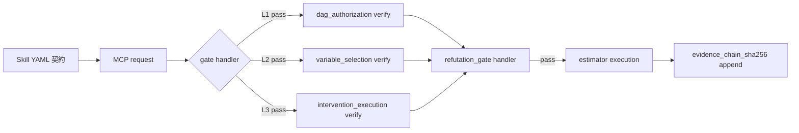
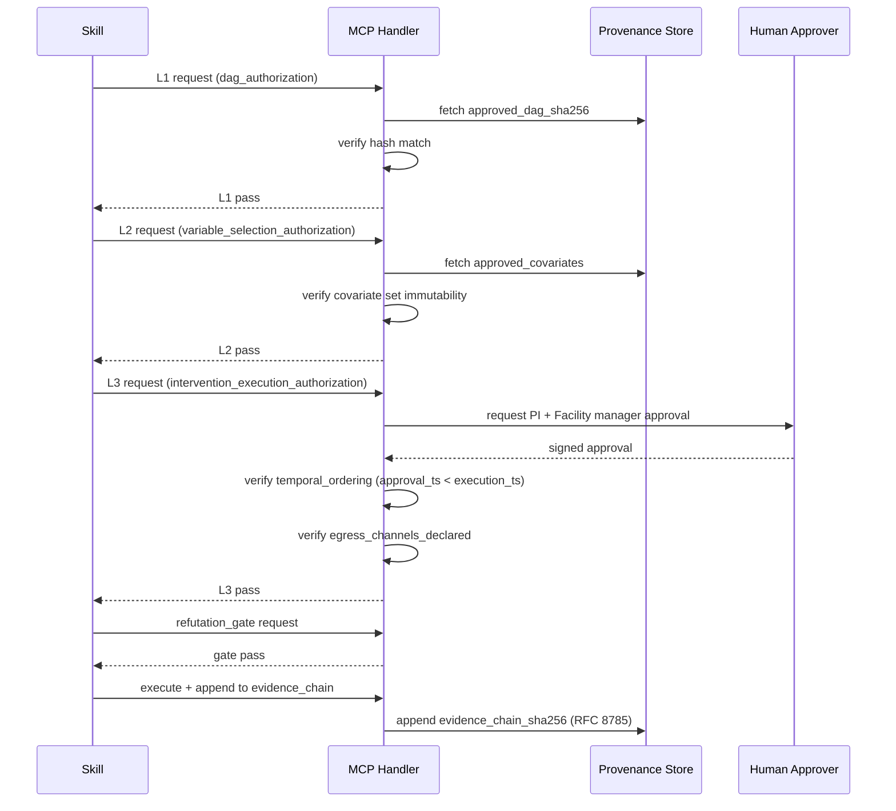

# 付録 B：因果推論・DoE 固有の MCP パターン

> [!NOTE]
> **本付録の位置付け**：Model Context Protocol（MCP）の一般設計は **vol-03 付録 B** を参照する。本付録は **因果推論と DoE 固有の課題** に集中する：
> - `dag_of_record_uri` / `dag_of_record_sha256` の pin と検証
> - `refutation_gate`（Ch9 §9.7.1）を MCP ハンドラで gate 化
> - **3 層承認フロー**（`dag_authorization` → `variable_selection_authorization` → `intervention_execution_authorization`）の MCP 実装
> - DoWhy / EconML / CausalPy / pgmpy / pyDOE2 の API チートシート

## B.1 全体構成 — MCP と Skill 契約の対応

vol-04 の Skill 契約は **canonical schema（Ch4 §4.9 template ①-⑫）** を YAML で持つが、これを **runtime で hash-verifiable に enforce する** のが MCP ハンドラの役割：



**MCP ハンドラの責務**：
1. Skill 契約の canonical schema 準拠を検証（型・enum 値）
2. 各承認 gate の provenance URI / SHA-256 を verify
3. `refutation_gate.aggregate_status == pass` を強制
4. `evidence_chain_sha256` を RFC 8785 canonical JSON 化で決定論的に計算
5. fatal 検知時に **fail-close**（Skill 停止 + Human へ escalation）

---

## B.2 パターン 1：DAG hash pin と検証

### B.2.1 課題

DAG は identification の根本。承認後の silent 差替え（Ch14 §14.3.1）を防ぐには、以下の手続きが必要：

1. `dag_authorization` 承認時に `approved_dag_sha256` を pin
2. 下流の任意の estimator 実行時に、その estimator が参照する `dag_of_record_sha256` と `approved_dag_sha256` を比較
3. 不一致なら **fatal**（`Ch13.modify_approved_dag_after_downstream_start`）

### B.2.2 MCP ハンドラ実装骨格

```python
# canonical hash algorithm: Ch13 §13.4.4 sha256_json_canonical_rfc8785
import hashlib, json
from rfc8785 import canonicalize  # or python-jcs

def compute_canonical_sha256(payload: dict) -> str:
    """
    RFC 8785 canonicalization → SHA-256.
    汎用（DAG / preregistration manifest / provenance など任意 dict に適用可）。
    """
    canonical_bytes = canonicalize(payload)
    return hashlib.sha256(canonical_bytes).hexdigest()

def mcp_handler_verify_dag(request: dict) -> dict:
    """
    L1 dag_authorization gate: Skill が参照する dag_of_record_sha256 が
    approved_dag_sha256 と一致することを検証。
    """
    approved_dag_sha256 = fetch_from_provenance(
        request["dag_authorization_provenance_uri"]
    )["approved_dag_sha256"]
    
    skill_dag_sha256 = request["dag_of_record_sha256"]
    
    if approved_dag_sha256 != skill_dag_sha256:
        return {
            "gate_status": "fail",
            "fatal": "Ch13.modify_approved_dag_after_downstream_start",
            "expected": approved_dag_sha256,
            "actual": skill_dag_sha256,
            "action": "fail_close_and_notify_research_lead",
        }
    
    return {"gate_status": "pass", "gate_level": "L1_dag_authorization"}
```

### B.2.3 provenance ハンドシェイク

MCP request/response の canonical shape：

```yaml
# Request（Skill → MCP）
mcp_request:
  skill_id: ate_estimation_skill
  skill_version: 0.1.0
  gate_level: L1_dag_authorization                     # canonical enum
  dag_of_record_uri: <artifact>
  dag_of_record_sha256: <sha256>
  dag_authorization_provenance_uri: <artifact>         # 承認証跡

# Response（MCP → Skill）
mcp_response:
  gate_status: pass | fail
  gate_level: L1_dag_authorization
  verified_at: <timestamp>
  verifier_signature: <cryptographic>                   # non-repudiation
  # fail 時のみ
  fatal: <canonical_fatal_name>
  action: fail_close_and_notify_research_lead
```

---

## B.3 パターン 2：refutation_gate MCP ハンドラ

### B.3.1 課題

`refutation_gate.aggregate_status == pass` を **runtime で強制** する。Skill が pass しない refutation 結果を隠して estimate を release するのを防ぐ（Ch4 §4.8 item 5、Ch14 §14.3.3）。

### B.3.2 handler 実装

```python
def mcp_handler_refutation_gate(request: dict) -> dict:
    """
    Ch9 §9.7.1 canonical refutation_gate をMCP で gate 化。
    declared_required_tests の全 test が pass しない限り estimate release を封じる。
    """
    gate = request["refutation_gate"]
    
    # 1. enum_version の verify（B-10、Ch14 §14.3.3）
    if gate.get("enum_version") != "ch09_v0_3":
        return {
            "gate_status": "fail",
            "fatal": "Ch14.downgrade_declared_required_tests_enum_version_silently",
        }
    
    # 2. preregistration manifest の immutability
    stored_preregistration = fetch_from_provenance(gate["preregistration_manifest_uri"])
    if compute_canonical_sha256(stored_preregistration) != gate["preregistration_manifest_sha256"]:
        return {
            "gate_status": "fail",
            "fatal": "Ch4.preregistration_manifest_post_hoc_modification",
        }
    
    # 3. declared_required_tests の全 pass 検証
    required = set(gate["declared_required_tests"])
    results = gate["test_results"]
    
    for test_name in required:
        status = results.get(test_name, {}).get("status")
        if status == "fail" or status == "insufficient_data":
            return {
                "gate_status": "fail",
                "fatal": "Ch9.refutation_skip",
                "failing_test": test_name,
            }
        if status == "not_applicable":
            # applicability_manifest で事前に pre-declared かを検証
            applicability = fetch_from_provenance(gate["applicability_manifest_uri"])
            if test_name not in applicability["preregistered_not_applicable_tests"]:
                return {
                    "gate_status": "fail",
                    "fatal": "Ch9.reclassify_failed_required_test_as_not_applicable_post_hoc",
                }
    
    # 4. estimator_provenance_reference の hash chain 検証（Ch4 §4.9 template ⑪）
    est_ref = gate["estimator_provenance_reference"]
    if not verify_hash_chain(est_ref):
        return {
            "gate_status": "fail",
            "fatal": "Ch13.estimator_contract_silent_change",
        }
    
    return {"gate_status": "pass", "aggregate_status": "pass"}
```

### B.3.3 partial_diagnostic_only モードの扱い

`refutation_gate.aggregate_status == partial_diagnostic_only` は **actionable estimate を返さない** モード：

```python
def enforce_partial_diagnostic_policy(gate_result: dict, request: dict):
    if gate_result.get("aggregate_status") == "partial_diagnostic_only":
        if request.get("output_class") == "actionable_estimate":
            raise FatalError(
                "Ch4.release_actionable_estimate_under_partial_diagnostic_only"
            )
        # diagnostic-only output は許可（下流 downstream chain には含めない）
```

---

## B.4 パターン 3：3 層承認フロー MCP 実装

### B.4.1 全体シーケンス



### B.4.2 L2 variable_selection_authorization ハンドラ

```python
def mcp_handler_variable_selection(request: dict) -> dict:
    """
    L2 variable_selection_authorization: approved_covariates と estimator input を比較。
    2 種類の violation を区別（audit_manifest_v1 downstream で失敗モード分離のため）:
      - actual - approved (extra covariates): Ch4 fatal
      - approved - actual (silent removal):   Ch14 §14.3.2 silent_confounder_removal_check
    """
    approved = set(fetch_from_provenance(
        request["variable_selection_authorization_provenance_uri"]
    )["approved_covariates"])
    
    actual = set(request["estimator_input_variables"])
    
    extra = actual - approved                             # 非承認 covariate の追加
    missing = approved - actual                           # 承認済 covariate の silent 削除
    
    if missing:
        return {
            "gate_status": "fail",
            "fatal": "Ch14.silent_confounder_removal_check",
            "missing_covariates": sorted(missing),
            "action": "fail_close",
        }
    if extra:
        return {
            "gate_status": "fail",
            "fatal": "Ch4.execute_estimator_without_variable_selection_authorization",
            "extra_covariates": sorted(extra),
            "action": "fail_close",
        }
    
    return {"gate_status": "pass", "gate_level": "L2_variable_selection_authorization"}
```

### B.4.3 L3 intervention_execution_authorization ハンドラ

```python
from datetime import datetime

def mcp_handler_intervention_execution(request: dict) -> dict:
    """
    L3 intervention_execution_authorization: 
    - PI + Facility manager 両者の署名を検証
    - temporal_ordering: approval_timestamp < intervention_execution_timestamp
    - egress_channels_declared / authorized_broadcast_targets の宣言
    """
    approval = fetch_from_provenance(
        request["intervention_execution_authorization_provenance_uri"]
    )
    
    # 署名検証（両者必須）
    if not (approval["pi_signature"] and approval["facility_manager_signature"]):
        return {
            "gate_status": "fail",
            "fatal": "Ch14.unauthorized_intervention_execution",
            "reason": "missing_dual_signature",
        }
    
    # temporal_ordering（Ch14 §14.3.4）
    approval_ts = datetime.fromisoformat(approval["approval_timestamp"])
    exec_ts = datetime.fromisoformat(request["intervention_execution_timestamp"])
    if exec_ts < approval_ts:
        return {
            "gate_status": "fail",
            "fatal": "Ch14.execute_intervention_before_l3_authorization",
            "approval_ts": str(approval_ts),
            "execution_ts": str(exec_ts),
        }
    
    # egress control（Ch4 §4.9 template ⑩、Ch14 §14.3.6）
    declared_channels = set(approval["egress_channels_declared"])
    actual_channels = set(request.get("actual_broadcast_channels", []))
    unauthorized = actual_channels - declared_channels
    if unauthorized:
        return {
            "gate_status": "fail",
            "fatal": "Ch14.broadcast_intervention_recommendation_without_l3_authorization",
            "unauthorized_channels": list(unauthorized),
        }
    
    return {"gate_status": "pass", "gate_level": "L3_intervention_execution_authorization"}
```

### B.4.4 L4 facility_standard_promotion_gate（Ch14 §14.5.2）

```python
def mcp_handler_l4_promotion(request: dict) -> dict:
    """
    L4 facility_standard_promotion: audit_manifest_v1 の 19 checks 全 pass が
    pre_condition（Ch14 §14.4）。
    重複提出（同一 check_id 19 個）や status enum 汚染で通過するのを防ぐため、
    canonical 19 check_id の完全一致を検証する。
    """
    # Ch14 §14.4 canonical 19 check_ids（Ch15 §15.1.1 クイックリファレンス参照）
    CANONICAL_19_CHECK_IDS = frozenset({
        "dag_hash_verify", "adjustment_set_immutability",
        "variable_selection_authorization_verify",
        "estimator_provenance_hash_chain",
        "refutation_gate_enum_version_verify",
        "refutation_gate_declared_required_tests_verify",
        "refutation_applicability_manifest_verify",
        "intervention_authorization_dual_signature",
        "intervention_temporal_ordering",
        "egress_channels_declared_verify",
        "evidence_chain_sha256_replay",
        "assignment_log_seed_match",
        "assignment_log_design_hash_match",
        "assignment_log_permutation_reproducibility",
        "assignment_log_execution_records_binding",
        "prior_predictive_check_verify",
        "prior_data_alignment_verify",
        "counterfactual_scope_gate_history_verify",
        "agent_action_log_append_only_verify",
    })
    ALLOWED_STATUSES = {"pass", "fail", "not_applicable"}
    
    audit = fetch_from_provenance(request["audit_manifest_uri"])
    checks = audit["checks"]
    
    # 1. check_id 完全一致（重複禁止、canonical セットと一致）
    present = {c["check_id"] for c in checks}
    if len(present) != len(checks):
        return {
            "gate_status": "fail",
            "fatal": "Ch14.claim_audit_pass_without_running_all_checks",
            "reason": "duplicate_check_id_detected",
        }
    if present != CANONICAL_19_CHECK_IDS:
        return {
            "gate_status": "fail",
            "fatal": "Ch14.claim_audit_pass_without_running_all_checks",
            "missing": sorted(CANONICAL_19_CHECK_IDS - present),
            "unexpected": sorted(present - CANONICAL_19_CHECK_IDS),
        }
    
    # 2. status enum 汚染検出（unknown status を silent に drop しない）
    for c in checks:
        if c["status"] not in ALLOWED_STATUSES:
            return {
                "gate_status": "fail",
                "fatal": "Ch14.claim_audit_pass_without_running_all_checks",
                "reason": "non_canonical_status",
                "check_id": c["check_id"],
                "actual_status": c["status"],
            }
    
    # 3. total_checks_expected == 19（Ch14 §14.4）
    if len(checks) != 19:
        return {
            "gate_status": "fail",
            "fatal": "Ch14.claim_audit_pass_without_running_all_checks",
            "total_checks_reported": len(checks),
            "expected": 19,
        }
    
    # 4. 一切の fail を許容しない
    failing = [c["check_id"] for c in checks if c["status"] == "fail"]
    if failing:
        return {
            "gate_status": "fail",
            "fatal": "Ch14.bypass_facility_standard_promotion_gate",
            "failing_checks": failing,
        }
    
    return {"gate_status": "pass", "gate_level": "L4_facility_standard_promotion"}
```

---

## B.5 パターン 4：evidence_chain_sha256 の決定論的計算

### B.5.1 canonical algorithm（Ch13 §13.4.4）

```python
import hashlib
from rfc8785 import canonicalize

# canonical: 17 fields, order preserved
EVIDENCE_CHAIN_INPUT_FIELDS = [
    "dag_authorization_uri",
    "dag_authorization_sha256",
    "approved_dag_uri",
    "approved_dag_sha256",
    "variable_selection_authorization_uri",
    "variable_selection_authorization_sha256",
    "approved_design_uri",
    "approved_design_sha256",
    "intervention_execution_authorization_uri",
    "intervention_execution_authorization_sha256",
    "approved_intervention_uri",
    "approved_intervention_sha256",
    "response_surface_provenance_uri",
    "refutation_gate_provenance_uri",
    "counterfactual_scope_gate_history",  # list of {phase, gate_status, timestamp}
    "audit_manifest_uri",
    "audit_manifest_sha256",
]

def compute_evidence_chain_sha256(provenance: dict) -> str:
    """
    Ch13 §13.4.4 canonical algorithm: sha256_json_canonical_rfc8785.
    実装が Python / Rust / Node.js のどれでも同一の hash が得られる。
    """
    canonical_dict = {}
    for field in EVIDENCE_CHAIN_INPUT_FIELDS:
        if field not in provenance:
            raise ValueError(f"Missing canonical field: {field}")
        canonical_dict[field] = provenance[field]
    
    # RFC 8785 JSON Canonicalization
    canonical_bytes = canonicalize(canonical_dict)
    
    # SHA-256
    return hashlib.sha256(canonical_bytes).hexdigest()
```

### B.5.2 timestamp 正規化

```python
from datetime import datetime, timezone

def normalize_timestamp_to_iso8601_utc(ts) -> str:
    """
    ISO 8601 UTC (YYYY-MM-DDTHH:MM:SSZ) に正規化。
    ミリ秒 / タイムゾーン差での hash 変動を防ぐ。
    """
    if isinstance(ts, str):
        dt = datetime.fromisoformat(ts.replace("Z", "+00:00"))
    else:
        dt = ts
    dt_utc = dt.astimezone(timezone.utc)
    return dt_utc.strftime("%Y-%m-%dT%H:%M:%SZ")
```

### B.5.3 replay test（audit_manifest_v1 check 内蔵）

```python
def audit_check_evidence_chain_replay(audit_context: dict) -> dict:
    """
    audit_manifest_v1 の 19 checks の 1 つ：evidence_chain_sha256 の re-computation。
    stored hash と recomputed hash が一致するか検証。
    """
    stored = audit_context["evidence_chain_sha256"]
    recomputed = compute_evidence_chain_sha256(audit_context["provenance"])
    
    if stored != recomputed:
        return {
            "check_id": "evidence_chain_sha256_replay",
            "status": "fail",
            "fatal": "Ch13.modify_evidence_chain_after_approval",
            "stored": stored,
            "recomputed": recomputed,
        }
    
    return {"check_id": "evidence_chain_sha256_replay", "status": "pass"}
```

---

## B.6 パターン 5：DoE Skill 固有 — assignment_log 4-stage detection

### B.6.1 課題

Ch10 §10.5.3 の 4-stage detection を MCP handler で強制：
1. `seed_match`
2. `design_hash_match`
3. `permutation_reproducibility`
4. `execution_records_binding`

### B.6.2 handler 実装

```python
import numpy as np

def mcp_handler_assignment_log_4stage(request: dict) -> dict:
    """
    Ch10 §10.5.3 canonical 4-stage detection。
    Ch11/Ch12/Ch14 §14.2.1 でも同一 check が発火。
    """
    log = request["assignment_log"]
    preregistration = fetch_from_provenance(request["preregistration_manifest_uri"])
    
    # Stage 1: seed_match
    if log["actual_seed"] != preregistration["randomization_seed_pinned"]:
        return {"gate_status": "fail", "stage": 1,
                "fatal": "Ch10.randomization_seed_mismatch"}
    
    # Stage 2: design_hash_match
    if log["actual_design_sha256"] != preregistration["design_matrix_sha256"]:
        return {"gate_status": "fail", "stage": 2,
                "fatal": "Ch10.design_matrix_altered_post_pin"}
    
    # Stage 3: permutation_reproducibility（byte-exact replay）
    replayed = replay_permutation(
        seed=log["actual_seed"],
        library=preregistration["permutation_library"],
        library_version=preregistration["permutation_library_version"],
    )
    if replayed.tobytes() != log["actual_assignment_bytes"]:
        return {"gate_status": "fail", "stage": 3,
                "fatal": "Ch10.permutation_not_byte_exact"}
    
    # Stage 4: execution_records_binding
    planned_order = log["planned_execution_order"]
    actual_order = log["actual_execution_order"]
    if planned_order != actual_order:
        return {"gate_status": "fail", "stage": 4,
                "fatal": "Ch10.execution_records_unbound_to_assignment"}
    
    return {"gate_status": "pass", "all_four_stages": "pass"}


def replay_permutation(seed: int, library: str, library_version: str) -> np.ndarray:
    """
    Canonical library に応じて byte-exact な permutation を再生成。
    canonical string は `numpy.random.default_rng`（Ch10 §10.5.3 SoT、appendix D §D.6）。
    """
    assert library == "numpy.random.default_rng", \
        f"Non-canonical library: {library} (expected 'numpy.random.default_rng')"
    rng = np.random.default_rng(seed)
    return rng.permutation(...)  # implementation-specific
```

---

## B.7 API チートシート

### B.7.1 DoWhy（identification + refutation）

```python
import dowhy

# 1. Identification
# 注：DoWhy の `graph=` 引数は GML/DOT 文字列 or ローカルファイルパスを想定。
# `arim://` 等の URI を渡す前に、MCP handler で dereference して GML 文字列に変換すること。
gml_graph = dereference_dag_uri_to_gml(dag_of_record_uri)   # canonical, Ch4 §4.4
model = dowhy.CausalModel(
    data=df,
    treatment="T",
    outcome="Y",
    graph=gml_graph,
)
identified_estimand = model.identify_effect(
    proceed_when_unidentifiable=False,  # Ch4 §4.8 item 1 防止
)

# 2. Estimation (backdoor)
estimate = model.estimate_effect(
    identified_estimand,
    method_name="backdoor.propensity_score_matching",
    target_units="ate",  # canonical estimand_type
)

# 3. Refutation (Ch9 §9.7.1 canonical enum)
refuters = {
    "placebo": "placebo_treatment_refuter",             # DoWhy API 名
    "random_common_cause": "random_common_cause",
    "data_subset_validation": "data_subset_refuter",
}
for canonical_name, dowhy_api_name in refuters.items():
    result = model.refute_estimate(
        identified_estimand, estimate,
        method_name=dowhy_api_name,
    )
    # canonical_name で refutation_gate.test_results に格納
```

### B.7.2 EconML（DR-Learner / DML / X-Learner）

```python
from econml.dr import DRLearner
from econml.dml import LinearDML
from sklearn.ensemble import RandomForestRegressor, RandomForestClassifier

# DR-Learner（Ch8 CATE）
dr = DRLearner(
    model_regression=RandomForestRegressor(random_state=42),
    model_propensity=RandomForestClassifier(random_state=42),
    model_final=LinearRegression(),
    cv=5,                                                # cross_fitting_folds
    random_state=42,                                      # cross_fitting_seed
)
dr.fit(Y, T, X=X, W=W)  # X: heterogeneity, W: adjustment
cate = dr.effect(X_new)
ci_lower, ci_upper = dr.effect_interval(X_new, alpha=0.05)

# DML
dml = LinearDML(
    model_y=RandomForestRegressor(random_state=42),
    model_t=RandomForestRegressor(random_state=42),
    cv=5,
    random_state=42,
)
```

### B.7.3 CausalPy（Bayesian causal）

```python
import causalpy as cp

# Bayesian DiD
result = cp.pymc_experiments.DifferenceInDifferences(
    data=df,
    formula="Y ~ 1 + T*post",
    time_variable_name="year",
    group_variable_name="unit",
    treated=1,
)
# 事後分布から effect + credible interval を取得
```

### B.7.4 pgmpy（DAG 定義 + backdoor 判定）

```python
from pgmpy.models import BayesianNetwork
from pgmpy.inference.CausalInference import CausalInference

# DAG 定義（Ch5 §5.6）
model = BayesianNetwork([
    ("R", "T"), ("R", "Y"), ("T", "Y"),
    ("P", "Y"), ("C", "Y"),
])

# Backdoor adjustment set の自動導出
inf = CausalInference(model)
adjustment_sets = inf.get_all_backdoor_adjustment_sets("T", "Y")
# frozenset({'R'}) など canonical adjustment set list を得る

# do-calculus
query = inf.query(
    variables=["Y"],
    do={"T": 1},
    evidence={"R": "high"},
)
```

### B.7.5 pyDOE2 + smt（DoE + 応答曲面）

```python
import pyDOE2
import numpy as np

# Full factorial（Ch10 §10.8）
design = pyDOE2.fullfact([3, 3, 2])  # 3 × 3 × 2 = 18 runs

# Central composite（Ch11 §11）
design = pyDOE2.ccdesign(3, center=(4, 4), alpha="rotatable", face="cci")

# Randomization（canonical seed pinning）
rng = np.random.default_rng(seed=42)
run_order = rng.permutation(len(design))

# Response surface（smt）
from smt.surrogate_models import KRG  # Gaussian Process
gp = KRG(theta0=[1e-2] * n_features)
gp.set_training_values(design, y)
gp.train()
optimum_uri = gp.predict_values(x_star)
```

### B.7.6 linearmodels（DiD / IV）

```python
from linearmodels import PanelOLS, IV2SLS

# DiD via two-way fixed effects
panel = df.set_index(["unit", "year"])
did = PanelOLS.from_formula(
    "Y ~ 1 + T + EntityEffects + TimeEffects",
    data=panel,
).fit()

# 2SLS IV
iv = IV2SLS.from_formula(
    "Y ~ 1 + X + [T ~ Z]",  # T は endogenous, Z は instrument
    data=df,
).fit()
# first_stage_f_statistic は iv.first_stage.diagnostics で取得
```

---

## B.8 fail-close ハンドラの標準テンプレート

```python
def fail_close_handler(fatal_name: str, context: dict) -> None:
    """
    canonical fatal 検知時の標準手順（Ch4 §4.6.4）：
    1. estimate release を封じる（output_class を diagnostic_only にダウングレード）
    2. agent_action_log に fail event を append（immutable）
    3. Human approver に notify
    4. evidence_chain に fail event を組み込み（audit_manifest_v1 で検出可能に）
    5. Skill 実行を停止（最後に raise。以下 4 手続きが必ず実行されるように順序を固定）
    """
    # 1. release 封じ（output_class を diagnostic_only にダウングレード or 空）
    context["output"] = None
    context["output_class"] = "diagnostic_only"
    
    # 2. agent_action_log 追記（append-only）
    try:
        append_to_action_log({
            "gate_id": context["gate_id"],
            "attempt_result": "fail",
            "fatal": fatal_name,
            "timestamp": normalize_timestamp_to_iso8601_utc(datetime.now(timezone.utc)),
            "suppressed": False,                          # bypass 検出
        })
    except Exception as log_err:
        # ログ失敗自体を audit で拾えるよう、meta-fatal を保持しつつ後段の raise へ進む
        context["_meta_fatal"] = f"Ch13.agent_action_log_append_failure: {log_err}"
    
    # 3. Human notification（notify 失敗も raise を阻害しない）
    try:
        notify_approver(
            approver=context.get("fallback_approver", "facility_causal_review_board"),
            subject=f"FATAL: {fatal_name} in skill {context['skill_id']}",
            evidence_uri=context["provenance_uri"],
        )
    except Exception:
        pass                                              # 通知失敗は log 済み。raise は必ず実行。
    
    # 4. evidence_chain 側の後段処理は呼び出し側で追記（本 handler の責務外）
    
    # 5. 最後に例外を raise して Skill 実行を停止
    raise FatalError(fatal_name)
```

---

## B.9 MCP request/response schema 要約

すべての MCP request は以下を含む：

```yaml
mcp_request_canonical_schema:
  skill_id: <string>
  skill_version: <semver>
  canonical_version: vol04_v1.0                          # Ch15 §15.5
  gate_level: <L{n}_{name}>                              # 完全形 (Ch4 §4.6.1)
  role: <agent_autonomous | human_required>              # Ch13 canonical
  action_class: <propose_only | propose_and_execute | propose_and_execute_with_gate>
  provenance_uri_list:                                   # verify 対象
    - dag_authorization_provenance_uri
    - variable_selection_authorization_provenance_uri
    - intervention_execution_authorization_provenance_uri
    - refutation_gate_provenance_uri
    - counterfactual_scope_gate_provenance_uri
  agent_action_log_uri: <artifact>
  request_timestamp: <ISO 8601 UTC>
```

Response：

```yaml
mcp_response_canonical_schema:
  gate_status: pass | fail | conditional_pass
  gate_level: <L{n}_{name}>
  verified_at: <ISO 8601 UTC>
  verifier_signature: <cryptographic>
  # fail 時
  fatal: <canonical_fatal_name>                          # Ch4 §4.8 + Ch{n} 章の fatal
  fatal_evidence_uri: <artifact>
  action: fail_close | conditional_release | notify_only
```

---

## 章末チェックリスト

- [ ] `dag_of_record_sha256` の verify handler を実装している
- [ ] `refutation_gate` MCP handler で `enum_version: ch09_v0_3` を強制している
- [ ] 3 層承認（L1 / L2 / L3）の各 handler を分離実装
- [ ] L3 handler で **PI + Facility manager 両署名** を検証
- [ ] L3 handler で `temporal_ordering`（approval_ts < execution_ts）を検証
- [ ] L4 handler で `total_checks_expected == 19` を検証
- [ ] `evidence_chain_sha256` を RFC 8785 canonical JSON で決定論的に計算
- [ ] 全 timestamp を ISO 8601 UTC に正規化
- [ ] assignment_log 4-stage detection を Ch10 §10.5.3 canonical に実装
- [ ] fail-close handler で agent_action_log に append-only 記録
- [ ] canonical fatal 名の完全リストを持ち、cross-chapter reference は `Ch{n}.` prefix で参照（Ch4 §4.8 S-2 命名規約）
