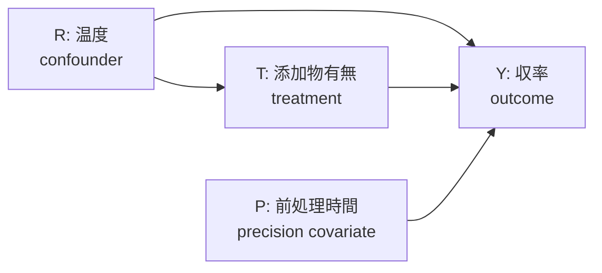

# 付録 C：演習データセット

> [!NOTE]
> **本付録の位置付け**：Vol-04 本編（Ch3-Ch13）の演習・worked example で使用する **合成因果データ** の生成スクリプトと、**公開データセット** のカタログ、**ARIM 実データ持込時の匿名化ガイド** を提供する。
> - **表形式データ**（材料実験、DoE、CATE 推定）を主軸
> - 5 データ型（spectrum / timeseries / image / diffraction / multimodal）の小規模例を併記
> - **真の DAG + ground truth ATE/CATE** を持つ合成データで、Skill / MCP の contract test が可能

## C.1 データセットカタログ

| ID | 種別 | データ型 | 用途 | 真の因果構造 | サイズ |
|:---|:---|:---|:---|:---|:---|
| C-1 | 合成 | 表形式 | ATE / propensity（Ch7） | 既知（backdoor） | N=2,000 |
| C-2 | 合成 | 表形式 | CATE / DR-Learner（Ch8） | 既知（heterogeneous） | N=5,000 |
| C-3 | 合成 | 表形式 | DiD / パネル（Ch7 拡張） | 既知（time-varying） | N=1,000 × T=10 |
| C-4 | 合成 | 表形式 | IV / weak IV（Ch7） | 既知（unobserved conf.） | N=3,000 |
| C-5 | 合成 | 表形式 | DoE 応答曲面（Ch10-Ch11） | 既知（response surface） | N=20-50 runs |
| C-6 | 合成 | 表形式 | Bayesian DoE（Ch12） | 既知（prior + noise） | N=15 runs |
| C-7 | 合成 | spectrum | 特徴量 → 因果（Ch3 導入） | 既知 | N=200 |
| C-8 | 合成 | timeseries | 介入時点効果（Ch7 派生） | 既知 | N=100 × T=50 |
| C-9 | 合成 | image | image-level covariate（Ch3） | 既知 | N=100 |
| C-10 | 合成 | diffraction | 相同定 covariate（Ch5） | 既知 | N=50 |
| C-11 | 公開 | 表形式 | Lalonde（DiD/IPW 定番） | 一部既知 | N=2,675 |
| C-12 | 公開 | 表形式 | IHDP（CATE 定番） | semi-synthetic | N=747 |
| C-13 | 公開 | 表形式 | Twins（CATE 双子ペア） | quasi-experimental | N=11,984 |
| C-14 | 公開 | 表形式 | Materials Project（材料 API） | なし（探索用） | ~150k |
| C-15 | 公開 | 表形式 | causal-benchmark（Neal et al.） | 既知 | 複数 |

---

## C.2 合成データ C-1：ATE 用（表形式）

### C.2.1 真の DAG



**識別戦略**：Backdoor adjustment set = {R}（P は precision covariate、adjustment 不要だが分散削減に使用可）

**Ground truth ATE**：`τ = 2.0`

### C.2.2 生成スクリプト

```python
"""
Synthetic ATE dataset (C-1).
Backdoor adjustment set = {R}; ground truth ATE = 2.0.
"""
import numpy as np
import pandas as pd

def generate_c1_ate_dataset(n: int = 2000, seed: int = 42) -> pd.DataFrame:
    rng = np.random.default_rng(seed)
    
    # R: temperature (confounder)
    R = rng.normal(loc=500, scale=50, size=n)
    R_std = (R - R.mean()) / R.std()
    
    # T: additive presence (treatment), depends on R
    logit = 0.8 * R_std                                   # temperature-dependent propensity
    p = 1 / (1 + np.exp(-logit))
    T = rng.binomial(1, p)
    
    # P: pre-treatment time (precision covariate)
    P = rng.normal(30, 5, n)
    
    # Y: yield (outcome)
    Y = (
        50.0                                              # baseline
        + 2.0 * T                                         # ground truth ATE = 2.0
        + 3.0 * R_std                                     # confounding effect
        + 1.5 * ((P - 30) / 5)                            # precision covariate
        + rng.normal(0, 1.0, n)                           # noise
    )
    
    return pd.DataFrame({"R": R, "T": T, "P": P, "Y": Y})

if __name__ == "__main__":
    df = generate_c1_ate_dataset()
    df.to_csv("c1_ate_dataset.csv", index=False)
    print(f"Ground truth ATE: 2.0")
    print(f"Naive difference: {df[df.T==1].Y.mean() - df[df.T==0].Y.mean():.3f}")
    # naive difference は confounding で biased
```

**期待値**：naive difference は約 4.2、backdoor adjust 後は ~2.0 に収束（DoWhy / EconML どちらでも）。

---

## C.3 合成データ C-2：CATE 用（表形式）

### C.3.1 真の CATE 関数

```
τ(X) = 1.5 + 0.8 * (X_1 > 0) - 0.5 * X_2
```

X_1 は heterogeneity driver、X_2 は smooth modulation。

### C.3.2 生成スクリプト

```python
def generate_c2_cate_dataset(n: int = 5000, seed: int = 42) -> pd.DataFrame:
    rng = np.random.default_rng(seed)
    
    # Heterogeneity features
    X1 = rng.normal(0, 1, n)
    X2 = rng.normal(0, 1, n)
    X3 = rng.normal(0, 1, n)                              # adjustment (not heterogeneity)
    
    # Propensity (depends on X3)
    logit = 0.5 * X3
    p = 1 / (1 + np.exp(-logit))
    T = rng.binomial(1, p)
    
    # True CATE
    tau = 1.5 + 0.8 * (X1 > 0).astype(float) - 0.5 * X2
    
    # Y = f(X) + T * tau(X) + eps
    Y = 2.0 + 0.5 * X1 + 1.0 * X3 + T * tau + rng.normal(0, 0.5, n)
    
    df = pd.DataFrame({"X1": X1, "X2": X2, "X3": X3, "T": T, "Y": Y})
    df["true_cate"] = tau
    return df
```

**評価**：DR-Learner の CATE estimate と `true_cate` の PEHE (Precision in Estimation of Heterogeneous Effects) を計算。

---

## C.4 合成データ C-3：DiD 用（パネル）

### C.4.1 生成仕様

- N=1,000 units × T=10 periods
- Treatment は t=6 から group A（500 units）に導入
- Ground truth ATT = 3.0（parallel trend 満たす）

```python
def generate_c3_did_dataset(n_units: int = 1000, n_periods: int = 10, seed: int = 42):
    rng = np.random.default_rng(seed)
    
    unit_fe = rng.normal(0, 2, n_units)                   # unit fixed effect
    time_fe = np.linspace(0, 1, n_periods)                # linear time trend
    
    is_treated_group = rng.binomial(1, 0.5, n_units)      # 50% treated group
    
    rows = []
    for i in range(n_units):
        for t in range(n_periods):
            post = int(t >= 6)
            T_it = is_treated_group[i] * post
            Y_it = (
                5.0
                + unit_fe[i]
                + time_fe[t]
                + 3.0 * T_it                              # ground truth ATT = 3.0
                + rng.normal(0, 0.5)
            )
            rows.append({
                "unit": i, "period": t,
                "treated_group": is_treated_group[i],
                "post": post, "T": T_it, "Y": Y_it,
            })
    return pd.DataFrame(rows)
```

**Skill 契約**：Ch7 §7 の DiD Skill テンプレートで parallel trend の placebo test（t<6 の期間で ATE=0）を refutation として実装。

---

## C.5 合成データ C-4：IV 用（unobserved confounder）

### C.5.1 生成仕様

真の DAG：`Z → T → Y`, `U → T`, `U → Y`（U は unobserved）

Ground truth ATE = 1.5、instrument strength は first-stage F ~ 30。

```python
def generate_c4_iv_dataset(n: int = 3000, seed: int = 42):
    rng = np.random.default_rng(seed)
    
    U = rng.normal(0, 1, n)                               # unobserved confounder
    Z = rng.binomial(1, 0.5, n)                           # instrument
    
    # T: influenced by Z and U
    logit_T = 1.5 * Z + 1.0 * U
    p_T = 1 / (1 + np.exp(-logit_T))
    T = rng.binomial(1, p_T)
    
    # Y: influenced by T (causal) and U (confounding), NOT by Z directly
    Y = 2.0 + 1.5 * T + 2.0 * U + rng.normal(0, 0.5, n)
    
    return pd.DataFrame({"Z": Z, "T": T, "Y": Y})         # U is NOT included
```

**弱 IV の生成**：`logit_T = 0.1 * Z + 1.0 * U` に変更すると first-stage F ~ 3 の弱 IV となる（Ch7 の Stock–Yogo threshold=10 test 用）。

---

## C.6 合成データ C-5：DoE 応答曲面

### C.6.1 真の応答関数

```
Y = 5.0 + 2.0 * x1 + 3.0 * x2 - 1.5 * x1^2 - 1.0 * x2^2 + 0.8 * x1 * x2 + eps
```

Ground truth optimum: `x1 ≈ 0.42, x2 ≈ 1.67`, `Y_max ≈ 8.5`

```python
def generate_c5_doe_dataset(design: str = "ccd", seed: int = 42):
    """
    design: 'full_factorial' | 'fractional' | 'ccd' | 'box_behnken'
    Returns design matrix + noisy y observations.
    """
    import pyDOE2
    rng = np.random.default_rng(seed)
    
    if design == "ccd":
        X = pyDOE2.ccdesign(2, center=(4, 4), alpha="rotatable", face="cci")
    elif design == "full_factorial":
        X = pyDOE2.fullfact([3, 3]) - 1                   # levels: -1, 0, +1
    elif design == "box_behnken":
        X = pyDOE2.bbdesign(3)                            # 3 factor
    
    x1, x2 = X[:, 0], X[:, 1]
    y_true = 5.0 + 2.0*x1 + 3.0*x2 - 1.5*x1**2 - 1.0*x2**2 + 0.8*x1*x2
    y_obs = y_true + rng.normal(0, 0.3, len(y_true))
    
    df = pd.DataFrame(X, columns=["x1", "x2"])
    df["y_true"] = y_true
    df["y_obs"] = y_obs
    df["run_order"] = rng.permutation(len(df))            # canonical seed pinning
    return df
```

**用途**：Ch10 応答曲面法、Ch11 Taguchi ロバスト設計、Ch14 assignment_log 4-stage detection の演習。

---

## C.7 合成データ C-6：Bayesian DoE（少数実験）

### C.7.1 生成仕様

- 事前分布 known（Ch12 §12.2.3 prior_predictive_check 用）
- N=15 runs（sequential design 用）
- 真のパラメータ: `beta = [1.5, -2.0, 0.5]`

```python
def generate_c6_bayesian_doe(n: int = 15, seed: int = 42):
    rng = np.random.default_rng(seed)
    
    # Prior: β ~ N(0, 2^2)
    beta_true = np.array([1.5, -2.0, 0.5])
    
    # Design: Latin Hypercube
    import pyDOE2
    X = pyDOE2.lhs(3, samples=n, random_state=seed)
    X_centered = 2 * X - 1                                # scale to [-1, 1]
    
    y = X_centered @ beta_true + rng.normal(0, 0.3, n)
    
    df = pd.DataFrame(X_centered, columns=["x1", "x2", "x3"])
    df["y"] = y
    df["beta_true"] = str(beta_true.tolist())
    return df
```

---

## C.8 追加データ型の小規模例

### C.8.1 spectrum（C-7）

XRD-like 1D spectrum + covariate：

```python
def generate_c7_spectrum_dataset(n: int = 200, n_points: int = 500, seed: int = 42):
    rng = np.random.default_rng(seed)
    x_axis = np.linspace(10, 80, n_points)                # 2θ degrees
    
    rows = []
    for i in range(n):
        # covariate: sample age
        age_days = rng.integers(0, 365)
        # treatment: annealing (0/1)
        T = rng.binomial(1, 0.5)
        # spectrum peak shift due to T
        peak_center = 45.0 + 0.5 * T + 0.001 * age_days
        spectrum = np.exp(-((x_axis - peak_center) ** 2) / 2) + rng.normal(0, 0.05, n_points)
        # outcome: peak intensity
        Y = spectrum.max() + rng.normal(0, 0.01)
        rows.append({"id": i, "age_days": age_days, "T": T, "Y": Y,
                     "spectrum": spectrum.tolist(), "x_axis": x_axis.tolist()})
    return pd.DataFrame(rows)
```

### C.8.2 timeseries（C-8）— 介入時点効果

```python
def generate_c8_timeseries_dataset(n_units: int = 100, T: int = 50, seed: int = 42):
    """Interrupted time series with treatment at t=25."""
    rng = np.random.default_rng(seed)
    rows = []
    for i in range(n_units):
        trend = np.linspace(0, 2, T)
        treatment_effect = np.where(np.arange(T) >= 25, 1.5, 0)
        noise = rng.normal(0, 0.3, T)
        Y = 5 + trend + treatment_effect + noise
        rows.extend([{"unit": i, "t": t, "post": int(t >= 25), "Y": Y[t]} for t in range(T)])
    return pd.DataFrame(rows)
```

### C.8.3 image（C-9）— image-level covariate

小規模合成画像 + treatment 効果（Ch3 導入用）：

```python
def generate_c9_image_dataset(n: int = 100, size: int = 32, seed: int = 42):
    rng = np.random.default_rng(seed)
    images = rng.random((n, size, size))                  # 32×32 gray
    covariate = images.mean(axis=(1, 2))                  # brightness = covariate
    T = rng.binomial(1, 0.5, n)
    Y = 3.0 + 2.0 * T + 4.0 * covariate + rng.normal(0, 0.2, n)
    return {"images": images, "df": pd.DataFrame({"brightness": covariate, "T": T, "Y": Y})}
```

### C.8.4 diffraction（C-10）— 相同定 covariate

```python
def generate_c10_diffraction_dataset(n: int = 50, seed: int = 42):
    """Phase identification confounds treatment effect."""
    rng = np.random.default_rng(seed)
    phase = rng.choice(["alpha", "beta"], n, p=[0.6, 0.4])
    T = np.where(phase == "alpha", rng.binomial(1, 0.7, n), rng.binomial(1, 0.3, n))
    lattice_a = np.where(phase == "alpha", 3.5, 4.2) + rng.normal(0, 0.05, n)
    Y = 10 + 2.0 * T + 5.0 * (phase == "alpha") + rng.normal(0, 0.3, n)
    return pd.DataFrame({"phase": phase, "lattice_a": lattice_a, "T": T, "Y": Y})
```

---

## C.9 公開データセット

### C.9.1 Lalonde（DiD / IPW 定番）

- **入手**：`from causaldata import lalonde; df = lalonde.load_pandas().data`
- **treatment**：`treat`（NSW 職業訓練プログラム）
- **outcome**：`re78`（1978 年所得）
- **covariates**：`age, educ, black, hispan, married, nodegree, re74, re75`
- **既知の challenge**：IPW extreme weights、experimental vs. observational 比較

### C.9.2 IHDP（CATE 定番、semi-synthetic）

- **入手**：`https://www.fredjo.com/files/ihdp_npci_1-100.train.npz.zip`
- **本質**：NICU 早産児プログラムの experimental + Hill (2011) の semi-synthetic outcome
- **用途**：CATE推定精度（PEHE）評価

### C.9.3 Twins（quasi-experimental）

- **入手**：`https://github.com/AMLab-Amsterdam/CEVAE/tree/master/datasets/TWINS`
- **本質**：双子ペアの mortality 差 → outcome の counterfactual が両方観測可能
- **用途**：CATE の individual-level ground truth

### C.9.4 Materials Project

- **API**：`from mp_api.client import MPRester; with MPRester(api_key) as m: docs = m.materials.summary.search(...)`
- **用途**：材料組成 → 特性（bandgap / formation_energy）の探索（**因果ではなく相関** に注意）
- **警告**：selection bias（登録された材料のみ）を明示的に扱う

### C.9.5 causal-benchmark（Neal et al.）

- **入手**：`https://github.com/bradyneal/causal-benchmark`
- **本質**：LBIDD、ACIC 系の standardized benchmark
- **用途**：Skill / MCP handler の contract test

---

## C.10 ARIM 実データ持込時の匿名化 + identification 戦略事前レビュー

### C.10.1 匿名化ガイド（table + spectrum + image）

| 対象 | 匿名化アクション | 監査項目 |
|:---|:---|:---|
| 実験者名 / メールアドレス | ハッシュ化（施設内 salt） | agent_action_log と紐付け不可 |
| 装置 serial number | 装置カテゴリコードに置換 | 装置固有 fingerprint 消去 |
| 実施日時 | 週単位 or 月単位に丸め | timeseries の temporal ordering 保存要 |
| 座標情報（画像内位置） | ROI-only crop | image-level covariate は保持可 |
| composition ratios | quantile bin に離散化（10 分位） | continuous heterogeneity の粒度低下 |
| 未公開材料 ID | 施設内 pseudonym | mapping table は施設側で厳格管理 |

### C.10.2 identification 戦略 pre-review 手順

**Ch4 §4.6.1 L1_dag_authorization gate に到達する前の pre-review** を推奨：

1. **DAG proposal**：Skill が propose した DAG を PDF 化
2. **assumption inventory**：backdoor / frontdoor / IV / DiD の各仮定を一覧化
3. **causal review board 事前相談**：以下を確認
   - 未観測 confounder の候補列挙が MECE か
   - selection への影響（sampling / drop-out）を明示しているか
   - positivity（treatment に対する overlap）を検証する計画があるか
   - SUTVA（no interference / consistency）が成立する scope か
4. **pre-review 結果を `dag_authorization_provenance_uri` に append**（正式 L1 承認の supporting evidence）

> [!IMPORTANT]
> **absence of evidence ≠ evidence of absence**：DAG に描かれていない交絡は「無い」のではなく「未検証」。ARIM 施設固有の暗黙的な pipeline bias（例：装置校正差、オペレーター差）を積極的に候補化する。

### C.10.3 canonical pre-review manifest

```yaml
pre_review_manifest:
  dataset_source: ARIM_facility_X
  anonymization_version: v1.0
  identification_strategy_declared: backdoor              # canonical enum
  adjustment_set_proposed: [equipment_category, operator_group, week_of_year]
  unobserved_confounders_candidate:
    - equipment_calibration_drift
    - operator_experience_level
    - sample_batch_id
  positivity_check_planned: true
  sutva_scope_declared: within_single_facility_no_cross_transfer
  pre_review_board_signatures:
    - role: pi
      timestamp: <ISO 8601 UTC>
    - role: facility_causal_review_board
      timestamp: <ISO 8601 UTC>
    - role: statistician
      timestamp: <ISO 8601 UTC>
```

---

## C.11 全データセットの再現性検証

```bash
# 全 generator を実行し、hash 一致を確認
python3 -c "
from c1_generator import generate_c1_ate_dataset
import hashlib
df = generate_c1_ate_dataset(seed=42)
h = hashlib.sha256(df.to_csv(index=False).encode()).hexdigest()
print(f'C-1 hash: {h}')
"
# 期待値：異なる環境で同一 hash → 完全な determinism
```

**canonical library versions**（seed pinning 前提）：
- `numpy >= 1.24, < 2.0`（Generator API 安定）
- `pandas >= 2.0`
- `pyDOE2 >= 1.3`
- `scipy >= 1.10`

---

## 章末チェックリスト

- [ ] C-1〜C-6 の合成データ生成スクリプトは seed=42 で byte-exact に再現可能
- [ ] 全 script で `numpy.random.default_rng(seed)` を使用（canonical、Ch10 §10.5.3）
- [ ] Ground truth ATE / CATE / ATT を各データセットのドキュメントで明示
- [ ] 公開データセット（Lalonde / IHDP / Twins）の入手 URL を記載
- [ ] 匿名化ガイドが施設内 salt / pseudonym mapping table の管理を明示
- [ ] ARIM 実データ持込前の pre-review manifest を canonical に記載
- [ ] positivity / SUTVA / unobserved confounder を pre-review で候補化
