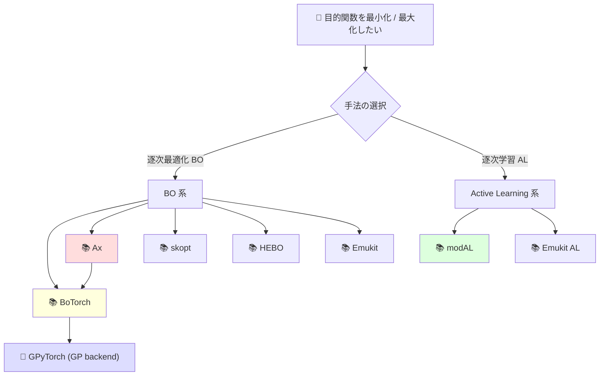

# 第4章 BO / active learning ライブラリ地図 — Agentic 使い分け

> **本章の到達目標**
> - **BoTorch / GPyTorch / Ax / Emukit / scikit-optimize / HEBO / modAL** の 7 ライブラリの **位置づけと責務境界**を 1 枚のマップで説明できる
> - **BoTorch と Ax の gap**（BoTorch = 研究ライブラリ、Ax = 実験管理層）と、**なぜ本書は主に BoTorch を扱い、Ax は Batch BO / experiment tracking で言及する** かを判断できる
> - 各ライブラリで **エージェントがどこまで自律的に叩けるか**（Skill 化に適する API 境界）を判断できる
> - vol-04 の DoE ライブラリ（`pyDOE2` / `dexpy` / `smt`）と vol-05 の BO ライブラリの **連携パス** を 2 種以上示せる
> - 自分のユースケース（単目的 / 多目的 / 制約付き / batch / active learning）に対して **ライブラリを 1 つ選び、選定根拠を書ける**
>
> **本章で扱わないこと**
> - 各ライブラリの API 詳細（付録 B チートシートで扱う）
> - GP kernel の実装比較（第6章）
> - Ax による experiment tracking の完全実装（第12章）
> - MCP サーバ側の Skill 実装（付録 B）

---

## 4.1 なぜライブラリ地図が必要か — 7 ライブラリの分業構造

BO / active learning のライブラリは **単一の "決定版" が存在しない**——研究の系譜（Meta / Facebook 系 = BoTorch/Ax、University of Sheffield 系 = Emukit、Huawei 系 = HEBO 等）と、狙う抽象度（研究 vs 実験管理 vs 汎用最適化）が分かれているためです。

エージェント時代の運用では、**ライブラリの選択そのものが Skill 契約の一部**——「この Skill は BoTorch で GP fit + qEHVI」という宣言が provenance に残ることで、後日の再現・監査が可能になります。

### 7 ライブラリの位置づけ 1 枚マップ

| ライブラリ | 抽象度 | 主要責務 | 依存 | Skill 化しやすさ |
|---|---|---|---|:-:|
| **GPyTorch** | 低（GP のみ）| Scalable GP、kernel 設計、MCMC/VI | PyTorch | ○ |
| **BoTorch** | 中（BO 中核）| Acquisition function、Monte Carlo BO、多目的 qEHVI、制約付き BO の building blocks | PyTorch + GPyTorch | ◎ |
| **Ax** | 高（実験管理層）| BoTorch を裏で使い、Experiment / Trial / GenerationStrategy を上位管理 | BoTorch | △（default GS 使用時は自律実行しづらい） |
| **Emukit** | 中（BO + AL + BQ）| Bayesian quadrature、experimental design、active learning。model wrapper / acquisition / candidate point calculator / loop の抽象 | numpy/scipy + model wrappers（GPy 等）| ○ |
| **scikit-optimize (skopt)** | 高（軽量 BO）| 単目的 BO、`ask()` / `tell()` API、`gp_minimize` 等 | scikit-learn | ◎（ask/tell に限る；`gp_minimize` は非推奨）|
| **HEBO** | 中〜高（実務寄り BO）| 混合空間・比較的高次元の HPO / BBO ベンチで実績、NeurIPS 2020 BBO Challenge 優勝 | PyTorch | ○ |
| **modAL** | 中（AL 特化）| Active learning workflow、pool-based sampling、query strategies | scikit-learn | ◎ |
| **modAL** | 中（AL 特化）| Active learning workflow、pool-based sampling、query strategies | scikit-learn | ◎ |

### 責務境界のマインドマップ



> [!TIP]
> **BoTorch は本書の中心ライブラリ**（第6-11章の実装例が BoTorch 中心）ですが、**単目的で少データ・簡単に試したいなら skopt が最短**、**多様な混合空間 + 実務**なら HEBO、**active learning が主眼**なら modAL——という使い分けを本章で判断できるようにします。

---

## 4.2 BoTorch と Ax の gap — 「ライブラリ」と「実験管理層」の違い

BoTorch と Ax は同じ Meta (Facebook) 系列で **並行して開発**されており、初学者が混同しやすい 2 ライブラリです。以下の 3 点で判断してください。

### 3 つの gap

| 観点 | BoTorch | Ax |
|---|---|---|
| **狙う抽象度** | GP model + acquisition の **数学的コア** | Experiment / Trial / GenerationStrategy の **workflow 管理** |
| **状態管理** | ステートレス（tensor in, tensor out）| ステートフル（DB / JSON で trial を永続化）|
| **典型的な使用者** | 研究者、Skill 実装者 | 実験プラットフォームの運用者 |

### 「本書は主に BoTorch」の理由

- **Skill 化の粒度**：BoTorch は **1 Skill = 1 iteration の候補提案**として綺麗に分離できる。Ax は Experiment オブジェクト全体を Skill が握るため、**Skill 境界と Ax の GenerationStrategy が競合**しがち
- **自律実行との相性**：BoTorch は「tensor in → tensor out」なので、**エージェントが自律的に叩ける境界が明確**。Ax は状態フルな experiment orchestration 層で、**default `GenerationStrategy` を使うと model / acquisition の選択が Skill 外に隠れやすい**——使う場合は GS を明示指定し、model / acquisition options / storage state を provenance に固定する必要がある
- **provenance の透明性**：BoTorch の呼び出しは全 hyperparameter が明示的（`Model(...)` に渡す引数として全て残る）。Ax は default GS が iteration ごとに model / acquisition を切り替えることがあり、**明示 pin なしでは第3章 §3.5 逸脱 2（acquisition drift）と見分けがつかない**

### 「Ax を使う場面」

Ax は **experiment tracking レイヤとして** 第12章の Batch BO 節で言及します。以下の 3 条件が揃うときのみ Ax を推奨：

1. **並列 Trial（Batch BO）を管理したい**——Ax の `AxClient.get_next_trials(max_trials=N)` が最短（引数名は Ax version 依存）
2. **複数実験を DB で永続化したい**——Ax の SQLAlchemy backend
3. **人間が UI / storage で trial を承認・追跡したい**——Ax の Service API + storage

**逆に上記が該当しないなら BoTorch 直呼びが Skill 化に有利**——Ax の抽象層を挟むメリットは、Agentic 運用では小さいことが多いです。

### BoTorch と Ax の関係図

```
┌─────────────────────────┐
│  Ax (experiment layer)  │
│  - Experiment           │
│  - GenerationStrategy   │
│  - Trial persistence    │
└──────────┬──────────────┘
           │ 内部で呼び出し
           ↓
┌─────────────────────────┐
│  BoTorch (BO core)      │
│  - AcquisitionFunction  │
│  - Model wrapper        │
│  - Optimization         │
└──────────┬──────────────┘
           │ GP backend
           ↓
┌─────────────────────────┐
│  GPyTorch (GP engine)   │
│  - ExactGP, ApproxGP    │
│  - Kernel / Likelihood  │
└─────────────────────────┘
```

> [!IMPORTANT]
> **Skill 契約に "BoTorch 直呼び / Ax 経由" を明示的に記録**してください（`bo_library_stack` provenance フィールド、第5章で pin）。同一の acquisition function でも、Ax 経由と直呼びで **hyperparameter defaults が異なる**（Ax の内部デフォルトが上書きすることがある）ため、再現性の観点から重要です。**enum 値域（初出、第5章で正式化）**：
>
> | 値 | 意味 |
> |---|---|
> | `botorch_direct` | BoTorch を直接呼び出す（本書の推奨）|
> | `ax_botorch` | Ax 経由で BoTorch を呼ぶ（GS 明示 pin 必須）|
> | `skopt_ask_tell` | scikit-optimize の `ask()` / `tell()` API |
> | `hebo` | HEBO の `HEBO` クラス |
> | `emukit` | Emukit の Loop + Model wrapper |
> | `modal_al` | modAL の ActiveLearner |
> | `custom` | 上記以外（Skill 契約で詳細記述必須） |
>
> 併せて記録するフィールド：`library_version`, `model_backend`, `acquisition_impl`, `generation_strategy_uri`（Ax のみ、任意）。

---

## 4.3 各ライブラリのエージェント自律度（Skill 化しやすさ）

BO / AL の Skill 化では、**「エージェントがどこまで自律的に API を叩けるか」** がライブラリ選定の実用的な判断軸になります。以下、7 ライブラリを **自律度 3 段階**で評価。

| ライブラリ | 自律度 | 理由 | Human 介入が必要な場面 |
|---|:-:|---|---|
| **GPyTorch** | 🟢 高 | 純粋な tensor 演算、副作用なし | Kernel 選択（Skill 契約で pin）、hyperparameter 初期化 |
| **BoTorch** | 🟢 高 | Acquisition + optimizer が明示的 | Acquisition 選択（Skill 契約で pin）、raw_samples 数 |
| **skopt** | 🟢 高 | 単目的で API が単純、`gp_minimize` 一行 | Kernel 選択の絞り込み |
| **modAL** | 🟢 高 | Query strategy が明示、DB とは疎結合 | Query strategy 選択、oracle 呼び出し承認（oracle = 実験測定 / 専門家 / シミュレータ / 既存 DB のいずれか、Human 承認下）|
| **HEBO** | 🟡 中 | 実装内部の判断が多い（transformer 選択等） | 混合空間の型定義、transformer の選択 |
| **Emukit** | 🟡 中 | API が多層で選択肢が多い | model wrapper / acquisition / candidate point calculator / loop の 4 層を毎回設定 |
| **Ax** | 🔴 低 | Default GenerationStrategy が model/acquisition を自動切替、Skill 外に隠れやすい | GenerationStrategy の明示指定、storage state の pin、Trial 承認 |

> [!NOTE]
> **🔴 = エージェント単独で使うと provenance が不透明になるライブラリ**。Ax の default `GenerationStrategy` は iteration ごとに model / acquisition を自動切替できるため、**明示 pin なしにエージェントから叩くと、内部の acquisition 切替や model 切替が Skill 外に隠れます**——第3章 §3.5 の逸脱 2（acquisition drift）と実質見分けがつかない状態になります。**modAL の "labeling は Human"** については、AL の query strategy は「どのサンプルを oracle に問い合わせるか」を決めるだけで、oracle は Human 専門家・装置測定・シミュレータ・既存 DB のいずれもありえます——ARIM 文脈では oracle は多くの場合 **実験測定値**（Human 承認下）です。

---

## 4.4 vol-04 の DoE ライブラリとの連携パス

vol-04 で紹介した DoE ライブラリと、vol-05 の BO ライブラリの **連携パターン** を 3 つ整理します。ARIM 現場では **初期実験は DoE、後半は BO** という組み合わせが典型です。

### パターン 1：`pyDOE2` / `dexpy` で初期探索 → BoTorch で BO

- **やり方**：Latin Hypercube (`pyDOE2.lhs(dim, samples=N_init)`) や factorial (`dexpy`) で `N_init` 点を生成 → 全点測定 → **これを BoTorch の initial training data に投入** → 以降は qEI / qEHVI で逐次
- **向いている場面**：`N_init` が明確に決まっている（例：`N_init = 2 * dim`）、探索空間が連続、装置差なし
- **provenance**：`initial_design_source: "pyDOE2.lhs(dim=X, samples=Y, seed=Z)"` を Skill provenance に記録。vol-04 第10章の randomization seed 規約と整合させる

### パターン 2：`smt` の Kriging surrogate → BoTorch へ移行

- **やり方**：vol-04 第11章で使った `smt.surrogate_models.KRG`（Kriging）で応答曲面を作った後、**GP 実装を BoTorch の SingleTaskGP に切り替え** → acquisition で逐次候補
- **向いている場面**：応答曲面法で **静的な最適化** をした後に、追加サンプルで再最適化したい
- **provenance**：`surrogate_migration: {from: "smt.KRG(...)", to: "botorch.SingleTaskGP(...)"}` を記録
- **注意**：`smt` と BoTorch では **kernel パラメータ化が異なる**——`smt` の `squar_exp` は $k(\Delta x) = \exp(-\sum_i \theta_i \Delta x_i^2)$、GPyTorch/BoTorch の `RBFKernel` は $k(\Delta x) = \exp(-\tfrac{1}{2} \sum_i \Delta x_i^2 / \ell_i^2)$ なので、同一 coded/normalized 空間に揃えた場合の対応は **$\theta_i = 1/(2 \ell_i^2)$**、逆に **$\ell_i = 1/\sqrt{2 \theta_i}$**。SMT は内部で X を標準化するため、**変換前に coded 空間を揃える**必要があります。移行時は数値変換 + Human 承認必須。第6章で詳述

### パターン 3：vol-04 第12章 (Bayesian D/A-optimality) → BoTorch KG/MES

- **やり方**：vol-04 第12章の one-shot Bayesian DoE で「1 バッチ設計」→ 測定 → **BoTorch の Knowledge Gradient (KG) または Max-value Entropy Search (MES) で 2 バッチ目以降を逐次生成**
- **向いている場面**：1 バッチ目は完全に事前確定したい、2 バッチ以降は adaptive
- **境界**：vol-04 Ch12 = **one-shot Bayesian DoE**、vol-05 Ch7 = **逐次 KG/MES**——**同じ D-optimality 系の acquisition でも、one-shot と逐次では実装が異なる**。第7章「vol-04 Ch12 との boundary」節（planned）で詳述

### 連携マップ

```
vol-04 DoE 領域              │  vol-05 BO 領域
────────────────────────────┼───────────────────────────
[Pattern 1]                  │
pyDOE2 / dexpy               │
初期 factorial / LHS ────────┼─→ BoTorch initial_X
                             │   + SingleTaskGP + qEI
                             │
[Pattern 2]                  │
smt Kriging (Ch11)           │
応答曲面 model ──────────────┼─→ BoTorch SingleTaskGP に
                             │   kernel パラメータを変換
                             │
[Pattern 3]                  │
Bayesian D-optimality (Ch12) │
one-shot design ─────────────┼─→ BoTorch qKG / qMES で
                             │   2 バッチ目以降を逐次
```

---

## 4.5 ライブラリ選定判断表 — 自分のケースで 1 つ選ぶ

自分のユースケースを以下の 5 軸で分類し、推奨ライブラリを 1 つ選んでください。

| 軸 | 自分のケース |
|---|---|
| **目的関数の数** | 単目的 / 2 目的 / 3+ 目的 |
| **制約の有無** | なし / 実行可能領域制約 / safe BO 相当 |
| **変数の型** | 連続のみ / 離散混合 / カテゴリ変数あり |
| **iteration の並列度** | 1 点ずつ / batch (n=2-10) / 大規模 batch (n>10) |
| **主眼** | 最適化 / 学習 / 混合 |

### 選定マトリクス

| ケース | 推奨 1st | 推奨 2nd | 理由 |
|---|---|---|---|
| 単目的 + 連続 + 1 点ずつ | **skopt (ask/tell)** | BoTorch | ask/tell で少データ・単目的に最短（`gp_minimize` は非推奨）|
| 単目的 + 連続 + batch | **BoTorch** | HEBO | qEI が本流、raw_samples で調整可能 |
| 単目的 + 混合空間 | **HEBO** | BoTorch | HEBO の transformer が混合空間に強い |
| 2-3 目的 + 連続 | **BoTorch** | Emukit | qEHVI が本流、多目的の実装が整備 |
| 2-3 目的 + batch | **BoTorch** | Ax + BoTorch | qEHVI + batch の統合、Ax は tracking |
| 実行可能領域制約あり | **BoTorch** | Emukit | cEI (constrained EI) が本流 |
| safe BO（安全条件）| **SafeOpt-py** | BoTorch custom | SafeOpt-py は SafeOpt 系の既製実装、BoTorch は制約 GP + custom safe-set / constrained acquisition の building blocks を提供 |
| Active Learning（学習主眼）| **modAL** | Emukit | modAL の query strategy が明示的 |
| 実験プラットフォーム統合 | **Ax + BoTorch** | — | Trial 永続化 + Human 承認 storage |

> [!TIP]
> **迷ったら BoTorch から始める**——第6-11章の実装例はすべて BoTorch 中心。skopt / HEBO / Emukit は「BoTorch では過剰な場面での alternative」として位置づけます。

---

## 4.6 各ライブラリの Skill 化例（最小）— API 境界の目安

具体的な API 詳細は付録 B チートシートで扱いますが、**Skill 化する際の API 境界**（エージェントが叩く関数の粒度）を BoTorch と skopt について例示します。

### 例 1：BoTorch — 1 Skill = 1 iteration

```python
# Skill: propose_next_candidate
# Input: X_observed (n×d tensor), Y_observed (n×1 tensor), bounds (2×d)
# Output: dict {X_next, acquisition_value, status, hallucination_flag}

from botorch.models import SingleTaskGP
from botorch.models.transforms import Normalize, Standardize
from botorch.fit import fit_gpytorch_mll
from botorch.acquisition.logei import qLogExpectedImprovement
from botorch.optim import optimize_acqf
from gpytorch.mlls import ExactMarginalLogLikelihood

def propose_next_candidate(X_obs, Y_obs, bounds, iteration_index):
    d = X_obs.shape[-1]
    # Step 1: GP fit (kernel は Skill 契約で pin。Normalize/Standardize は数値安定に必須)
    gp = SingleTaskGP(
        X_obs, Y_obs,
        input_transform=Normalize(d=d),
        outcome_transform=Standardize(m=1),
    )
    mll = ExactMarginalLogLikelihood(gp.likelihood, gp)
    fit_gpytorch_mll(mll)  # 現行 API。fit_gpytorch_model は legacy

    # Step 2: Acquisition (acquisition_spec は Skill 契約で pin)
    #   BoTorch 公式は LogEI 系を推奨（数値安定性向上）
    acqf = qLogExpectedImprovement(gp, best_f=Y_obs.max())

    # Step 3: Optimize acquisition (raw_samples は必須引数)
    X_next, acq_value = optimize_acqf(
        acqf, bounds=bounds, q=1,
        num_restarts=10, raw_samples=128,
    )

    # Step 4: 外挿検知 (Ch7 で operational 化)
    detection = check_hallucinated_recommendation(gp, X_next, X_obs, bounds)
    if detection.flag:
        return {
            "status": "needs_human_review",
            "X_next": X_next, "acquisition_value": acq_value,
            "hallucination_flag": detection.reasons,
        }
    return {
        "status": "ok",
        "X_next": X_next, "acquisition_value": acq_value,
        "hallucination_flag": None,
    }
```

**Skill 境界の特徴**：
- 入力：観測データ + bounds + iteration index
- 出力：次候補 + acquisition 値
- **副作用なし**——エージェントが安全に叩ける
- **kernel / acquisition は Skill 契約で pin**——Skill 内で変更されない

### 例 2：skopt — 全体を 1 Skill で

```python
# Skill: run_single_objective_bo
# Input: objective_fn (callable), bounds, n_calls
# Output: optimization result (dict)

def run_single_objective_bo(objective_fn, bounds, n_calls, seed):
    result = gp_minimize(
        func=objective_fn,
        dimensions=bounds,
        n_calls=n_calls,
        random_state=seed,
        acq_func="EI",
    )
    return result
```

**Skill 境界の特徴**：
- **objective_fn が Skill 内で呼び出される**——エージェントの自律実行だと Human 承認をスキップしがち
- **本書の Agentic 運用には合わない**——`gp_minimize` は Human-in-the-loop に組み込みづらい
- **skopt を使うなら candidate 提案だけを取り出し、objective 評価は Human 承認経由に分離**（付録 B）

> [!WARNING]
> `gp_minimize(func=...)` のように **objective function を Skill に渡すパターンは、エージェント運用では危険**——エージェントが `func` を勝手に何度も呼び出し、Human 承認なしに実験実行してしまう恐れがあります。**skopt を Agentic で使う場合、`ask()` / `tell()` API に分解**（付録 B）して、`ask` = 候補提案 Skill、`tell` = 観測結果を Skill に渡す、と分離してください。

---

## 4.7 章末演習 — 自分のケースでライブラリを選ぶ

**問 1**：第2章 §2.5 で分類した自分の Type（A / B / C / D / E）は？

**問 2**：§4.5 の選定マトリクスで、自分のケースに該当する行を 1 つ選び、推奨ライブラリを書き出してください。

**問 3**：第3章 §3.3 で選んだ装置差の扱い方（A: categorical / B: hierarchical / C: blocking）は、選定したライブラリで実装可能ですか？（例：HEBO は categorical 入力に強い、hierarchical GP は BoTorch の Multitask 系）

**問 4**：vol-04 で使った DoE ライブラリ（`pyDOE2` / `dexpy` / `smt`）を、§4.4 のパターン 1-3 のどれで連携しますか？

**問 5**：選定したライブラリで **Ax を挟む** か **BoTorch 直呼び** か——§4.3 の自律度と §4.2 の gap 表を参照して判断してください。

---

## 4.8 次章に進む前のチェックリスト

- [ ] **§4.1 の 7 ライブラリマップ**で各ライブラリの責務を 1 行で説明できる
- [ ] **§4.2 の BoTorch と Ax の gap** を 3 観点で説明できる
- [ ] **§4.3 の自律度**で「Ax を安易に Skill 化してはいけない理由」が言える
- [ ] **§4.4 の連携パターン 3 種**から自分のケースに合うものを 1 つ選んだ
- [ ] **§4.5 の選定マトリクス**で自分のライブラリを 1 つ確定した
- [ ] 選定したライブラリで **§3.5 の 5 逸脱**がどれくらい防げるか、大まかに見当がついた

「うろ覚え」があれば、該当節に短く戻ってから第5章「BO × Agentic Skill 設計原則」へ進んでください。第5章から Part II（単目的 BO Skill 化）が始まります。

---

## 参考資料

### vol-05 の該当章

> [!NOTE]
> vol-05 の第5章以降および付録は執筆中（planned）。以下のリンクは章確定後に有効化されます。

- [第1章 vol-01〜04 の最小復習](./chapter-01.md)
- [第2章 予測 → 因果 → 逐次 のラダー](./chapter-02.md)（§2.5 Type A-E）
- [第3章 ARIM × BO × Agentic 特有の課題](./chapter-03.md)（§3.3 装置差の扱い、§3.5 5 逸脱）
- 第5章 BO × Agentic Skill 設計原則（planned、`bo_library_stack` provenance）
- 第6章 GP surrogate（planned、kernel パラメータ化の smt-BoTorch 変換）
- 第7章 Acquisition と外挿検知（planned、vol-04 Ch12 との boundary）
- 第12章 Batch BO（planned、Ax による experiment tracking）
- 付録 B BoTorch / GPyTorch / Ax / Emukit / modAL チートシート（planned、MCP サーバ実装含む）

### vol-04 の該当章（前提）

- [第10章 古典的実験計画の Skill 化](../vol-04/chapter-10.md)（`pyDOE2` / `dexpy`、randomization seed）
- [第11章 応答曲面法とタグチメソッド](../vol-04/chapter-11.md)（`smt` Kriging surrogate）
- [第12章 Bayesian D/A-optimality](../vol-04/chapter-12.md)（one-shot Bayesian DoE、vol-05 Ch7 との boundary）

### 外部参考（ライブラリ公式）

- BoTorch — <https://botorch.org/>（Balandat et al., "BoTorch: A Framework for Efficient Monte-Carlo Bayesian Optimization" NeurIPS 2020）
- GPyTorch — <https://gpytorch.ai/>（Gardner et al., "GPyTorch: Blackbox Matrix-Matrix Gaussian Process Inference with GPU Acceleration" NeurIPS 2018）
- Ax — <https://ax.dev/>（Meta）
- Emukit — <https://emukit.github.io/>（Paleyes et al., "Emulation of physical processes with Emukit" NeurIPS 2019 Workshop）
- scikit-optimize — <https://scikit-optimize.github.io/>
- HEBO — <https://github.com/huawei-noah/HEBO>（Cowen-Rivers et al., "HEBO: Pushing the Limits of Sample-Efficient Hyper-parameter Optimisation" JAIR 2022、NeurIPS 2020 BBO Challenge 優勝）
- modAL — <https://modAL-python.github.io/>（Danka & Horvath, "modAL: A modular active learning framework for Python" arXiv:1805.00979）
- SafeOpt-py — <https://github.com/befelix/SafeOpt>（Sui et al., "Safe Exploration for Optimization with Gaussian Processes" ICML 2015）

### 実務ノート

- Frazier, P. I. "A Tutorial on Bayesian Optimization" (arXiv:1807.02811, 2018) — ライブラリ横断のアルゴリズム比較
- Turner, R. et al. "Bayesian Optimization is Superior to Random Search for Machine Learning Hyperparameter Tuning" (NeurIPS 2020 BBO Challenge summary) — HEBO 優勝の背景
